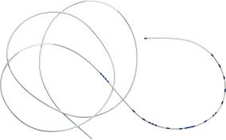
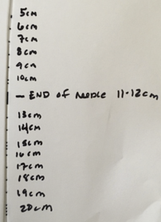
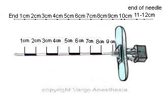
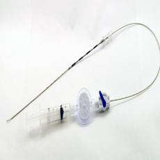
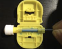
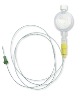
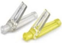
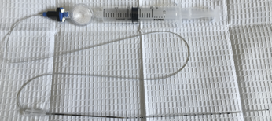

Epidural Catheters and Connectors    body {font-family: 'Open Sans', sans-serif;}

### Epidural Catheters and Connectors

The typical epidural catheter is a very fine plastic catheter (tube), which is placed through the skin into the epidural space. This temporary catheter is usually left in place for only 1-2 days in OB practice.An epidural catheter confers versatility by allowing extension of the duration of anesthesia beyond the original dose by administering additional doses of local anesthetic.  
  
**Stainless steel catheters (Wire wrapped catheters- Arrow Flex-Tip catheter)  
**More expensive than the standard plastic catheters. They are considered kink-resistant. Many anesthesia providers say they are easier to thread than the traditional plastic catheters.  
  
**Nylon Epidural Catheters  
**Designed to provide strength and flexibility. The catheters are designed to be are kink- and shear-resistant.  
  
**Single-orifice catheters vs multiple-orifice closed-end cathetersSingle-orifice, open-ended catheters** appear to be LESS popular than the **multiple-orificeclosed-end catheters.** Evidence suggests that multiple-orifice, closed-end catheters result in a more even distribution of local anesthetic and a greater likelihood of successful epidural anesthesia.  
  
Possible disadvantage of **multiple-orifice, closed-end catheters** is that local anesthetic may be injected into more than one anatomical site. Most providers still prefer these multiple-orifice, closed end catheters.  
  
Today, the epidural catheters (single- and multiple-orifice) are soft, flexible, and reliable. Some critics say that paying careful attention to detail during the injection of local anesthetic through either epidural catheter should make them both reliable.  
  
**cm makings on the epidural catheter** The catheter has cm markings from 5cm-20cm. The cm markings on the catheters are used as a reference for inserting and securing. It is important to know the cm markings.Some epidural catheters have mm markings from the distal tip of catheter from 10 mm to 250 mm.  
  
With insertion of an epidural catheter insertion, the catheter should only be advanced 3 to 4 cm beyond the epidural needle tip. We initially insert the catheter more than the 3-4 cm white removing the epidural needle. We then pull the catheter out just a little as needed to match the INITIAL cm marking reference point where the catheter was 3-4 cm distal to the tip of the epidural needle within the epidural space.

****

  

****

  

****

  

****

  
**Other End of the Catheter  
**The distal end (tip) of the catheter is in the epidural space, The other end (proximal tip) needs to be connected to something, so a luer lock syringe can be connected for administration of meds. Some of these small attachment devices are already attached while some are not.  
  
**Bacterial Filter  
**A bacterial filter can be applied to the connector for the prevention of an epidural infection. The filter needs primed and to have air eliminated from it.  
  
Either way, you may need to apply one of these connectors to the epidural catheter, depending on your kit.  
  
Some catheter connectors can secure the end of the catheter by turning connector body and cap to opposite directions, gently pulling on the catheter to assure secure fixing.  
  
Over-tightening of the connector can cause kinking or crushing of the catheter.  
  
**Filter Checks**  
For safety reasons, check the filter by filling it with saline or local analgesic before connecting to the connector.  

****

  

****

  

****

  
Below is a stainless steel epidural catheter **_NOTE:_** _Looks like an Arrow Flex-Tip “Wire Wound” catheter. Is it conventionally called a “stainless steel epidural catheter?”_

****