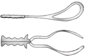

Epidural Dosing for a Forcep Delivery    body {font-family: 'Open Sans', sans-serif;}

### Epidural Dosing for a Forcep Delivery

_If an instrumental delivery is anticipated, a denser sacral block is required.  
  
_This is basically a denser top off for the perineal area (S2-S4).  
A fast onset with only an increase in analgesia is and NOT affecting the mother’s ability to push is desired.  
Use a fast-acting local anesthetic and avoid a motor block. You don’t want to affect the mother’s pushing.  
If you decrease the motor strength required for pushing, the mother require an emergency C-section. You must preserve the motor function.  
  
**A forceps delivery is considered when labor meets certain criteria:**  
Cervix is fully dilated  
Membranes are ruptured  
Vertex presentation and normal position of the fetal head have been verified.  
Mother is not able to push the baby out  
  
**Position  
**The patient should be sitting up 90 degrees for gravity to assist the S2-S4 block.  
Inject 3% Chloroprocaine 5-10 ml in 5 ml increments while the patient is sitting upright  
Inject 2% Lidocaine 5-10 ml in 5 ml increments while the patient is sitting upright.  
  
**Note:** Some recommends adding an average of 1 ml of sodium bicarbonate per 10 ml of local anesthetic for a faster onset. In most cases, however, there is insufficient time to obtain sodium bicarbonate and perform this admixture.  
  
**Another source:  
**Take 30ml of 3% Nesacaine (chloroprocaine) or 2% lidocaine with epi in anesthesia cart and add 3 ml sodium bicarbonate. Inject 5-15ml in 5ml increments over 10 minutes until sacral anesthesia is achieved.  
Remain immediately available because a failed forceps delivery may develop into a stat C-section.  
  
**Types of Forceps  
Simpson forceps:** The most common. Used to deliver a molded fetal head, as is commonly seen in nulliparous women.  
  
**Tucker-McLane forceps:** Have a more rounded cephalic curve, more suitable for the unmolded fetal head commonly seen in multiparous women.  
  
**Kielland forceps:** For rotation of the fetal head; these lack a pelvic curve.  

****

**Medscape.com**

1.  Take 30ml of 3% Nesacaine or 2% lidocaine with epi in anesthesia cart and add 3 ml bicarb.
2.  Raise head of bed so that the patient is in sitting position
3.  Inject 5-15 ml of Nesacaine in 5 ml increments over 10 minutes until sacral anesthesia is achieved
4.  Stay with patient until delivery and record BP's for at least 15 minutes. Remember a failed forceps delivery will likely become a STAT C-section. Replace Nesacaine or lidocaine syringe.