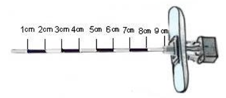

Epidural Skin to Epidural Debth    body {font-family: 'Open Sans', sans-serif;}

### Distance (average) from the skin to epidural space

**Thin adult:** 3 cm                
**Average adult:** 4-6 cm            
**Obese adult:** up to 8 cm

****

_Above: Epidural needle with markings_