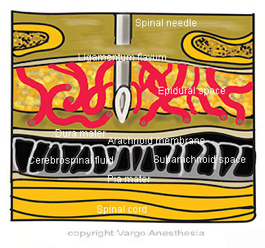
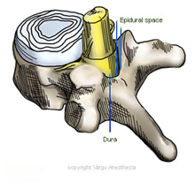

Epidural Space    body {font-family: 'Open Sans', sans-serif;}

### Epidural Space

The epidural space lies between the ligamentum flavum and the dura mater (first layer of meninges). It extends from the foramen magnum to the sacral hiatus and contains emerging nerve roots of the spinal cord, fat and veins.  
It is considered a potential space and is the location of epidural catheter insertion.  

****

  

****

  
**What is inside the Epidural Space**  
Loose connective tissue  
Adipose tissue (epidural fat)  
Lymphatics  
Spinal nerve roots  
Dura sac  
Venous plexus (internal vertebral) also known as Batson’s plexus  
  
Closes at the foramen magnum where the spinal dura attaches to the dura of the cranium  
Closes at the sacral hiatus by the sacrococcygeal ligament  
The space is widest at the level of the lumbar vertebrae and thinnest in the cervical area  
  
**Epidural Fat  
**The amount of epidural fat in the posterior epidural space is directly related to age and body weight. The amount of epidural fat varies with spinal location; it increases with caudal progression, being absent in the cervical spine and highest in the lumbosacral spinal region  
  
**Venous Plexus in Epidural Space  
**The thin-walled valveless venous plexi include plexus venous vertebralis interior, anterior, and posterior. These veins are vulnerable to damage during needle puncture or advancement of an epidural catheter.  
In addition, venous plexus distention can occur with anatomical changes in the spinal canal including adjacent level spinal stenosis.  
  
Sometimes the epidural needle and catheter entry may cause an in inflammatory change that may cause connective tissue proliferation and adhesions between the dura mater and the ligamentum flavum.  
  
**Size of Epidural Space Varies  
**The size of the epidural space also varies based on anatomical level with the posterior epidural space measuring approximately:  
0.4 mm at C7 to T1  
7.5 mm in the upper thoracic spine  
4.1 mm at the T11 to T12,  
4 to 7 mm in the lumbar regions  
  
**Epidural Space Septa  
**Dissection and CT epidurography, suggest the presence of dural space septa. Such a band (septum) is a possible reason for unilateral or incomplete epidural anesthesia. Others have suggested that the presence of a dorsal median band is an artifact of epidural space distension.  

Chestnut, David.(2014) Chestnut’s Obstetric Anesthesia Principles and Practice . Pp. 230  
  
Nickalls RW, Kokri MS. The width of the posterior epidural space in obstetric patients.  _Anaesthesia_ . 1986; 41: 432–433.  
  
Hogan QH. Lumbar epidural anatomy. A new look by cryomicrotome section.  _Anesthesiology_ . 1991; 75: 767–775.  
  
Bernards CM. Sophistry in medicine: lessons from the epidural space.  _Reg Anesth Pain Med_ . 2005; 30: 56–66.  
  
Meijenhorst GC. Computed tomography of the lumbar epidural veins.  _Radiology_ . 1982; 145: 687–691.  
Igarashi T, Hirabayashi Y, Shimizu R, Saitoh K, Fukuda H, Mitsuhata H. The lumbar extradural structure changes with increasing age.  _Br J Anaesth_ . 1997; 78: 149–152.  
  
 Igarashi T, Hirabayashi Y, Shimizu R, et al. Inflammatory changes after extradural anaesthesia may affect the spread of local anaesthetic within the extradural space.  _Br J Anaesth_ . 1996; 77: 347–351.   
  
Wu HT, Schweitzer ME, Parker L. Is epidural fat associated with body habitus?  _J Comput Assist Tomogr_ . 2005; 29: 99–102.  
  
**Gray's Anatomy for Students  
**By Richard Drake, A. Wayne Vogl, Adam W. M. Mitchell