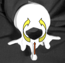

Epidural - Local Anesthetic Distribution, Uptake and Elimination    body {font-family: 'Open Sans', sans-serif;}

### Epidural - Local Anesthetic Distribution, Uptake and Elimination

First of all, we have to remember what is inside of the epidural space.  
**  
What is inside the Epidural Space**  
Loose connective tissue  
Adipose Tissue (epidural fat)  
Lymphatics  
Spinal Nerve roots  
Dura sac  
Venous plexus (Internal vertebral) also known as Batson’s Plexus**  
  
Local Anesthetic Mechanism of Action  
**Blocks the sodium channels on the axons.  
  
**An epidural dose takes 6-8 times the dose of a spinal to create a comparable block.  
**The majority of the local anesthetic administered is absorbed systemically by the rich venous plexus found within the epidural space. The rough dura surrounding spinal nerve/nerve roots act as a modest barrier for the spread of local anesthetics. A local anesthetic must penetrate the arachnoid and dura mater, which prevents a fast onset. Spinals do not have a dura to penetrate. Local anesthetics are lipid soluble and a small amount will be absorbed by tissue and epidural fat. What remains will eventually reach its intended site of action, the spinal nerve and nerve roots.  
  
Epidural veins absorb a significant amount of local anesthetic with blood concentrations peaking. Local anesthetics absorbed in the epidural veins will be diluted in the blood.  
  
The pulmonary system acts as a temporary buffer and protects other organs from the toxic effects of local anesthetics. Distribution occurs to the vessel rich organs, muscle, and fat in 10-30 minutes after a bolus.  
  
Local anesthetics administered in the epidural space move in a horizontal and longitudinal direction. Theoretically, if enough local anesthetic is injected, it could spread up to the foramen magnum and down to the sacral foramina. Clinically, the extent of longitudinal spread is volume dependent and cephalad spread is limited.  
  
**Limited Spread with 20 Extra mLs of Local Anesthetic**  
An epidural will only spread 4 additional dermatomes when increasing the volume of local anesthetics from 10ml to 30 ml.  
  
**Horizontal Spread  
**Horizontal Spread occurs through intervertebral foramina, entering the dural cuff via the arachnoid villi and into the CSF. A small amount of local anesthetic may travel to the anterior epidural space. Blockade occurs at the mixed spinal nerves, dorsal root ganglia, and to a small extent the spinal cord.

****

Long acting amides will bind to alpha-1 globulins which have a high affinity to local anesthetics but become rapidly saturated.Amides are metabolized in the liver and excreted by the kidneys.Esters are metabolized by pseudocholinesterase so rapidly that there are rarely significant plasma levels.

IFNA / International Federation of Nurse Anesthetists  
Developing Countries Regional Anesthesia Lecture Series  
Daniel D. Moos CRNA, Ed.D.   U.S.A.  
  
Chestnut, David.(2014) Chestnut’s Obstetric Anesthesia Principles and Practice.  
  
Santos, Alan., Epstein, Jonathan.,(2015) Chaudhuri, Kallol Obstetric Anesthesia ; 2015.