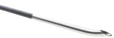
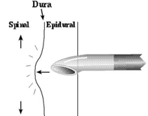
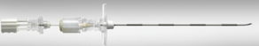

Epidural - Needles and Stylet    body {font-family: 'Open Sans', sans-serif;}

### Epidural - Needles and Stylet

**A suitable epidural needle should have the following:  
**Easy penetration of ligaments  
Minimally traumatic penetration  
Enhances the epidural catheter advancement  
  
**2 Common Epidural Needles**  
**Tuohy** \- by far the most popular epidural needles  
**Crawford  
  
Touhy Needle - Most Popular  
**The distal end is bent 20 degrees to direct the catheter into the epidural space.  
The orifice must fully penetrate the dura.The catheter should never be withdrawn through a Tuohy needle due to the risk of transection.  
  
**Crawford Epidural Needle  
**The tip of the needle lacks a curved end  
Must approach the epidural space obliquely if a catheter is to be inserted  
Does not have to penetrate as deep as a Tuohy needle  
  
The design of epidural needles has come a long way.  
This can be attributed to modifications in needle design and material.  
Most of the original needle modifications were not patented; thus, manufacturers apply names freely to their needles.  
  
Epidural needles are typically a larger gauge (16-18) than spinal needles to permit better assessment of loss of resistance and passage of a catheter.  
The 17g and 18g needles appear to be the most popular size supplied in kits.  
The epidural needle also has a stylet.  
  
**Epidural Needle Length (adults)  
**Epidural Needles (for adults) are traditionally 3.5 inches in length.  
5 inch epidural needles are also manufactured and used for patients with thick or fatty backs in which the epidural space cannot be reached with the traditional 3.5 inch needle.The length from the needle tip to the hub is 11-12cm in the traditional 3.5 inch needle.  
(see image below)  
  
Some manufacturers will also label their lengths in: 80mm, 90mm, 120mm, 152mm.  
  
**Epidural needle cm markings** (graduations)  
The cm markings on the epidural needle are used to determine the depth from the skin to the epidural space.  
  
**Ex.** When you reach the loss or resistance (epidural space), look at the cm mark on your needle at the patient’s SKIN LEVEL. If the needle to skin is 4cm, then you know the epidural space is 4cm deep.  
  
Knowing that, after you insert the epidural catheter 3-5cm into the epidural space while carefully  
pulling out the needle, you know that the epidural catheter cm markings at the SKIN LEVEL should be 7-9cm.    
  
**Note:** You notice the 11-12cm markings on the epidural catheter below is equal in size as the epidural needle just below it.

****

Epidural kits tend to vary, so it is always good to know your reference points between the catheter and needle before you start to place an epidural.  
  
**Epidural Needles  
**There are multiple types of epidural needles as well as catheters, but in modern practice, our epidural needles are disposable, as are the rest of the epidural kits, to ensure sterility.  
As mentioned above, The Tuohy needle is the most popular.  
**  
Epidural Bevel  
**Epidural needles are designed with a curved tip to help prevent puncture of the dural membrane.  
  
**The Touhy Needle** named after the inventor - Edward B. Tuohy, a prominent figure in anesthesiology. The heel of the bevel is usually angled and dull to reduce the risk of cutting through the dura. It has a smooth anti-coring curve at its tip designed to cause a catheter passing through the needle's lumen to exit at a 45-degree angle.

****

  

****

There are now modifications of the Tuohy epidural needle.  
  
The bevels of the epidural needles vary, and it is the bevel that differentiates the needle types.  
**Other types of epidural needles include:  
**The Crawford Needle  
The Tuohy Needle-most popular  
The Hustead Needle  
The Weiss Needle  
  
**Hub of Epidural Needle  
**The hub of the epidural is usually transparent to offer easy visualization of blood or CSF  
The hub also has fixed wings to provide a stable surface for your fingersAn hourglass-shaped, ridged hub, offers ergonomic placement of your fingers.  
  
**Epidural Needle Stylet  
**There is also an epidural needle stylet that comes in the epidural kit.  
The stylet is commonly used to prevent tissue from clogging the needle, and minimizes coring of the skin and subcutaneous tissues.  
You remove the stylet when you enter the ligamentum flavum and attach the loss of resistance syringe to the hub of the epidural needle.  
Stylets are usually stainless steel, some are plastic.

****

The needle and stylet fit together perfectly to give a completely smooth bevel surface.  
  
**More Notes  
The Touhy Needle  
**Invented by Edward B. Tuohy, an anesthesiologist who trained at the Mayo Clinic.  
Tuohy knew of early clinical work by Paget and Dogliotti on epidural blocks, but he was more interested in continuous spinal anesthesia. Touhy replaced a sharp barker epidural needle with a hypodermic needle that had been designed by Ralph L. Huber (a dentist who liked designing hypodermic needles). Huber’s needle had a directional tip, which allowed anesthesiologists to direct the catheter as it exited the needle tip.  
The long, sharp, curved tip was designed to lessen the pain of an injection and decrease the risk of depositing plugs of skin into underlying tissues. Although Huber intended this needle for IV and tissue injections, Tuohy recognized that the directional point might facilitate placement of spinal catheters. Tuohy also added a stylet, thereby hoping to further decrease the risk of skin plugging.  
Other doctors have since modified the directional epidural needle for epidural catheters.  
  
**The Hustead Needle**  
Robert Hustead first practiced anesthesiology as a student at Yale University (1952–1954). After  
special training, he provided anesthesia service on nights and weekends in the labor and delivery suite during his last 2 years of medical school and during his internship, a common practice at that time.  
  
As a first-year anesthesiology resident, Hustead made his own modifications to the Tuohy- Huber needle by hand by using a stone and a needle sharpener.  
He sanded off the sharp tip of the original Tuohy-Huber needle (i.e., he eliminated the secondary bevel of the needle tip) and changed the angle of the bevel.  
The result was a needle opening that did not exceed 2.7 mm in length  
The angle of the needle bevel was 12°–15°.  
He also smoothed the heel of the needle bevel to reduce the danger of trapping and cutting the tubing should it have to be withdrawn.  
Not until 1965, however, did he find a manufacturer (Monoject) willing to produce a needle to his specifications.