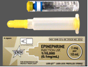

Epinephrine Dosing Tables    body {font-family: 'Open Sans', sans-serif;}

### Epinephrine Dosing Tables

**Quick Epinephrine mix:** 1mg vial mixed with 250 ml bag = 4mcg/ml.   
1mg vial mixed with 100 ml bag = 10 mcg/ml.   
**Receptor activity (greatest to least):** Beta 2 > Beta 1 > Alpha 2 > Alpha**Low dose:** 0.01-0.03mcg/kg/min for inotropic and chronotropic, and may decease slightly SVR.**High doses:** Alpha 1 vasoconstriction becomes dominant (increases SVR, MAP and CO).  
**  
Epinephrine  
**1:1,000 = 1mg/ml (small 1 ml vials)  
1:10,000 = 0.1 mg (100 mcg)/ml  
1:100,000 = 10 mcg/ml  
1:200,000 = 5 mcg/ml  
1:400,000 = 2.5 mcg/ml

****

\= 1:1,000 (1mg/ml)  
  
Below = 1:10,000 (0.1 mg/ml or 100 mcg/ml)  

****

  
**Asystole:** **Usual and AHA recommended Epi doses; 0.1 mg/ml (1:10,000)**

**Epinephrine** **single doses 0.1 mg/ml (1:10,000) below  
IV:** 0.5 to 1 mg (5 to 10 ml) IV once  
**During resuscitation:** 0.5 mg (5 ml) should be given IV every 5 minutes.  
**Intracardiac:** 0.3 to 0.5 mg (3 to 5 ml)  
**Endotracheal:** 0.5 to 1 mg (5 ml to 10 ml)  
  
**_The American Heart Association (AHA) recommends_** _:  
**IV or intraosseous:** 1 mg IV or intraosseous every 3 to 5 minutes during cardiac arrest.  
**Endotracheal** : 2 to 2.5 mg endotracheally every 3 to 5 minutes during cardiac arrest if IV or intraosseous route cannot be established._

**Ventricular Fibrillation:** **Usual and AHA recommended Epi doses; 0.1 mg/ml (1:10,000)**

**IV:** 0.5 to 1 mg (5 to 10 ml) IV once  
**During resuscitation:** 0.5 mg (5 mL) should be given IV every 5 minutes  
**Intracardiac:** 0.3 to 0.5 mg (3 to 5 ml)  
**Endotracheal:** 0.5 to 1 mg (5 ml to 10 ml)  
  
**_The American Heart Association (AHA) recommends_** _:__  
**IV or intraosseous** : 1 mg IV or intraosseous every 3 to 5 minutes during cardiac arrest  
**Endotracheal:** 2 to 2.5 mg endotracheally every 3 to 5 minutes during cardiac arrest if IV or intraosseous route cannot be established._

**Ventricular Tachycardia** **and usual Epinephrine doses (1:10,000)** **0.1 mg/m** **l**

**IV:** 0.5 to 1 mg (5 to 10 ml) IV once  
**During resuscitation:** 0.5 mg (5 ml) should be given IV every 5 minutes  
**Intracardiac:** 0.3 to 0.5 mg (3 to 5 ml)  
**Endotracheal:** 0.5 to 1 mg (5 mL to 10 ml)  
**The American Heart Association (AHA) recommends** :  
**_IV or intraosseous:_** _1 mg IV or intraosseous every 3 to 5 minutes during cardiac arrest  
**Endotracheal:** 2 to 2.5 mg endotracheally every 3 to 5 minutes during cardiac arrest if IV or intraosseous route cannot be established_

**Cardiac Arrest:** **Usual and AHA recommended Epi doses; 0.1 mg/ml (1:10,000)**

**IV:** 0.5 to 1 mg (5 to 10 ml) IV once  
**During resuscitation:** 0.5 mg (5 ml) should be given IV every 5 minutes.  
**Intracardiac:** 0.3 to 0.5 mg (3 to 5 ml)  
**Endotracheal:** 0.5 to 1 mg (5 ml to 10 ml)  
  
**_The American Heart Association (AHA) recommends_** _:  
**IV or intraosseous:** 1 mg IV or intraosseous every 3 to 5 minutes during cardiac arrest.  
**Endotracheal** : 2 to 2.5 mg endotracheally every 3 to 5 minutes during cardiac arrest if IV or intraosseous route cannot be established._

  
**Severe acute refractory bronchospasm:** **Usual Epi dose; (1:10,000) 0.1 mg/ml**

0.1 to 0.25 mg (1 to 2.5 ml) IV slowly once

**  
Anaphylaxis: Usual Epinephrine dose; (1:1,000) 1mg/ml**

**IM: (30 kg or greater):** 0.3 mg IM or subcutaneously into anterolateral aspect of thigh; repeat as needed.  
**IV:** **Injectable Solution of 0.1 mg/ml (1:10,000)** : **0.1 mg/ml**  
0.1 to 0.25 mg (1 to 2.5 ml) IV slowly once  
**Convenience Kit 1 mg/ml (1:1000)** : **0.1 mg/ml**  
0.2 to 1 mg IM or subcutaneous

**Hypotension:** **Usual Epinephrine dose; 1 mg/ml (1:1000):**

**Continuous Infusion:** 0.05 to 2 mcg/kg/min IV and titrate to desired MAP.  
Titrate Q 10 to 15 minutes in increments of 0.05 to 0.2 mcg/kg/min  
to achieve desired blood pressure goal

  
**Shock: Usual Epinephrine dose; 1 mg/ml (1:1000)**

**Continuous Infusion:** 0.05 to 2 mcg/kg/min IV and titrate to desired MAP.  
Titrate Q 10 to 15 minutes in increments of 0.05 to 0.2 mcg/kg/min  
to achieve desired blood pressure goal

  
  

Epocrates  
https://online.epocrates.com/u/1011571/Levophed/Adult