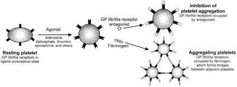

Eptifibatide (Integrilin)    body {font-family: 'Open Sans', sans-serif;}

### Eptifibatide (Integrilin)

**Reversible GP IIb/IIIa Inhibitor.  
Considered an “Anti-Platelet” medication  
Reversible:** Not bound to the platelets for the platelets’ entire life-span.  
  
**Eptifibatide** is modeled after the Lys-Gly-Asp sequence of the active protein (barbourin) in the venom of the pygmy rattlesnake, _Sistrurus barbour._  
  
**Indications  
**Treatment of acute coronary syndrome (ACS) managed medically or with percutaneous coronary intervention (PCI) including intracoronary stenting.  
  
**Mechanism of Action**  
Binds to the platelet surface receptors GP IIb/IIIa and prevents he receptors from binding to fibrinogen. Inhibits platelet aggregation. Conceptually, eptifibatide sits in the binding pocket between the IIb and IIIa arms of glycoprotein IIb/IIIa, thus preventing the binding of fibrinogen and thrombus formation.  
  
**Note below:** on right, when the GPIIb/IIIa receptors are antagonized, they are unable to bind to fibrinogen and other platelets.  

****

  
**Doses**  
Acute Coronary Syndromes: 180 mcg/kg IV bolus over 1-2 min, THEN 2 mcg/kg/min IV for up to 72 hours.  
  
**Percutaneous Coronary Intervention (PCI):** 180 mcg/kg IV, THEN Continuous infusion 2 mcg/kg/min with another 180 mcg/kg IV bolus 10 minutes after 1st one. Continue infusion for at least 12 hours.  
  
**Renal Impairment  
**(CrCl <50 mL/min)  
ACS: 180 mcg/kg IV, THEN continuous infusion 1 mcg/kg/min.  
PCI: 180 mcg/kg IV, THEN continuous infusion 1 mcg/kg/min with another 180 mcg/kg IV bolus 10 minutes after 1st one.  
  
**INTEGRILIN should be given concomitantly with heparin dosed to achieve the following parameters:**  
During medical management: target aPTT 50 to 70 seconds  
During PCI: target ACT 200 to 300 seconds**GPIIb/IIIa receptors** These are the major platelet surface receptors for the binding of fibrinogen and von Willebrand factor. Fibrinogen binds to the GPIIb/IIIa receptors to aggregate with other platelets.  
  
**Optional Laboratory Tests** (platelet function should to be evaluated)  
VerifyNow IIb/IIIa test (platelet function assay)  
Multiplate (platelet function assay)  
PRP - Aggregation (platelet function test)  
PFA - 100/200 (platelet function assay)  
Whole blood aggregation (platelet function assay)  
Plateletworks Assay (platelet function assay)  
  
**PT/PTT:** no measurable effect when administered alone.  
**ACT:** Eptifibatide typically prolongs the ACT by 40 – 50 seconds but no linear correlation.  
  
**Other two** **GP IIb/IIIa Inhibitors:**  
Abciximab (Reopro) – irreversible.  
Tirofiban (Aggrastat) – reversible.  
  
Eptifibatide rarely associated with thrombocytopenia.  
  
**Onset:** 15 minutes after bolus.  
**Metabolism:** renal clearance 50%  
**Excretion:** Urine  
**Total body clearance** – majority excreted unchanged  
Deaminated form (metabolites detected in urine but not in plasma)  
  
**T1/2:** 2.5 hours; prolonged in renal insufficiency  
  
**Duration after termination  
**Eptifibatide has a short half-life.  
Four hours after termination of an eptifibatide infusion, platelet aggregation recovers to approximately 70% of normal with the return of normal hemostasis.  
Eptifibatide has a lower affinity for the glycoprotein IIb/IIIa receptor.  
  
**Renal Insufficiency:  
**Approximately 50% of eptifibatide is cleared by the healthy kidney.  
Total drug clearance is decreased by 50% and epifibatide concentrations are doubled in patients with an estimated creatinine clearance < 50 mL/min.  
  
**Eptifibatide (Integrilin) and Neuraxial or Deep Regional Block**

table.tableizer-table { font-size: 12px; border: 1px solid #CCC; font-family: Arial, Helvetica, sans-serif; } .tableizer-table td { padding: 4px; margin: 3px; border: 1px solid #CCC; } .tableizer-table th { background-color: #104E8B; color: #FFF; font-weight: bold; }

| Minimal Time between  
last dose and block | Can it be given  
with epidural catheter in place? | When to restart Integrilin  
after catheter removal |
| --- | --- | --- |
| 4-8 hours  
(longer with renal impairment) | Avoid | 6 hours  
(some literature state 2 hours) |

  
**Restart medication after procedure:** 2-4 hours per some guidelines  
_According to ASRA, GBIIb/IIa drugs are contraindicated within 4 weeks after surgery.  
The patient should be neurologically monitored if administered before that time._  
  
**Remove catheter after administration:** ASRA - Unknown  
**Specific** **Antidote:** None  
**Minor bleeding:** Desmopressin 0.3 mcg/kg x 1.  
**Major Bleeding:** 10 units of cryoprecipitate  
Platelets administration has been documented but is of questionable benefit.  

Platelet Glycoprotein IIb/IIIa Antagonists: Pharmacology and Clinical Developments  
  
Anesthesiology 5 2002, Vol.96, 1237-1249.  
David C. Warltier, M.D., Ph.D., Editor; Peter C. A. Kam, F.R.C.A., F.A.N.Z.C.A., F.C.A.R.C.S.I., F.H.K.C.A.(Hon.); Mark K. Egan, F.A.N.Z.C.A.Phillips DR, Scarborough RM: Clinical pharmacology of eptifibatide. Am J Cardiol 1997; 80: 11B–20BPhillips, DR Scarborough, RM  
Neuraxial and peripheral nerve blocks in patients taking anticoagulant or thromboprophylactic drugs: challenges and solutions.  
  
Jinlei Li, Thomas Halaszynski; Department of Anesthesiology, Yale University, Yale New Haven Hospital, New Haven, CT, USA  
https://www.dovepress.com/neuraxial-and-peripheral-nerve-blocks-in-patients-taking-anticoagulant-peer-reviewed-fulltext-article-LRA  
Guidelines for the Management of Anticoagulant and Anti-Platelet Agent Associated Bleeding Complications in Adults  
http://wsp.mclaren.org/Lapeer/files/Guidelines%20for%20the%20Management%20of%20Anticoagulant%20Agents.pdf  
  
Guidelines for Neuraxial Anesthesia and Anticoagulation  
Developed by Anticoagulation Task Force and Anesthesia Development Team. P&T Approved February 2014. Last update July 2015.  
**https://kr.ihc.com/ext/Dcmnt?ncid=520499512&tfrm=default**  
  
ANTICOAGULANTS: THE GUIDE TO REVERSAL  
OHSU Hospital and Clinics Department of Pharmacy Services Pharmacy and Therapeutics Committee October 2011.  
  
**Neurosurg Focus 34 (5):** E6, 2013 ©AANS, 2013  
The role of anticoagulants, antiplatelet agents, and their reversal strategies in the management of intracerebral hemorrhage  
_Division of Neurosurgery, Department of Surgery, East Carolina University Brody School of Medicine, Greenville, North Carolina; and Department of Neurosurgery, Virginia Commonwealth University School of Medicine, Richmond, Virginia_  
  
Anticoagulation 3rd Edition  
_Regional Anesthesia and Pain Medicine_ :  
January/February 2010 - Volume 35 - Issue 1 - pp 64-101  
doi: 10.1097/AAP.0b013e3181c15c70  
Asra Practice Advisory  
  
British Journal of Anaesthesia 111 (S1): i96–i113 (2013) doi:10.1093/bja/aet401  
http://bja.oxfordjournals.org/content/111/suppl\_1/i96.full.pdf+htmlRegional anaesthesia in the patient receiving antithrombotic and antiplatelet therapy http://bja.oxfordjournals.org/content/107/suppl\_1/i96.full#ref-4  
T.T. Horlocker  
Department of Anesthesiology, Mayo Clinic, Rochester, MN 55905, USA  
  
Horlocker TT, Wedel DJ, Benzon H, et al. Regional anesthesia in the anticoagulated patient: defining the risks (the second ASRA Consensus Conference on Neuraxial Anesthesia and Anticoagulation). Reg Anesth Pain Med 2003;28:172-97  
  
Rxlist.com  
http://www.rxlist.com/integrilin-drug.htm  
  
Clinical Anesthesia Fundamentals; 2015  
Barash, Cullen, Stoelting, Cahalan, Stock, Ortega and Sharar  
  
Hartl P, Brucke P, Dienstl E, Vinazzer H: Prophylaxis of thromboembolism in general surgery: comparison between standard heparin and Fragmin. Thromb Res. 1990 Feb 15;57(4):577-84  
  
Samama MM, Gerotziafas GT: Comparative pharmacokinetics of LMWHs. Semin Thromb Hemost. 2000;26 Suppl 1:31-8.  
  
**GlobalRPh.com  
http://www.globalrph.com/eptifibatide\_dilution.htm  
  
Medscape.com  
http://reference.medscape.com/drug/integrilin-eptifibatide-342149#3**