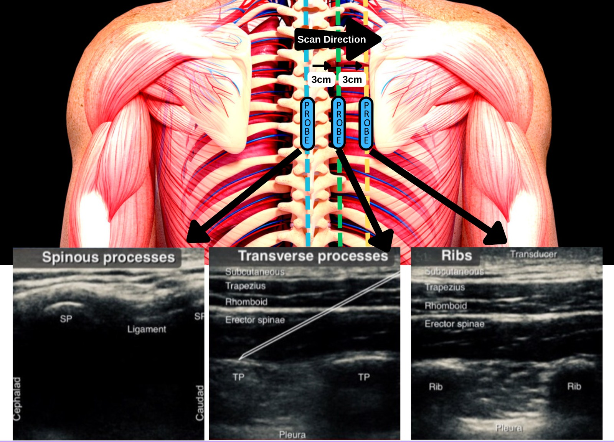

Erector Spinae Block Plane (T5) US Probe Location    body {font-family: 'Open Sans', sans-serif;}

### Erector Spinae Block Plane (T5) US Probe Location

To help verify the proper probe position, the US probe can be moved back and forth in 3 locations.  
Most experienced anesthesia providers utilize landmarks.  
**  
In the middle of the back over the spinous process:**  
3 cm laterally is the transverse process (your target)  
3cm more laterally are the ribs.  
**

****

Landmarks often used:  
**Lateral-inferior scapular is T7-T8  
Mid-scapula of T5 area  
  

Erector Spinae Plane Block (ESPB)  
Highland EM Ultrasound (accessed 07/2023)  
http://highlandultrasound.com/erector  
Edited by Michael Kaminsky, Regional Anesthesiologist