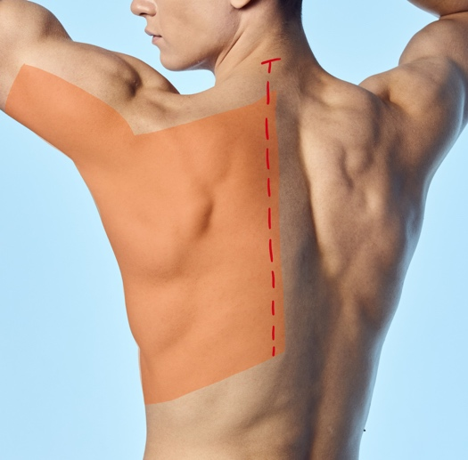
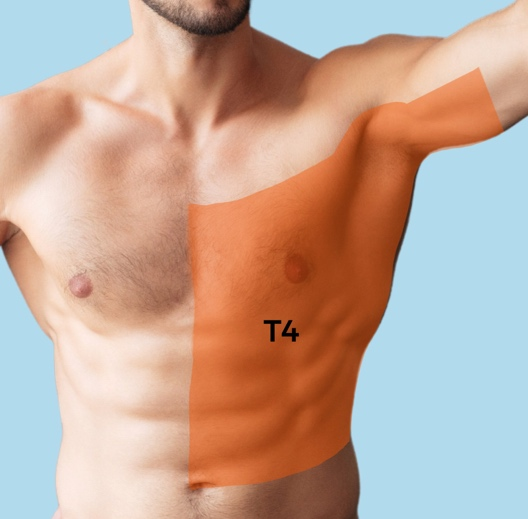
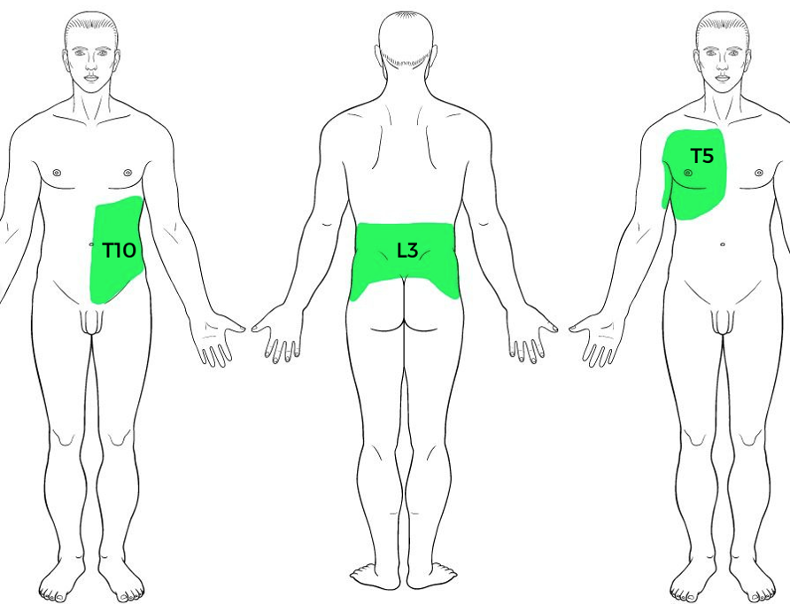
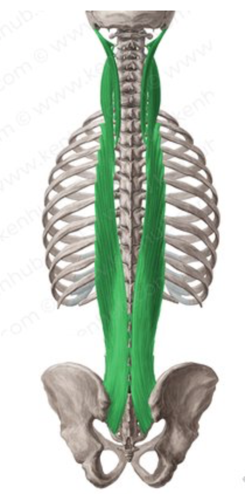
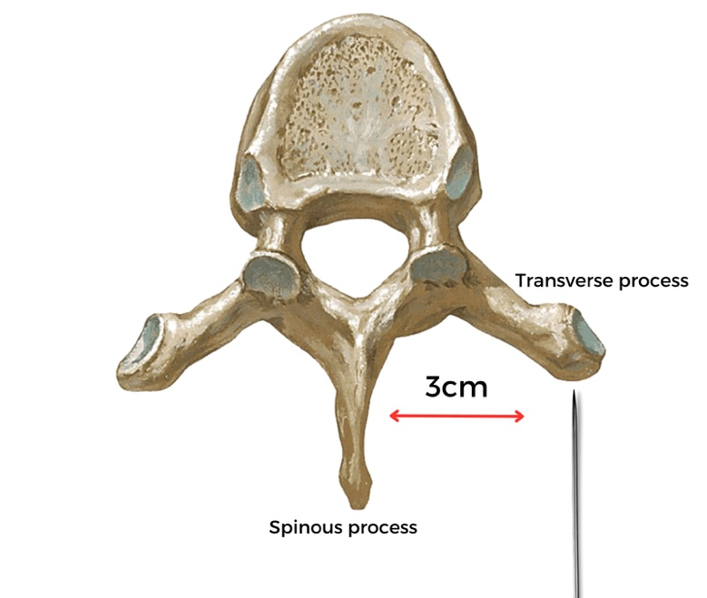
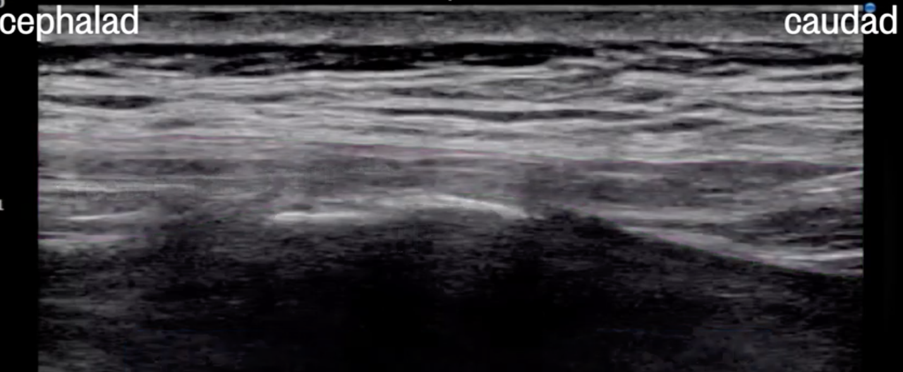
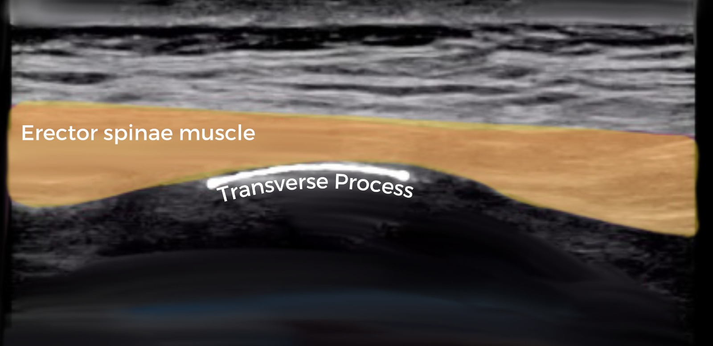
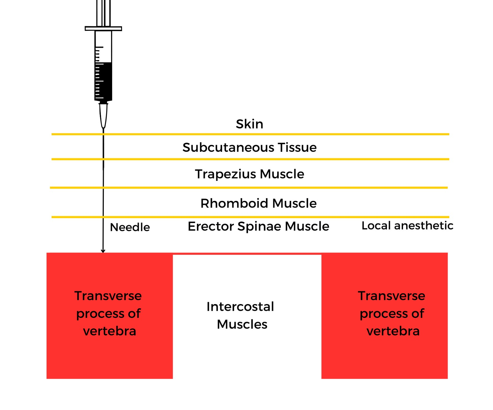
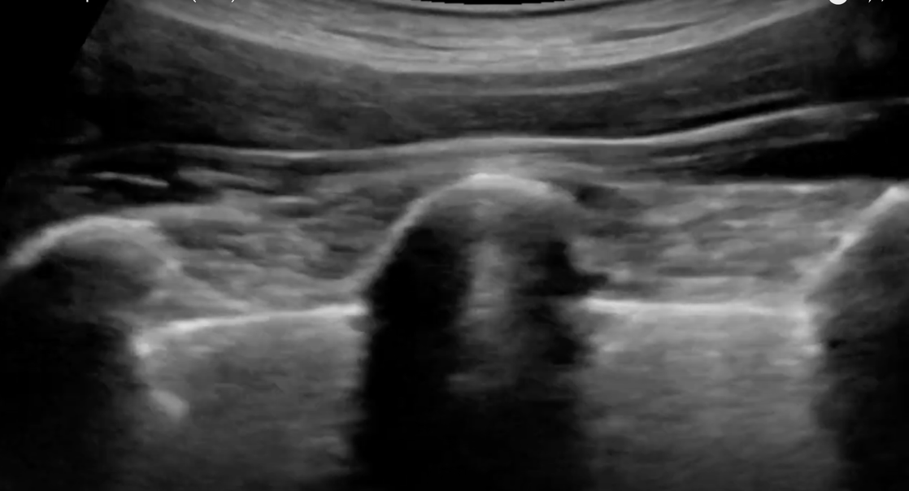
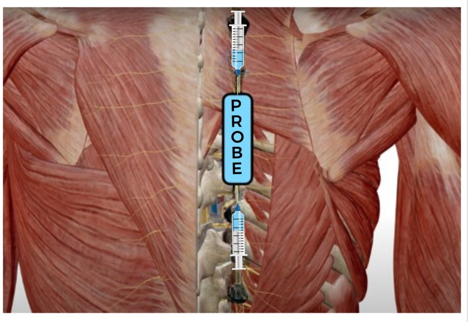

Erector Spinae Plane (ESP) Nerve Block (T5)    body {font-family: 'Open Sans', sans-serif;}

### Erector Spinae Plane (ESP) Nerve Block (T5)

The ESP block is most often performed between the T5-T7 paraspinal levels, but it can also be performed at lower levels.  
This block provides extensive analgesia to the posterior, lateral, and anterior thoracic wall.  
  
**It can be:**  
Unilateral  
Bilateral

****

****

**This block is considered easier and safer to perform than:**  
\- Traditional epidural  
\- Paravertebral block  
\- Intercostal block**Possible indications of T5 ESP: Thoracic surgery and sternotomy**\- Cardiothoracic surgery (sternotomy)-bilateral block  
\- Mastectomy (breast surgery)  
\- Shoulder disarticulation  
\- Thoracic spine surgery  
\- Rib fracture management  
\- Thoracic neuropathic pain in a patient with metastatic disease of the ribs and rib fractures  
  
**The T5 ESP block is a paraspinal fascial plane block.**  
\- It involves the injection of local anesthetic (LA) in the back between the tip of the transverse process of the thoracic vertebra and the fascia plane of the erector spinae (ES).  
\- The LA is injected when the needle reaches the plane (or comes in contact) with the corner of the transverse process.  
\- This is considered one of the easiest and safest blocks to perform.

****

**However, the ESP blocks could be performed at other levels:**  
**T10:** Abdominal indications  
**L3:** Lumbar spine surgery

****

When injected in the thoracic region (T5 or T10), the LA will spread and may cover 8 levels  
in a cranio-caudal fashion (4 up and 4 down).  
When injected in the lumbar area (L3), it may only cover 4 levels because the muscle is thicker and less compliant.  
  
For now, we will only be focusing on the popular T5 injection below.  
  
**Absolute contraindication:** (as with other regional blocks)  
\- Patient refusal  
\- Inflammation or infection over the injection site.  
\- Allergy to local anesthetics  
  
**Relative contraindications:** (as with other regional blocks)\- Patient uncooperativeness (Pediatric or elderly patients may need sedation).  
**\- Pre-existing peripheral neuropathies.  
**  
**Anticoagulation or bleeding disorders and ESP block:**  
Anticoagulation may be a relative contraindication, although no recent ASRA guidelines specifically address paraspinal blocks and anticoagulation.  
  
**Basic anatomy:**  
**The Erector Spinae:  
**The ES is a group of muscles that bilaterally run vertically beside the spine.  
It looks like a long strip of meat surrounded by fascia.  
It has various origins and insertions along the spine.  
The carious origins and insertions provide channels for the spreading of the injected local anesthetic.

****

**The Erector Spinae is composed of:**  
Iliocostalis  
Longissimus  
Spinalis  
  
**Patient position:**  
US images are identical whether the patient is sitting, lateral or prone.  
Most anesthesia providers prefer the patient sitting up.  
  
**US probe position for T5 ESP block:**  
Position the US probe in a parasagittal longitudinal position 2.5-3 cm lateral to the back's spinous process (midline).  
Refer to _“Erector Spinae Plane Bock US Probe Positioning”_ in this app.  
  
**Assuming a right-sided unilateral block (below):**

****

**Assuming a right-sided unilateral block.  
  
US probe position starting at the T5 area:  
  
**Lateral-inferior scapular is T7-T8  
Mid-scapula of T5 area**

****

Landmarks for this block:  
Landmarks often used:  
**Lateral-inferior scapular is T7-T8  
Mid-scapula of T 5 area**  
  
Below is a view of the thoracic transverse process in this area described:

****

****

****

If you move the probe 3 cm more laterally as above, you will view ribs below:

****

****You can count ribs by moving the probe up to verify location.  
Note:** T1 = 1st rib, then count down.  
To identify the ribs, you may slide the probe up to the top rib and count the ribs as you move the probe down until you get to the T5 level.Slide the probe back medially until you see the transitioning from the ribs to the transverse process.**  
  
Needle insertion is towards the transverse process.  
**The needle can be inserted cephalad or caudal, it does not matter, the anatomy is the same.Direct the needle within the interfascial plane between ESP and transverse process.  
The needle is inserted with the aim of the corner of the transverse process.

****

Inject the LA by using the transverse process as a “backstop."  
**Caution:** Avoid advancing the needle past the transverse process into the pleura.

****

**The precise mechanism of the ESP block:** Controversial**  
  
The spread of LA (above):  
**LA spreads anteriorly to the paravertebral space and laterally to reach intercostal nerves and spreads along the plane in a craniocaudal manner, covering 3-4 levels above and below.  
Both the ventral and dorsal rami can be blocked in the paravertebral space.For this reason, the ESP can be thought of as a paravertebral by proxy.

****

**Note:** A few mLs of normal saline or D5W can be used to initiate the hydrodissection.  
A small test injection should show the fasciae lift up, seeing hydrodissection of the ES lifting off the transverse process.

****

With LA injection, you should visualize hydrodissection as the ES is “peeling” away from the transverse process.  
  
**Local anesthetic and volume:  
**\- The ESPB is more of a volume block, as the volume is important for the spread of LA.  
\- Adequate volume is required to spread LA 8 dermatomes (4 levels below and above the injection site).  
  
**\- Unilateral:** 30 mLs 0.5% ropivacaine is common.  
**\- Bilateral:** 30 mLs (each side) of 0.2% ropivacaine is common (lower concentration).  
\- Due to the high volume of LA used with bilateral blocks, most anesthesia providers use a lower concentration of ropivacaine to avoid local toxicity.  
**Unilateral ESPB block with** **0.5% Ropivacaine** (2.0 mg/mL) table.tableizer-table { font-size: 12px; border: 1px solid #CCC; font-family: Arial, Helvetica, sans-serif; } .tableizer-table td { padding: 4px; margin: 3px; border: 1px solid #CCC; } .tableizer-table th { background-color: #104E8B; color: #FFF; font-weight: bold; }

| Max dose | 50 kg patient | 70+ kg patient |
| --- | --- | --- |
| 3 mg/kg  
No more than 225 mg or 75 mLs | 30 mLs (150mg) | 30 mLs (150mg) to  
40 mLs (200 mg) |

**Bilateral ESPB block with 0.2% Ropivacaine** (5 mg/mL) table.tableizer-table { font-size: 12px; border: 1px solid #CCC; font-family: Arial, Helvetica, sans-serif; } .tableizer-table td { padding: 4px; margin: 3px; border: 1px solid #CCC; } .tableizer-table th { background-color: #104E8B; color: #FFF; font-weight: bold; }

| Max dose | 50 kg patient | 70+ kg patient |
| --- | --- | --- |
| 3 mg/kg (plain)  
No more than 225 mg or 45 mLs | 30 mLs (60 mg)  
each side | 30 mLs (60 mg) to  
40 mLs (80 mg)  
each side |

  
**Bupivacaine can also be used, but it is less popular for this block.**  
0.2 and 0.5% Bupivacaine plain or with epi may also be used.  
**Continuous infusion with midline catheters:**  
7 mLs/hour for each side is a common rate.  
More common for rib fractures and mastectomies.  
  
**Possible complications/side effects:  
**\- Spinal cord Infection at the needle insertion site  
\- LA toxicity/allergy  
\- Vascular puncture  
\- Pleural puncture  
\- Pneumothorax  
\- Filed block  
\- Hematoma  
\- Horner’s syndrome following high thoracic ESP block  
\- Epidural or subarachnoid injection  
\- Motor weakness  
\- Priapism  
\- Harlequin syndrome  
  
**More notes:  
Advantages of ESP blocks:**  
These blocks are technically easier to perform compared with neuraxial, paravertebral, nerve plexus, and nerve blocks.  
  
Use the transverse process as a “backstop” to avoid advancing the needle deep into the pleura.  
  
Performing the ESP block too medial or lateral may inhibit the spread of LA into the paravertebral or intercostal spaces.  
  
The injection of LA within the erector spinae muscle instead of ES plane deep may inhibit spread into the paravertebral space.  
  

Edited by Michael Kaminsky, Regional Anesthesiologist  
  
Erector Spinae Plane (ESP) Block  
Regional Anesthesiology and Acute Pain in Medicine (accessed 07/2023)  
https://www.youtube.com/watch?v=O9RB0K7f8pM  
  
Erector Spinae Plane Block (ESPB)  
HighlandUltrasound.com (accessed 07/2023)http://highlandultrasound.com/erector  
  
Erector Spinae Plane Block  
StatPealrs (accessed 07/2023)  
Sandeep Krishnan; Marco Cascella.  
https://www.ncbi.nlm.nih.gov/books/NBK545305/  
  
Tips for the Erector Spinae Plane Block  
NYSORA (accessed 07/2023)  
https://www.nysora.com/news/tips-for-the-erector-spinae-plane-block/  
  
Erector Spinae Plane Block  
NYSORA (accessed 07/2023)  
Dr. Hadzic  
https://www.nysora.com/news/erector-spinae-block-esb-explained/  
  
The Erector Spinae Plane Block: A Novel Analgesic Technique in Thoracic Neuropathic Pain.  
Regional Anesthesia & Pain Medicine. 2016 Sep-Oct;41(5):621-7.  
Rero M, Adhikary SD, Lopez H, Tsui C, Chin KJ.  
Continuous Erector Spinae Plane Block for thoracotomy analgesia after epidural failure.  
Journal of Clinical Anesthesiology. 2019 May;54:132-133.  
Raft J, Chin KJ, Belanger ME, Clairoux A, Richebé P, Brulotte V.  
  
The analgesic efficacy of pre-operative bilateral erector spinae plane (ESP) blocks in patients having ventral hernia repair.  
Anaesthesia. 2017 Apr;72(4):452-460.  
Chin KJ, Adhikary S, Sarwani N, Forero M.  
  
Erector spinae plane block for pain relief in rib fractures.  
British Journal of Anesthesiology. 2017 Mar 01;118(3):474-475.  
Hamilton DL, Manickam B.