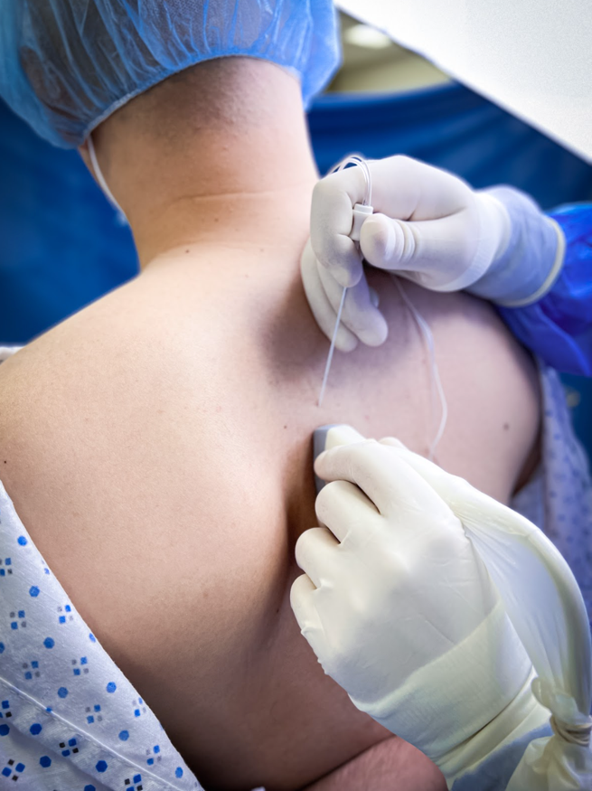
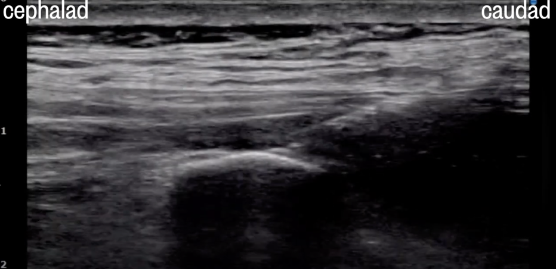

Erector Spinae Plane Block Equipment and Technique    body {font-family: 'Open Sans', sans-serif;}

### Erector Spinae Plane Block Equipment and Technique

Review _“Erector Spinae Plane (ESP) Nerve Block (T5)”_ for other information.  
**  
Equipment and items needed:  
**\- An informed consent, including risks and benefits of the procedure.  
\- Resuscitation and airway equipment should be nearby, including intra-lipids for local anesthetic toxicity.  
\- Standard patient monitoring.  
\- Intravenous access  
\- Sterile gloves and surgical cap, and mask.  
  
**US equipment etc.:  
**\- High-frequency linear transducer (6-13 MHz), mid-frequency linear (5-10 MHz), or low-frequency curved transducer (2-5 MHz).  
\- Sterile probe cover and gel  
\- 50-80mm, 21-22g echogenic non-stimulating needle  
\- 20-30ml of local anesthetic per side (usually 30)  
\- Skin disinfectant  
  
**Local anesthetic:** 0.2% (or 0.25%) or 0.5% bupivacaine or ropivacaine (20 to 30ml)  
Normal saline or D5W syringes for small boluses to initially verify placement.  
  
**Local anesthetic and volume:  
**The ESPB is more of a volume block, as the volume is essential for the spread of LA.  
Adequate volume is required to spread of LA 8 dermatomes (4 levels below and above the injection site).  
  
**Unilateral:** 30 mLs **0.5%** ropivacaine is common.  
**Bilateral:** 30 mLs (each side) of **0.2%** ropivacaine is common (lower concentration).  
  
Due to the high volume of LA used with bilateral blocks, most anesthesia providers use a lower concentration of ropivacaine to avoid local toxicity.  
**Unilateral ESPB block with** **0.5% Ropivacaine** (5 mg/mL) table.tableizer-table { font-size: 12px; border: 1px solid #CCC; font-family: Arial, Helvetica, sans-serif; } .tableizer-table td { padding: 4px; margin: 3px; border: 1px solid #CCC; } .tableizer-table th { background-color: #104E8B; color: #FFF; font-weight: bold; }

| Max dose | 50 kg patient | 70+ kg patient |
| --- | --- | --- |
| 3 mg/kg  
No more than 225 mg or 75 mLs | 30 mLs (150mg) | 30 mLs (150mg) to  
40 mLs (200 mg) |

**Bilateral ESPB block with 0.2% Ropivacaine** (2 mg/mL) table.tableizer-table { font-size: 12px; border: 1px solid #CCC; font-family: Arial, Helvetica, sans-serif; } .tableizer-table td { padding: 4px; margin: 3px; border: 1px solid #CCC; } .tableizer-table th { background-color: #104E8B; color: #FFF; font-weight: bold; }

| Max dose | 50 kg patient | 70+ kg patient |
| --- | --- | --- |
| 3 mg/kg (plain)  
No more than 225 mg or 45 mLs | 30 mLs (60 mg)  
each side | 30 mLs (60 mg) to  
40 mLs (80 mg)  
each side |

  
A peri-procedural “timeout” should be performed to confirm the type of procedure, side, and location of the procedure and to ensure no contraindications.

****

**US probe placement:**  
\- Refer to _“Erector Spinae Plane Block Probe Positioning”_ for details.  
\- Place the US transducer in a cephalocaudal orientation over the midline of the back at the desired level.  
\- The probe should then slowly be moved laterally until the transverse process is visible (about 3 cm).  
\- The transverse process requires differentiation from the rib at that level.  
\- The transverse process will be more superficial and wider, while the rib will be deeper and thinner.  
\- Upon verification of the transverse process, the trapezius muscle, rhomboid major muscle (if performing at T5 level or higher), and erector spinae muscle should be identified as superficial to the transverse process.  
\- The needle should be inserted superior to the ultrasound probe using an in-plane approach in the cephalad to the caudal direction.  
\- The needle bevel should point posteriorly and inferiorly and advance under ultrasound guidance through the trapezius, rhomboid major, and erector spinae muscle and towards the transverse process.  
Once the needle tip is below the erector spinae muscle (ES plane), a small bolus of normal saline or D5W should be given through the needle (using the transverse process as a backstop to verify position.  
  
The erector spinae muscle should be visualized, separating from the transverse process.  
This separation (hydrodissection) from the transverse process confirms the proper needle position.

****

The local anesthetic should then be injected in 5 ml increments, with aspiration after every 5 ml to prevent intravascular injection.  
  
**If using a catheter for continuous infusion:  
**\- After injecting only 0-20 mLs of the local anesthetic solution, the catheter can thread easily into that space.  
\- It is essential to thread 5 to 7 cm of the catheter into the space to avoid inadvertent catheter dislodgement.  
\- The last 10 to 20 cc can then be injected through the catheter after confirming that the catheter is not intravascular.  
\- The ultrasound probe can be moved caudally during injection into the catheter, and the local anesthetic can often spread caudally from the catheter.  
  
**Rate:** 7 mLs/hour for each side  
  

Contributor: Michael MacKinnon DNP, FMP-CRNA,,FAANA  
National University Associate Professor Doctor of Anesthesiology Program  
Edited by Michael Kaminsky, Regional Anesthesiologist  
  
Erector Spinae Plane (ESP) Block  
Regional Anesthesiology and Acute Pain in Medicine (accessed 07/2023)  
https://www.youtube.com/watch?v=O9RB0K7f8pM  
  
Erector Spinae Plane Block (ESPB)  
HighlandUltrasound.com (accessed 07/2023)  
http://highlandultrasound.com/erector  
  
Erector Spinae Plane Block  
StatPealrs (accessed 07/2023)  
Sandeep Krishnan; Marco Cascella.  
https://www.ncbi.nlm.nih.gov/books/NBK545305/  
  
Tips for the Erector Spinae Plane Block  
NYSORA (accessed 07/2023)  
https://www.nysora.com/news/tips-for-the-erector-spinae-plane-block/  
  
Erector Spinae Plane Block  
NYSORA (accessed 07/2023)  
Dr. Hadzic  
https://www.nysora.com/news/erector-spinae-block-esb-explained/  
  
The Erector Spinae Plane Block: A Novel Analgesic Technique in Thoracic Neuropathic Pain.  
Regional Anesthesia & Pain Medicine. 2016 Sep-Oct;41(5):621-7.  
Rero M, Adhikary SD, Lopez H, Tsui C, Chin KJ.