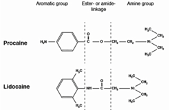

Ester and Amides Local Anesthetics Notes    body {font-family: 'Open Sans', sans-serif;}

### Ester and Amides Local Anesthetics Notes

**Amides differ from esters in four important ways:**  
Chemical  
Structure  
Stability  
Metabolism  
Allergy  
  
**Chemical Structure  
****Esters:** The aromatic ring is bound to a COO group (less stable linkage)  
**Amide:** The aromatic ring is bound to a NH group (more stable linkage)  
Ester links are more prone to hydrolysis than amide links. Esters usually  
have a shorter duration of action.  

****

  
**Stability****Amides** are much more stable than Esters  
The **ester** linkage is more easily broken than the amide bond.  
**Ester** drugs are less stable in solution  
**Esters** generally have a much shorter shelf life and can’t be store as long as **amide**  
**Amides** are heat stable and can be autoclaved  
  
**Metabolism** **(** Slower Hydrolyzation = Toxicity)**Esters local anesthetics:** Are RAPIDLY hydrolyzed (except Tetracaine) in the plasma by the  
enzyme Pseudocholinesterase. Cocaine, an ester, is an exception, as it is metabolized predominantly by the liver.  
The rapid hydrolysis of Esters (except Tetracaine) decreases the risk of maternal toxicity and maternal drug transfer.  
After metabolism, the byproduct of Esters is PABA.  
Tetracaine (also an ester) is hydrolyzed the slowest which makes it 16 times more toxic than Chloroprocaine which is hydrolyzed the fastest.  
  
**Amides local anesthetics:** Are metabolized by liver microsomal enzymes in the liver (cytochrome P450) through N-dealkylation & subsequent hydrolysis and excreted in the urine.Patients with significant liver disease or CHF who have poor hepatic blood flow will have trouble metabolizing amides and other agents. The major metabolite is PPX.  
_Avoid Amide local anesthetics with impaired liver patients._  
  
Half-life of **amide** local anesthetics are generally longer, thus a longer duration.  
Unfortunately, the toxicity is much greater due to their longer duration.  
Metabolism byproducts of amide local anesthetics can possess clinical activity if allowed to accumulate in the bloodAll local anesthetics have the ability to cause sedation.  
  
**The rate of hydrolysis is related to the degree of toxicity.**  
The slower the metabolism (hydrolization), the higher risk of toxicity.  
Meaning that the local anesthetic is still circulating in the blood and can accumulate to toxic levels.  
  
**Allergy** (it is all about PABA)  
**Esters** local anesthetics are metabolized to PABA or PABA derivatives.  
PABA antagonize the action of sulfonamides. PABA is known to produce skin sensitivity reactions.  
PABA is a natural chemical found in the vitamin folic acid and also in several foods, including grains, eggs, milk, and meat.  
In medicine, it’s used to treat some skin conditions, as well as in some cases of arthritis, infertility in women, anemia, rheumatic fever, systemic lupus erythematosus, and even headaches.  
Most manufacturers have phased out the use of PABA because of its tendency to cause allergic reactions.  
  
**Amides:** Amides are NOT broken down to PABA and rarely cause an allergic reaction.  
  
**Amides local anesthetics have two “I”s and Esters only have one**  
  

table.tableizer-table { font-size: 12px; border: 1px solid #CCC; font-family: Arial, Helvetica, sans-serif; } .tableizer-table td { padding: 4px; margin: 3px; border: 1px solid #CCC; } .tableizer-table th { background-color: #104E8B; color: #FFF; font-weight: bold; }

| Amides | Esters |
| --- | --- |
| Lidocaine | Chloroprocaine |
| Bupivacaine | Procaine |
| Ropivacaine | Tetracaine |
| Prilocaine | Cocaine |
| Mepivacaine | Benzocaine |
| Etidocaine |   |
| Dibucaine |   |
| Articaine |  |

  
The spinal fluid contains negligible esterases. So intrathecal injection of ester type LAs usually have a longer duration of action.

Pharmacology of Local Anesthetics 2005 Donald H. Lamberthttp://debunk-it.org/Don%20Lambert's%20Presentations/Pharmacology\_Syllabus\_2005.pdf  
  
Tuckley JM. Pharmacology of local anesthetic agents. Update in Anesthesia 1994; 4: 19-24 Available at: www.world-anaesthesia.org  
  
Principles and Practice of Pharmacology for Anesthetists: Calvey and Williams Pharmacology for Anesthesia and Intensive Care:  
Peck, Hill and Williams Lagan G, McClure HA.  
Review of local anesthetic agents. Current Anesthesia & Critical Care 2004 15: 247-254 Handbook of Local Anesthesia. Malamed, Stanley. 5 th Edition. 2004 “www.mhaus.org”