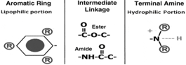
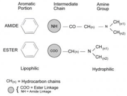
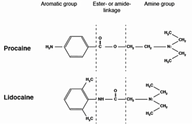

Ester vs Amine – Difference in Chemical Structure    body {font-family: 'Open Sans', sans-serif;}

### Ester vs Amine – Difference in Chemical Structure

Local anesthetics consist of an aromatic ring (seen on the left below) and an amine (right), separated by a hydrocarbon chain.  
  
As you already know, all local anesthetics have a unionized lipophilic (lipid-soluble hydrophobic) aromatic ring on the left (below).  
  
On the opposite end on the right it has a charged (ionized), hydrophilic amine group.  
  
It is the lipophilic end of the local anesthetics that diffuses the nerve cell. The more lipophilic, the faster the onset. Local anesthetics are weak bases - partly **ionized** with acids and the **unionized** part is lipophilic.  
  
The lipophilic part (unionized) helps the LA to penetrate into nerve membrane. It then must become **ionized (charged)** to bind to the Na channel receptor site.  
  
The two are connected (linked) to each other by an intermediate hydrocarbon chain. The bond between the aromatic ring and the hydrophilic group determines if the local anesthetic is either an Ester or Amide. It’s all about the intermediate chain.  
  
_It is easier to look for an “NH” next to the aromatic ring on the left.  
NH tells you the local anesthetic is an “Amide.”_ The Ester has the COO or C=O  
  
**Note the four images**

****

****

****

****

**Strichartz GR: Structural elements which determine local anesthetic activity, Local Anesthetics.  
Edited by Strichartz GR. Berlin, Springer-Verlag, 1987, pp 292**