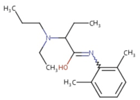

Etidocaine (Duranest)    body {font-family: 'Open Sans', sans-serif;}

### Etidocaine (Duranest)

**Amide** \- type local anesthetic  
**pKA:** 7.7  
**Relative Potency (CNS Toxicity):** 2 out of 4  
Etidocaine is not as popular anymore due to its profound motor block compared to sensory block. Profound motor blocks noted epidurals, thus not used in OB Chemically related to lidocaine.  
Similar onset as lidocaine with a longer duration.  
  
**Motor and sensory block onset:** Rapid, 3-5 minutes  
**Duration:** 1.5-2 times longer than lidocaine via epidural route.**Duration:** Peripheral nerve blocks may last up to 12 hours.Great for cases during which the surgeon requires muscle relaxation.  
  
**Etidocaine**

table.tableizer-table { font-size: 12px; border: 1px solid #CCC; font-family: Arial, Helvetica, sans-serif; } .tableizer-table td { padding: 4px; margin: 3px; border: 1px solid #CCC; } .tableizer-table th { background-color: #104E8B; color: #FFF; font-weight: bold; }

| Route | Conc | Onset | Duration | Max Doses |
| --- | --- | --- | --- | --- |
| Infiltration | 0.5% | Fast | 1-4 hours | Plain: 2.5 mg/kg or no more than 300 mg  
with epi: 4 mg/kg or no more than 400 mg |
| Epidural | 1-1.5% | Fast | 2-4 hours | Plain: 2.5 mg/kg or no more than 300 mg  
with epi: 4 mg/kg or no more than 400 mg |
| Spinal | N/A | N/A | N/A | N/A |
| Peripheral Block | 0.5-1% | Fast | 3-12 hours | Plain: 2.5 mg/kg or no more than 300 mg  
with epi: 4 mg/kg or no more than 400 mg |

Pocket Anesthesia ; 3 rd ed. 2017. Pp 2D-22. R. Urman, J. Ehrenfeld

****

  
  
**Mechanism of action:** Like other local anesthetics, it binds to the intracellular portion of sodium channels and, by blocking sodium influx into nerve cells, prevents depolarization.  
  
**Metabolized:** Liver  
**Excretion:** Kidney-metabolites unchanged in urine  
The percent of dose excreted as unchanged drug is less than 10%  
**Metabolites:** 20 metabolites of etidocaine have been found in the urine.  
Renal dysfunction may not affect etidocaine kinetics but may increase the accumulation of metabolites.  
  
**Half-Life:** following an IV bolus is about 2.5 hours.  
  
**Epidural: Etidocaine and epi** The intensity of motor and sensory block was markedly influenced by epinephrine, although duration of action was less affected. Etidocaine has a long duration of activity, but has the main disadvantage of increased bleeding during oral surgery.  
  
**Contraindications of etidocaine and other amide local anesthetics:  
**Patient allergy to etidocainePatients taking antidepressants  
  
**Liver failure** \- etidocaine is an amide. Amide local anesthetics are metabolized by liver microsomal enzymes in the liver (cytochrome P450), through N-dealkylation & subsequent hydrolysis, and excreted in the urine.  
  
Patients taking MAO inhibitors – possible fatal drug interactions  
  
**MAO Inhibitors:  
**

-   Methylene Blue
-   Isocarboxazid
-   Linezolid
-   Moclobemide
-   Phenelzine
-   Procarbazine
-   Rasagiline
-   Selegiline
-   Tranylcypromine

**Etidocaine is an amide, NOT an ester.** Amides are NOT broken down to PABA and rarely cause an allergic reaction. Thus, PABA allergy is not a threat during the use of etidocaine.  

Pocket Anesthesia; 3 rd ed. 2017  
Urman, R; Ehrenfeld, J.  
  
RxList  
http://www.rxlist.com/duranest-drug.htm  
  
DrugBank  
https://www.drugbank.ca/drugs/DB08987  
  
Neural Blockade in Clinical Anesthesia and Management of Pain, Volume 494. P.123 Michael J. Cousins, Phillip O.   
  
Chestnut, David.(2014) Chestnut’s Obstetric Anesthesia Principles and Practice.  
  
**Chapter 45. Pharmacology of Local Anesthetics  
**Anesthesiology. 2nd ed. New York: McGraw-Hill; 2012  
  
Heavner JE. Longnecker DE, Newman MF, Brown DL, Zapol WM, 2nd ed. New York: McGraw-Hill; 2012.