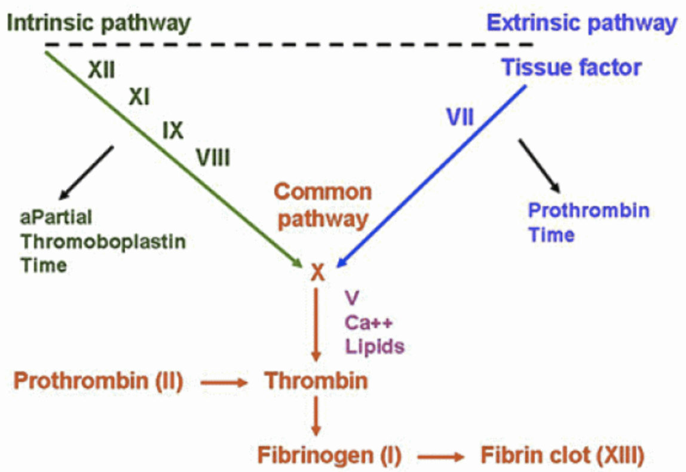
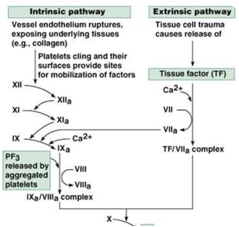

Extrinsic Pathway    body {font-family: 'Open Sans', sans-serif;}

### Extrinsic Pathway (Tissue Factor Pathway)

In the past, it was believed that the intrinsic and extrinsic pathways were parallel to each other and played an equal role in the coagulation process. It is now believed that the extrinsic pathway is more dominant, acting as the “spark” that kick-starts the coagulation process.  

****

  
Both the intrinsic and extrinsic pathways end at factor X, which is the start of the **_common pathway._**  
  
**Initiation of the intrinsic pathway (starts with tissue factor).**  
**Tissue factor (clotting factor III).  
  
Role of TF:** When released from damaged tissue, it initiates the extrinsic pathway with cofactor VII.  
  
Tissue factor (TF) is found on the outside of blood vessels and is not exposed to the bloodstream.  
  
Present in all tissues, but present in highest amounts in the lungs, brain and placenta.  
  
TF synthesis appears to occur in the subendothelial cells.  
  
TF becomes activated by external trauma that causes blood to escape from the vascular system.  
  
TF then combines with factor VII to form “VIIa tissue factor complex” and with the help of calcium, factor X is activated starting the common pathway.  
  
The greater the amount of damage, the more TF is released.  
  
**The extrinsic pathway:** factor III → factor VII → factor X.  
  
Since calcium is needed to assist in the activation of factor X, some illustrations include factor IV (Ca).  

****

  
**Note:** VIIa-tissue factor complex can quickly be inactivated by antithrombin III.  

Leung, L. K. (2015). _Overview of hemostasis._  
https://www.uptodate.com/contents/overview-of-hemostasis  
  
Hematology Made Easy, 2013.  
By Erhabor, Adias  
Guyton and Hall Medical Physiology; 2013.