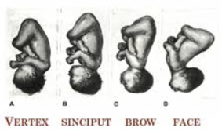

Face Presentations    body {font-family: 'Open Sans', sans-serif;}

### Face Presentations

****

With Face Presentation, the chin is directly posterior. Vaginal delivery is impossible unless the chin rotates anteriorly.  
  
**Face Presentations and Labor**  
Face presentation generally takes longer since the face dilates the cervix poorly-increasing the risk of C-section due to “failure to progress” or “cephalo-pelvic disproportion.”  
  
**It is very uncomfortable for the mom  
**The mom generally experiences greater discomfort and may receive more extensive lacerations despite proper prevention.  
If you combine a face presentation with an anterior back so that the chin is actually mom's tailbone) "mentum posterior" vaginal delivery becomes almost IMPOSSIBLE and damage to mom and baby from a vaginal birth is almost "guaranteed".  
  
Normally, the position of a fetus is facing rearward (toward the woman’s back) with the face and body angled to one side and the neck flexed, and presentation is head first.  
  
An abnormal position is facing forward, and abnormal presentations include face, brow, breech, and shoulder.  
  
The diameters of the head in a face presentation are NOT "just as favorable as for a normal presentation."  
  
**There are dangers to facial presentation:**  
Facial edema  
Bruising  
Edema of the larynx leading to respiratory difficulty  
Hyperextension injuries to the neck and spine (similar to whiplash and neck fractures!).

Duff, P (1981). "Diagnosis and Management of Face Presentation". Obstet Gynecol. 57 (1): 105–12.