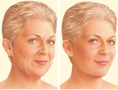
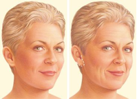
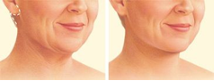

Facelift (Rhytidectomy)    body {font-family: 'Open Sans', sans-serif;}

### Facelift (Rhytidectomy)

Facelifts are usually performed to treat facial wrinkles or sagging caused by aging. The procedure removes excess skin, tightens underlying tissues and muscles. The skin is then re-draped over underlying tissue on the neck and face. A facelift is considered the “gold standard” for facial rejuvenation.  
  
**Facelift choices include:**  
Traditional facelift  
Limited incision facelift  
Neck lift  
  
**A traditional facelift  
**Incision often begins in the hairline at the temples, continues around the ear and ends in the lower scalp. Fat may be sculpted or redistributed from the face, jowls and neck. Underlying tissue is repositioned, commonly the deeper layers of the face and the muscles are also lifted. Skin is re-draped over the uplifted contours and excess skin is trimmed away.  
  
A second incision under the chin may be necessary to further improve an aging neck. Sutures or skin adhesives close the incisions.  

****

  
**Limited Incision (Mini-lifts)  
**An alternative to a traditional facelift uses shorter incisions at the temples, continuing around the ear. These lifts are usually reserved for patients with less skin relaxation, as the results are less rejuvenating than a full facelift.  

****

  
**Neck Lift**  
A neck lift addresses the sagging jowls, loose neck skin and fat accumulation under the chin. The neck lift incision often begins in front of the ear lobe and wraps around behind the ear and ends in the posterior hair behind the ear.  

****

  
**Drugs that affect coagulation must be avoided**  
Some plastic surgeons will postpone a procedure if any of these drugs that alter proper coagulation are still in the patient’s circulation.
Aspirin, or any product containing aspirin, should not be taken within 10 days of the date of surgery.  
  
Non-steroidal anti- inflammatory drugs (NSAIDs) such as ibuprofen (Advil®, Motrin®) or naproxen (Naprosyn®) should not be taken within 7 days of the date of surgery.
  
  
Many over-the-counter products contain aspirin or NSAIDS. Thus, review of prescribed and over-the-counter medications should be thorough.  
  
Acetaminophen (Tylenol®) is an acceptable analgesic.  
  
Most facelifts are performed using infiltration of local anesthetic to the chin, neck, and cheeks. The use of local anesthetic decreases the need for narcotics.  
  
**Anesthesia: General/ETT**  
Intubation is strongly recommended to secure the airway. Suturing the endotracheal tube to the teeth allows the tube to remain secure and the face to remain free to be surgically prepped. Stability of the endotracheal tube is essential to prevent displacement during the frequent position changes during the procedure.  
  
Flexible adaptors and couplers between the breathing circuit and the endotracheal tube are helpful in preventing disconnection or dislplacement during manipulation of the surgical field.  
  
Monitored anesthetic care with sedation is possible, but patient selection must be carefully done. Adequate local anesthetic must be used.  
  
**Narcotic:** If local anesthetic is adequate, limited narcotic is needed. 100 mcg of fentanyl is the maximum required.  
  
**Hypotension:** can be common once local anesthesia is established due to the decreased amount of stimulation.  
The use of ephedrine 25 mg IM at induction can limit hypotension.  
  
**Avoid hypertension:** The goal is to minimize bleeding but to maintain BP within 20% of baseline.  
Inhalation agent is titrated to limit hypertension.
  
A beta blocker may be necessary during emergence to limit post-operative bleeding secondary to hypertension.
  
**Antiemetic:** Required; any major nausea and vomiting (PONV) in the immediate postoperative period may result in aspiration of gastric contents as well as post-operative hematoma.  
  
**Antisialagogue:** Required; glycopyrrolate is recommended.  
**Fluids:** LR maintenance should be sufficient as there is limited blood loss during the case. **Duration:** 3-6 hours depending on whether the facelift is combined with eyes and eyebrows. **Position:** Supine with HOB up 10-20 degrees or reverse Trendelenburg.
  
Bed may be rotated 90 degrees. Patient’s arm will be tucked on the side where the surgeon prefers to be.
  
**ELB:** minimal-40 ml
  
**Emergence:** Either a deep or awake extubation depending on the patient’s airway. If an awake extubation is preferred, then it is important to limit hypertension which can lead to post-operative bleeding and hematoma.  
  
**Possible Complications:**  
**Neck hematoma:** 3-8%  
Major neck hematoma/swelling may compromise the airway 12-24 hours postoperatively.  
The patient is returned to the operating room if a hematoma is discovered because further delay places the flaps at risk, and an expanding hematoma can compromise the patient’s airway if not managed immediately. The incision is opened, clots evacuated, bleeding controlled, and the incisions closed over an active drain. Early and prompt intervention reduces the risk of further vascular compromise to an already compromised flap.  
  
Bleeding.  
Anesthesia risks.  
Infection  
Poor wound healing and skin loss.  
Facial nerve injury with weakness: 0.7-2.5%.  
Temporary or permanent hair loss at the incisions.  
Fluid accumulation.  
Numbness or other changes in skin sensation.  
Persistent pain.  
Parotid duct injury.  
Unfavorable scarring.  
Auricular nerve and jugular vein injury.  
Spinal accessory nerve injury if dissection was too deep.  
Skin irregularities and discoloration.  
Sutures may spontaneously surface through the skin, become visible or produce irritation. Removal may be required. Unsatisfactory results may include: asymmetry, unsatisfactory surgical scar location and unacceptable visible deformities at the ends of the incisions. (It may be necessary to perform an additional surgery to improve results).  
Deep vein thrombosis, cardiac and pulmonary complications.  

Facelift Surgery  
American Society of Plastic Surgery  
https://www.plasticsurgery.org/cosmetic-procedures/facelift/safety  
  
Complications in Facelift Surgery: Avoidance and Management  
Richard A.K. Chaffoo, MD, FACS,  
http://www.facialplastic.theclinics.com/article/S1064-7406(13)00096-5/pdf