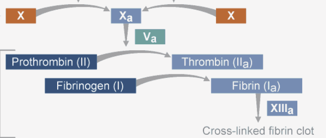

Factor I    body {font-family: 'Open Sans', sans-serif;}

### Factor I (Fibrinogen)

Fibrinogen (factor I) is converted to fibrin (factor Ia) by thrombin (factor IIa).  
Fibrin then forms a mesh around the wound ultimately leading to blood clot (fibrin clot).  
Fibrinogen > thrombin > fibrin monomers >fibrin clot.

****

Fibrinogen can form bridges between platelets, by binding to their GpIIb/IIIa surface membrane proteins; however, its major function is as the precursor to fibrin.  
  
**Pathway:** Both intrinsic and extrinsic (common pathway).  
**Active form:** Fibrin subunit (Ia)  
**Source:** Liver  
**Function:** Clot formation-fibrin  
  
**Associated genetic disorders with** **factor I (Fibrinogen)**  
Afibrinogenemia (complete lack of fibrinogen).  
Hypofibrinogenemia (reduced levels of fibrinogen).  
Hyperfibrinogenemia (dysfunctional fibrinogen).  
Familial renal amyloidosis.  
These individuals suffer from thromboembolism.  
_The gene for factor I is located on the fourth chromosome._  
  
_**More Notes**__  
Large stable molecule globulin protein (molecular weight. 341,000).  
When fibrinogen is exposed to thrombin, two peptides split from the fibrinogen molecule, leaving a fibrin monomer. These monomers aggregate together to form the final polymerized fibrin clot product._  

**Blood: Principles and Practice of Hematology, Volume 1, 1995. Pp 972  
**edited by Robert I. Handin, Samuel E. Lux  
  
Proteins involved in Blood Coagulation  
ClotBase-Knowledge on Blood Coagulation  
http://www.clotbase.bicnirrh.res.in/flow\_ln.php  
  
Pallister CJ, Watson MS (2010). _Haematology_ . Scion Publishing. pp. 336–347.  
  
Medical Physiology-Principals of Clinical Medicine, 2013  
By Rodney A. Rhoades, David R. Bell