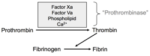
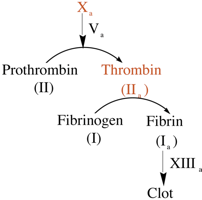
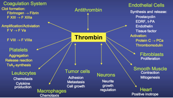

Factor II    body {font-family: 'Open Sans', sans-serif;}

### Factor II (Prothrombin)

**Other names:** Stable factor and serum prothrombin conversion accelerator (SPCA)  
**Prothrombin** is converted into **thrombin** via the “prothrombinase complex.” The complex exists of: factor X, factor V, phospholipid and Ca.

****

  
Some literature does not go into detail and merely mentions factor Xa and cofactor factor Va in the conversion of prothrombin to thrombin.

****

When prothrombin is converted to thrombin, it is activated and now called **Factor IIa.**  
**Thrombin** then acts to transform fibrinogen into fibrin, which, in combination with platelets and forms a fibrin **clot.**  
  
**Pathway:** Extrinsic  
**Source:** Liver  
A vitamin K dependent clotting factor affected by warfarin.  
  
**Half-life:** 42-60 hours.  
**Associated genetic disorders:** prothrombin G20210A and thrombophila.  
  
**Factor IIa is “activated” thrombin.**  
  
As shown below, thrombin has many roles. For purposes of this topic, thrombin helps convert fibrinogen to fibrin.

****

“Coagulation Made Simple” by Thomas Whitehill, MD,  
  
Individuals with prothrombin deficiency have hemorrhagic diatheses.  
Patients may also suffer from dysprothrombinemia or hypoprothrombinemia.  
Female patients may suffer from menorrhagia  
_The gene for thrombin is located on the eleventh chromosome (11p11-q12)._  
  
**More Notes**  
A stable protein with molecular weight of 63,000.  
Has a 70% consumption during clotting.  

**Blood: Principles and Practice of Hematology, Volume 1, 1995. Pp 972  
**edited by Robert I. Handin, Samuel E. Lux  
  
Proteins involved in Blood Coagulation  
ClotBase-Knowledge on Blood Coagulation  
http://www.clotbase.bicnirrh.res.in/flow\_ln.php  
  
Pallister CJ, Watson MS (2010). _Haematology_ . Scion Publishing. pp. 336–347.  
  
Medical Physiology-Principals of Clinical Medicine, 2013  
By Rodney A. Rhoades, David R. Bell  
  
“Coagulation Made Simple” by Thomas Whitehill, MD  
http://www.ucdenver.edu/academics/colleges/medicalschool/departments/surgery/education/GrandRounds/Documents/GRpdfs/2007-2008/3-17-08%20Whitehill.pdf  
  
Clinical Hematology: Theory and Procedures  
By Mary Louise Turgeon; 2005; pp. 351