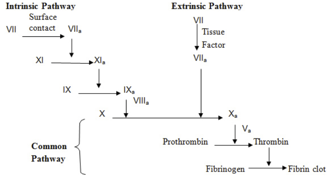

Factor III    body {font-family: 'Open Sans', sans-serif;}

### Factor III (Tissue factor, TF, tissue thromboplastin)

**Other names:** platelet tissue factor, tissue thromboplastin, CD142).  
  
**Role:** When released from damage tissue, it initiates the extrinsic pathway with cofactor VII.  
  
It is found on the outside of blood vessels and is not exposed to the bloodstream.  
Present in all tissues, but present in highest amounts in the lungs, brain and placenta.  
TF synthesis appears to occur in the subendothelial cells.  
  
Released from damaged tissue and essential for activating factor VII to VIIa, which initiates the EXTRINSIC pathway.  
  
Factor VIIa then helps activate (convert) factor X (now Xa) so Xa can help activate (convert) prothrombin (factor II) to thrombin (factor IIA).  
**Note:** Thombin (factor IIa) is simply prothrombin (factor II) in the activated state **–** owing to IIa.

****

**Pathway: Extrinsic**  
**Role:** Activate factor VII (to VIIa), so VIIa can activate factor X (to Xa), so Xa can activate (convert) factor II (prothrombin) to factor IIa (thrombin). This creates a burst of thrombin.  
_The gene for tissue factor is located on the first chromosome._  
  
Factor X is the “Stuart-Power factor.”  
  

Blood: Principles and Practice of Hematology, Volume 1, 1995, Pp 972  
edited by Robert I. Handin, Samuel E. Lux  
  
Proteins involved in Blood Coagulation  
ClotBase-Knowledge on Blood Coagulation  
http://www.clotbase.bicnirrh.res.in/flow\_ln.php  
  
Pallister CJ, Watson MS (2010). _Haematology_ . Scion Publishing. pp. 336–347.  
  
Medical Physiology-Principals of Clinical Medicine, 2013  
By Rodney A. Rhoades, David R. Bell  
  
Clinical Hematology: Theory and Procedures  
By Mary Louise Turgeon; 2005; pp. 351