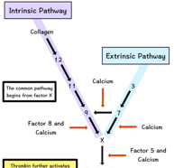

Factor IV    body {font-family: 'Open Sans', sans-serif;}

### Factor IV (Calcium: Ionized calcium)

Required for coagulation factors to bind to phospholipids (formally known as factor IV)  
It is both intrinsic and extrinsic (common pathway).  
  
**Source:** Bone, GI tract from food consumption.  
Clotting factors II, VII, IX, and X require calcium ion to work enzymatically.  
Only small amounts of Ca are need for coagulation.  
A calcium deficiency would NOT be expressed as a coagulation dysfunction, except in cases of massive transfusion.  
  

****

  

Clinical Hematology: Theory and Procedures  
By Mary Louise Turgeon; 2005; pp. 351  
  
Blood: Principles and Practice of Hematology, Volume 1, 1995, Pp 972  
edited by Robert I. Handin, Samuel E. Lux  
  
Proteins involved in Blood Coagulation  
ClotBase-Knowledge on Blood Coagulation  
http://www.clotbase.bicnirrh.res.in/flow\_ln.php  
  
Pallister CJ, Watson MS (2010). _Haematology_ . Scion Publishing. pp. 336–347.  
  
Medical Physiology-Principals of Clinical Medicine, 2013  
By Rodney A. Rhoades, David R. Bell  
  
Clinical Hematology: Theory and Procedures  
By Mary Louise Turgeon; 2005; pp. 351  
  
Medical Biochemistry, 2017  
By Gustavo Blanco, Antonio Blanco <  
  
“Coagulation Made Simple” by Thomas Whitehill, MD  
http://www.ucdenver.edu/academics/colleges/medicalschool/departments/surgery/education/GrandRounds/Documents/GRpdfs/2007-2008/3-17-08%20Whitehill.pdf