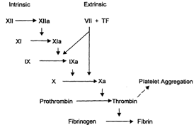

Factor IX    body {font-family: 'Open Sans', sans-serif;}

### Factor IX (Christmas Factor)

**Also called:** Platelet thromboplastin component (PTC); antihemophilic factor B.  
**Function:** It activates factor X with the help of factor VIIIa in the INTRINSIC pathway in the presence of Ca.

****

**Pathway:** Intrinsic  
Vitamin K dependent.  
**Source:** Liver  
**Half-life:** 21-30 hours.  
  
It is absent or inactive in the congenital disorder hemophilia B (Christmas disease).  
**Treatment:** Factor IX concentrate.  
  
Hemarthrosis, circumcisional bleeds, hematomas and intracranial bleeds with deficiency.  
Although the clinical symptoms of hemophilia A and B are similar, hemophilia B is less severe than hemophilia A.  
  
High antigen or activity levels of factor IX are associated with an increased risk of thromboembolism.  
_The gene for factor IX is located on the X chromosome (Xq27.1-q27.2)._  

Clinical Hematology: Theory and Procedures  
By Mary Louise Turgeon; 2005  
  
**Blood: Principles and Practice of Hematology, Volume 1, 1995  
**edited by Robert I. Handin, Samuel E. Lux  
  
Proteins involved in Blood Coagulation  
ClotBase-Knowledge on Blood Coagulation  
http://www.clotbase.bicnirrh.res.in/flow\_ln.php  
  
Pallister CJ, Watson MS (2010). _Haematology_ . Scion Publishing.  
  
Medical Physiology-Principals of Clinical Medicine, 2013  
By Rodney A. Rhoades, David R. Bell  
  
Clinical Hematology: Theory and Procedures  
By Mary Louise Turgeon; 2005