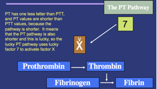

Factor VII    body {font-family: 'Open Sans', sans-serif;}

### Factor VII (Proconvertin, Serum Prothrombin Conversion Accelerator)

**Activates factors IX and X -** Initiates coagulation by activating factor IX (in the intrinsic pathway) and factor X (onset of common pathway) simultaneously with tissue factor in the extrinsic pathway.  
  
**Source:** Liver.  
Vitamin K dependent.  
  
**Pathway:** Extrinsic.  
  
**Half-life:** 4-6 hours.  
_Has the shortest half-life and is depleted first, within 2 days in vitamin K deficiency or liver disease._ However, Factor VII is in the extrinsic pathway and inhibition does NOT provide effective anticoagulation despite causing early INR elevation. (Managing Anticoagulated Patients in the Hospital. P.134).  
Other Vitamin K dependent factors take 3-10 days to be depleted. (Hematology and Practice, p.268).  
  
**Activated by:** Factor III (tissue factor).  
  
Acting with factor III to activate factor X which works with other factors to convert prothrombin into thrombin.  
Deficiency either hereditary or acquired (vitamin k deficiency).  
Deficiency may lead to epistaxis, menorrhagia, hematomas, hemarthrosis, digestive tract or cerebral hemorrhages.  
Deficiency of Factor VII prolongs PT but NOT PTT.

****

  
Factor VII is in the extrinsic pathway and affects PT and NOT “PTT” (PTT represents the Intrinsic pathway).  
_The gene for factor VII is located on the thirteenth chromosome (13q34-qter)._  

Clinical Hematology: Theory and Procedures  
By Mary Louise Turgeon; 2005; pp. 351  
  
Coag Made Easy  
By Dr. Alice Ma  
UNC Chapel Hill, 2004  
  
**Blood: Principles and Practice of Hematology, Volume 1, 1995, Pp 972  
**edited by Robert I. Handin, Samuel E. Lux  
  
Proteins involved in Blood Coagulation  
ClotBase-Knowledge on Blood Coagulation  
http://www.clotbase.bicnirrh.res.in/flow\_ln.php  
  
Pallister CJ, Watson MS (2010). _Haematology_ . Scion Publishing. pp. 336–347.  
  
  
Medical Physiology-Principals of Clinical Medicine, 2013  
By Rodney A. Rhoades, David R. Bell  
  
Clinical Hematology: Theory and Procedures  
By Mary Louise Turgeon; 2005; pp. 351  
  
Medical Biochemistry, 2017  
By Gustavo Blanco, Antonio Blanco  
“Coagulation Made Simple” by Thomas Whitehill, MD  
http://www.ucdenver.edu/academics/colleges/medicalschool/departments/surgery/education/GrandRounds/Documents/GRpdfs/2007-2008/3-17-08%20Whitehill.pdf