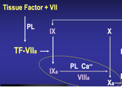

Factor VIII    body {font-family: 'Open Sans', sans-serif;}

### Factor VIII (Antihemophilic Factor-AHF)

(Anti-hemoplytic factor or globulin (AHG) or antihemophilic factor A)  
Activates Factor X.  
When activated (factor VIIIa), is a cofactor with factor IXa to activate factor X to FXa.  
Factor VIIIa and cofactor IXa require presence of Ca and phospholipids to activate factor X.

****

  
Factor VIIIa and cofactor IXa require presence of Ca and phospholipids to activate factor X.  
Factor VIII circulates in the bloodstream in an inactive form, bound to von Willebrand factor, until an injury that damages blood vessels occurs. In response to injury, factor VIII is activated and separates from von Willebrand factor.  
  
**Source:** Liver.  
**Pathway:** Intrinsic.  
**Activated by:** Thrombin.  
**Actions:** Acts as a cofactor with Factor IX and calcium to activate factor X.  
  
**Deficiency:** Hemophilia A (classic hemophilia).  
Mutations in the factor VIII gene results in hemophilia.  
Hemophilia A is an X-linked recessive coagulation disorder.  
It is the most common type of hemophilia.  
Patients suffer from clinical manifestations in their early childhood; spontaneous and traumatic bleeds continue throughout their life: hemarthrosis, circumcisional bleeds, hematomas and intracranial bleeds.  
  
_The gene for factor VIII is located on the long arm of X chromosome (Xq28)._  
  
_**Factor VIII Replacement  
**__50 units/kg increases factor VIII by 80-100%.  
Doses are usually Q 12h hours because factor 8 has a short half-life of 8-12 hours.  
Factor VIII can be derived from human plasma or recombinant.  
Mild hemophilia can be treated with desmopressin._  
Intravenous or intranasal administration of desmopressin to healthy individuals is followed by a rise in levels of both VWF and thus FVIII.  

Clinical Hematology: Theory and Procedures  
By Mary Louise Turgeon; 2005; pp. 351  
  
Coag Made Easy  
By Dr. Alice Ma  
UNC Chapel Hill, 2004  
  
**Blood: Principles and Practice of Hematology, Volume 1, 1995  
**edited by Robert I. Handin, Samuel E. Lux  
  
Proteins involved in Blood Coagulation  
ClotBase-Knowledge on Blood Coagulation  
http://www.clotbase.bicnirrh.res.in/flow\_ln.php  
  
Medical Physiology-Principals of Clinical Medicine, 2013  
By Rodney A. Rhoades, David R. Bell  
  
Clinical Hematology: Theory and Procedures  
By Mary Louise Turgeon; 2005; pp. 351  
  
Medical Biochemistry, 2017  
By Gustavo Blanco, Antonio Blanco  
“Coagulation Made Simple” by Thomas Whitehill, MD  
http://www.ucdenver.edu/academics/colleges/medicalschool/departments/surgery/education/GrandRounds/Documents/GRpdfs/2007-2008/3-17-08%20Whitehill.pdf