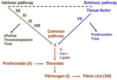

Factor X    body {font-family: 'Open Sans', sans-serif;}

### Factor X (Stuart-Prower-Factor; Stuart Factor or Prothrombinase)

Factor X is where the intrinsic and extrinsic pathways join to form the “common pathway.”  
Any drug that inhibits the common pathway will affect both PT and aPTT.

****

  
Activates factor II (prothrombin) to factor IIa and with the help of factor V (cofactor), it forms prothrombinase complex.

****

  
Prothrombinase catalyzes the conversion of prothrombin (Factor II), which is inactive, to active thrombin (Factor IIa).  
Vitamin K dependent.  
  
**Pathway:** It is both intrinsic and extrinsic (common pathway).  
**Half-life:** 40–45 hours.  
**Activated by:** Factors VIIa, VIIIa and IXa.  
**Factor Xa is inactivated by:** protein Z-dependent protease inhibitor (ZPI).  
The affinity for factor Xa is increased 1,000-fold by the presence of protein Z, while it does not require protein Z for inactivation of factor XI.  
Defects in protein Z lead to increased factor Xa activity and a propensity for thrombosis.  
  
**Pathway:** It is both intrinsic and extrinsic. It is the first member of the _final common pathway_ or _thrombin pathway_  
  
Its deficiency may cause bleeding diathesis and hemorrhages. Patients commonly suffer from epistaxis, gastrointestinal bleeds and hemarthrosis.  
_The gene for factor XI is located on the distal end on the long arm of fourth_ _chromosome (4q35)._  

Clinical Hematology: Theory and Procedures  
By Mary Louise Turgeon; 2005  
  
Coag Made Easy  
By Dr. Alice Ma  
UNC Chapel Hill, 2004  
  
**Blood: Principles and Practice of Hematology, Volume 1, 1995  
**edited by Robert I. Handin, Samuel E. Lux  
  
Proteins involved in Blood Coagulation  
ClotBase-Knowledge on Blood Coagulation  
http://www.clotbase.bicnirrh.res.in/flow\_ln.php  
  
Pallister CJ, Watson MS (2010). _Haematology_ . Scion Publishing.  
  
Medical Physiology-Principals of Clinical Medicine, 2013  
By Rodney A. Rhoades, David R. Bell  
  
Clinical Hematology: Theory and Procedures  
By Mary Louise Turgeon; 2005.  
  
Medical Biochemistry, 2017  
By Gustavo Blanco, Antonio Blanco  
  
“Coagulation Made Simple” by Thomas Whitehill, MD  
http://www.ucdenver.edu/academics/colleges/medicalschool/departments/surgery/education/GrandRounds/Documents/GRpdfs/2007-2008/3-17-08%20Whitehill.pdf