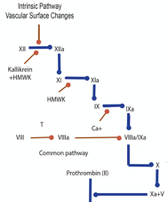

Factor XI    body {font-family: 'Open Sans', sans-serif;}

### Factor XI (Plasmathromboplastin Antecedent-PTA, Antihemophilic C)

**Function:** Activates factor IX in the intrinsic pathway.  
Factor XIa activates Factor IX to IXa. <

****

  
Deficiency results in hemophilia C.  
**Source:** Liver  
**Pathway:** Intrinsic  
**Half-life:** 52 hours  
**Activated into XIa by:** XIIa (Hageman factor), thrombin (IIa) XIIIa (fibrin-stabilizing factor)  
and FXIa itself; due to its activation by FXIIa.  
  
**Inhibitor of Factor XI:** Protein Z  
Factor XI is a member of the "contact pathway," which includes high molecular weight kininogen (HMWK or Fitzgerald factor), prekallikrein, factor XII, factor XI, and factor IX.  
  
**Deficiency of factor XI:** hemophilia C (rare).  
Mainly occurs in Ashkenazi Jews and is believed to affect approximately 8% of that population.  
Less commonly, hemophilia C can be found in Jews of Iraqi ancestry and in Israeli Arabs.  
The condition has been described in other populations at around 1% of cases.  
It is an autosomal recessive disorder.  
There is little spontaneous bleeding, but surgical procedures may cause excessive blood loss, and prophylaxis is required.  

Clinical Hematology: Theory and Procedures  
By Mary Louise Turgeon; 2005  
  
Coag Made Easy  
By Dr. Alice Ma  
UNC Chapel Hill, 2004  
  
**Blood: Principles and Practice of Hematology, Volume 1, 1995  
**edited by Robert I. Handin, Samuel E. Lux