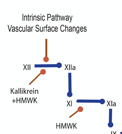
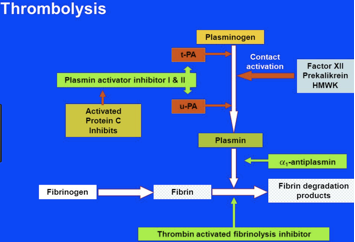

Factor XII    body {font-family: 'Open Sans', sans-serif;}

### Factor XII (Hageman factor, Contact Factor)

Review Intrinsic pathway: XII, XI, IX then VIII.  
**Function:** Activates Factor XI and initiates INTRINSIC pathway.

****

  
**Also:** Involved in converting plasminogen to plasmin in fibrinolysis with the help of high molecular weight kininogen (HMWK) and prekallikrein (PK.)

****

Also used during in vitro (coagulation lab testing); it initiates the clotting process.  
  
**Blood trauma causes:**

1.  Activates Factor XII.
2.  Release of platelet phospholipids (containing platelet factor 3)  
    Activated Factor XII requires kallikrein and HMWK to activate Factor XI.

**Origin:** Liver  
  
During contact activation, it is converted.  
It is measured indirectly by the measurement of kallikrein activity.  
Variability in ethnic backgrounds.  
  
**Factor XII deficiency**  
Low levels of FXII may be associated with increased predilection to thrombosis and CAD.  
Decreased in neonates and do not reach adult levels until 2 weeks of age.  
Found to be decreased in septic shock, type II hyperlipoproteinemia and severe liver disease.  
Deficiency prolongs PTT and PTT.  
  
Factor XII deficiency was first described in the medical literature in 1955 by doctors Oscar Ratnoff and Jane Colopy in a patient named John Hageman. The disorder is sometimes known as Hageman factor deficiency or Hageman trait.  
  
Factor XII deficiency is inherited as an autosomal recessive disorder.  
  
Factor XII deficiency affects persons of Asian descent more often than individuals of other ethnicities.  
  
**Incident of disorder:** 1 in 1 million.  
**Pathway:** Intrinsic.  

Thrombosis and Hemorrhage, pp 376  
edited by Joseph Loscalzo, Andrew I. Schafer  
  
Bradykinin, Kallidin and Kallikrein. Pp 90  
By Ervin G. Erdös, Anne F. Wilde  
  
Clinical Hematology: Theory and Procedures  
By Mary Louise Turgeon; 2005  
  
Coag Made Easy  
By Dr. Alice Ma  
UNC Chapel Hill, 2004  
  
**Blood: Principles and Practice of Hematology, Volume 1, 1995  
**edited by Robert I. Handin, Samuel E. Lux  
  
Proteins involved in Blood Coagulation  
ClotBase-Knowledge on Blood Coagulation  
http://www.clotbase.bicnirrh.res.in/flow\_ln.php  
  
Pallister CJ, Watson MS (2010). _Haematology_ . Scion Publishing.  
  
Medical Physiology-Principals of Clinical Medicine, 2013  
By Rodney A. Rhoades, David R. Bell  
  
Clinical Hematology: Theory and Procedures  
By Mary Louise Turgeon; 2005.  
  
Medical Biochemistry, 2017  
By Gustavo Blanco, Antonio Blanco  
  
“Coagulation Made Simple” by Thomas Whitehill, MD  
http://www.ucdenver.edu/academics/colleges/medicalschool/departments/surgery/education/GrandRounds/Documents/GRpdfs/2007-2008/3-17-08%20Whitehill.pdf