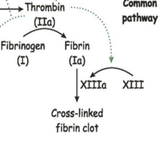

Factor XIII    body {font-family: 'Open Sans', sans-serif;}

### Factor XIII (Fibrin Stabilizing Factor)

Activated by thrombin into factor XIIIa in presence of calcium.  
It forms bonds between the fibrin chains and stabilizes the blood clot.  
Thus, it reduces the sensitivity of the clot to degradation by proteases.  

****

  
Genetic defects in the factor XIII gene leads to lifelong bleeding diathesis.  
Patients may also suffer from intercranial bleeding and death.  
_The gene for F13A is located on the sixth chromosome (6p24-25). The F13B gene is located on the long arm of first chromosome (1q32-32.1).  
  
**Source:** Liver.  
**Half-life:** 4-7 days.  
_**Pathway:** It is both intrinsic and extrinsic (common pathway).  
**Treatment:** FFP.  
  
**Factor XIII Deficiency**  
Factor XIII deficiency is a rare bleeding disorder.  
  
It is inherited form and a less severe form that is acquired during a person's lifetime.  
  
Signs and symptoms of inherited factor XIII deficiency begin soon after birth, usually with abnormal bleeding from the umbilical cord stump.  
  
Abnormal bleeding can occur after surgery or minor trauma. The condition can also cause spontaneous bleeding into the joints or muscles, leading to pain and disability. Women with inherited factor XIII deficiency tend to have heavy or prolonged menstrual bleeding (menorrhagia) and may experience recurrent pregnancy losses (miscarriages).  
  
May also cause nosebleeds, bleeding of the gums, easy bruising, problems with wound healing, and abnormal scar formation.  
  
Also increases the risk of intracranial hemorrhage.  
  
Acquired factor XIII deficiency becomes apparent later in life. People with the acquired form are less likely to have severe or life-threatening episodes of abnormal bleeding than those with the inherited form.  
  
**Pathway:** It is both intrinsic and extrinsic (common pathway).  
The proenzyme form of plasma transglutaminase.  
It is composed of two subunits - alpha (A) and beta (B).  
  

ClotBase-Knowledgebase on Blood Coagulation-Proteins involved in Blood Coagulation.  
http://www.clotbase.bicnirrh.res.in/flow\_ln.php