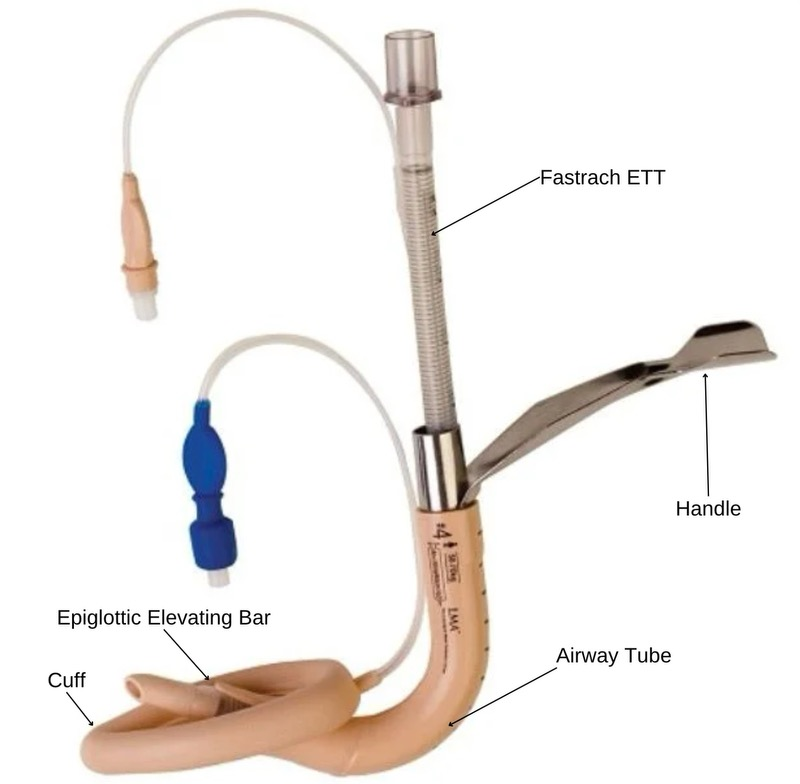
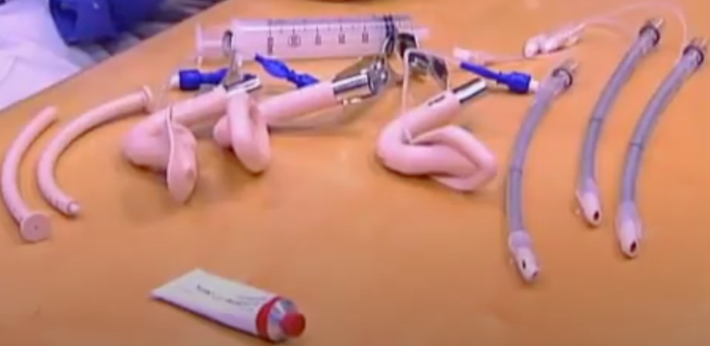
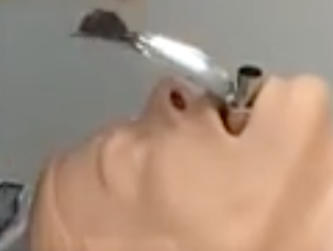

Fast Trach LMA (supraglottic airway device) SAD    body {font-family: 'Open Sans', sans-serif;}

### Fast Trach LMA (supraglottic airway device) SAD

\- FastrachTM is the most common LMA airway utilized as a conduit for intubation by anesthesia providers.  
\- It was specifically designed as a guide for blind trachea intubation without moving the head or neck and allows continuous ventilation between intubation attempts.  
\- It comes with a special ET tube with soft tips, which makes it possible to intubate blindly, especially in emergencies.  
  
It also comes with a stabilizing rod to anchor and extend the ET tube when removing the LMA.  
**\- Note:** Fiberoptic intubation is still recommended over a blind intubation with all SADs.

****

**Latex-free:** Made primarily of medical-grade silicone.  
Available in Single-Use and Reusable variants.  
  
**LMA Fastrach Indications:  
1\.** For use as a guide for intubation of the trachea.  
**2\.** For achieving and maintaining control of the airway during routine and emergencies, including anticipated or unexpected difficult airways.  
**3\.** As a method of establishing an airway in the profoundly unconscious patient with absent glossopharyngeal and laryngeal reflexes.  
  
**Reusable** **Fastrach kit:  
**Cost about $1,000 (2024 online post)  
It may be used a maximum of 40 times before being discarded.  
Includes size four reusable airway device  
7.5 mm reusable endotracheal tube  
Reusable stabilizer rod  
Sizes available: 3.0, 4.0, 5.0

****

table.tableizer-table { font-size: 12px; border: 1px solid #CCC; font-family: Arial, Helvetica, sans-serif; } .tableizer-table td { padding: 4px; margin: 3px; border: 1px solid #CCC; } .tableizer-table th { background-color: #104E8B; color: #FFF; font-weight: bold; }

| Description | Patient size | Max cuff volume (air) |
| --- | --- | --- |
| \# 3 Fastrach | 30 - 50 kg | up to 20 mL |
| \# 4 Fastrach | 50 - 70 kg | up to 30 mL |
| \# 5 Fastrach | 70- 1 00 kg | up to 40 mL |

**  
Use K‐Y Jelly® as the lubricant.  
**A water‐soluble lubricant, such as K‐Y Jelly®, should be used.  
Do not use silicone‐based lubricants as they degrade LMA FastrachTM components.  
Lubricants containing Lidocaine are not recommended for use with the device.  
  
Lidocaine can delay the return of the patient’s protective reflexes expected prior to removal of the device, may provoke an allergic reaction, or may affect the surrounding structures, including the vocal cords.  
  
**LMA Fastrach Insertion:**  
Unlike the traditional first-generation LMA, the LMA Fastrach connection port does not extend far outside the patient’s mouth.  
  
Refer to “Fastrach LMA Intubation and Extubation” for details.

****

  

Fastrach Intubation  
ImedrxTV (accessed 02/2024)  
https://www.youtube.com/watch?v=5CYqmvFIAzg  
Teleflex Instructions for Use-LMA Fastrach TM  
https://tinyurl.com/ms3dzw65  
  
LMA Fastrach  
East Lane Corporation (accessed 02/2024)  
https://eastlane.net/products/lma-fastrach