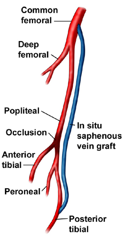

FemTib Bypass (Femoraltibial)     body {font-family: 'Open Sans', sans-serif;}

### FemTib Bypass (Femoraltibial)

Similar to a FemPop bypass except the bypass is more distal going from the Femoral artery down to the tibial artery. A bypass with autologous (patient’s own saphenous vein) or a synthetic graft.  

****

**Indications:** Occlusions <10cm in the superficial femoral or popliteal artery.

**Anesthetic:** Usually General/ETT or LMA. Sometimes a spinal or Epidural. I have seen one facility use LMA’s on 99% of these cases. Depends on the competency on the surgeon and duration of the case.

**Duration:** 2-4 hours (depends on the surgeon)

**A-line:** Yes, mostly for ACTs. ACT’s are usually Q30 minutes.  
Some surgeons don’t worry about ACTs so you may not need one.  
Have an ACT machine available in case the surgeon requests an ACT.    
**EBL:** 200-500mls  
**Heparin/Protamine:** Yes, have 10k units ready. 10k units is given before clamping.    
**Common comorbidities:**  PVD, HTN and DM.  
**Recommended BP:** Ask the surgeon.  Avoid hypotension, especially after the graft.   
**Neosynephrine drip:** Yes, treat like a CAD patient.  
**Antibiotics:** Usually Ancef.  
**Warming Blanket:** Yes, these could be long cases.

**Position:** Supine with arms out.  
**IV Access:** 1-2 18G. Sometimes you need to give blood depending on the experience of your surgeon.  
  
**Possible Complications**  
Wound infection  
Hemorrhage  
Hematoma  
Graft occlusion  
Seroma-fluid collecting under the wound  
DVTs, Pulmonary embolism  
Nerve injury  
Death

**Protamine Concern:**  
Always watch for that rare anaphylactic reaction to Protamine.  
Remember that this rare reaction does not need a prior exposure to Protamine.

**Patients at Risk for Anaphylactic Reaction from Protamine:**  
Patients with Fish allergies, 25% -fold risk for allergic reaction.

  
History of a Vasectomy. Nucleoprotamines are a normal component of human sperm cells. 22-33% of patients who undergo elective vasectomies develop protamine antibodies.  
  
Diabetics on NPH insulin.  
Remember NPH stands for “Neutral Protamine Hegedorn.”

These patients have an 8% fold risk of a reaction.

Jaffe, Richard A. _Anesthesiologist's Manual of Surgical Procedures_., 2012.

Kalbande, Manohar B. _Vascular Surgery Made Easy_. 2013.

Macksey, Lynn Fitzgerald. _Surgical Procedures and Anesthetic Implications: A Handbook for Nurse Anesthesia Practice_. Sudbury, MA: Jones & Bartlett Learning, 2012.

Moore, Wesley S., M.D. _Vascular and Endovascular Surgery: A Comprehensive Review Expert Consult:_ 2013