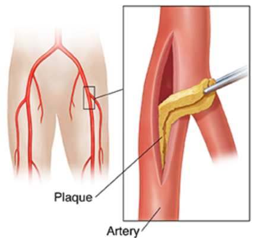

Femoral Artery Endarterectomy    body {font-family: 'Open Sans', sans-serif;}

### Femoral Artery Endarterectomy

Endarterectomy is a surgical procedure which involves the removal of part of the inner lining of an artery together with the adherent atherosclerotic plaque.  
The goal is to recanalize the occluded vessel and restore vascular supply to the tissue.  
  
For a femoral endarterectomy, a 5-10cm cut incision is made in the groin.  
The surgeon opens the femoral artery and removes the plaque, allowing the blood to flow more freely. The surgeon then closes the artery and, at this stage, a synthetic patch may be sutured onto the artery to prevent it from narrowing again. The wound is then closed with dissolvable stitches.  
  
**Indications:**  
Partial or total occlusion of the femoral artery from atherosclerosis and/or PAD.  
  
**Risk factors for atherosclerosis include:**  
high levels of cholesterol and triglycerides  
Hypertension  
Cigarette smoking  
Diabetes, types I and II  
Obesity  
Inactivity, lack of exercise  
Family history of early cardiovascular disease**  

****

  
Pre-operative evaluation  
Assess for related comorbidities associated with atherosclerosis.  
**_Consider risk stratification tool (RCRI) and AHA/ACC clinical practice guideline to direct pre-op evaluation._It is unlikely that the femoral artery is the only vessel pathologically affected!  
Assess for cardiovascular disease, CAD, previous MI, DM or COPD.  
Continue antianginal medications.  
Consider bet-blockers (if the patient is not already receiving).  
Consider cardiac workout.  
  
**Anesthesia is similar to a carotid endarterectomy, EXCEPT:**  
Patient is supine  
Less concern of cerebral perfusion with clamping.  
Less radical swings of blood pressure, easier to manage.**Anesthesia:** General with ETT, surgeon usually wants muscle relaxation.  
Spinal is acceptable, but rare.  
**Duration:** 90-150 minutes  
**Position:** Supine with arms tucked  
Remember the arms will be tucked, so double check the IV patency.  
**EBL:** Depends on the surgeon. There should not be much.  
**IV Access:** 1-2 18G.  
Hemorrhage is rare, but we usually have 2 units of blood on stand-by.  
**A-Line:** Always  
**Drips:** Neosynephrine. Always, and make sure your drip line is patent after the arm is tucked.  
  
**BP Requirement:** Usually close to the baseline. ALWAYS ask the surgeon.  
_Consider avoiding tachycardia as the patient may have undiagnosed CAD._  
  
**Drugs:** 10k units heparin already drawn up. The surgeon will tell you to give a certain amount before he clamps (around 100u/kg). Let him know when 2 minutes has gone by after giving Heparin.  
**Protamine:** Have available, however, some surgeons don’t reverse the heparin.  
**ACTs:** Yes.  
  
**Blood pressure maintenance:** Much easier than a carotid endarterectomy.Beta blockers are commonly used when needed.  
  
DO NOT sit the patient up greater than 30 degrees!Ask the surgeon where he wants the blood pressure.**Avoid HTN with emergence:** HTN will challenge the new graft and incision.  
Prepare to treat for temporary HTN with your drug of choice.  
Many anesthesia providers administer labetalol.  
Consider Cardene (Nicardipine hydrochloride) or a nitroglycerine continuous infusion for postoperative hypertension refractory to beta-blockers.  
  
**Extubation:** Deep extubation is usually acceptable. Check with the surgeon.  
Consider Cardene (Nicardipine hydrochloride) or a nitroglycerine continuous infusion for postoperative hypertension refractory to beta-blockers.  
  
**Possible Complications**  
Hemorrhage  
Stroke (embolization) from unstable plaque rupture.  
Groin hematoma  
Patient's will stay in hospital 1 or 2 nights following this procedure.  
  
**More Notes**  
Atherosclerosis is generally asymptomatic until the plaque stenosis exceeds 70 or 80 percent of the luminal diameter, which can produce a reduction in flow, as with coronary blood flow to myocardium.  
  

**Peripheral endarterectomy  
Encyclopedia of Surgery  
https://www.surgeryencyclopedia.com/Pa-St/Peripheral-Endarterectomy.html#ixzz5esIzR3gk  
  
**