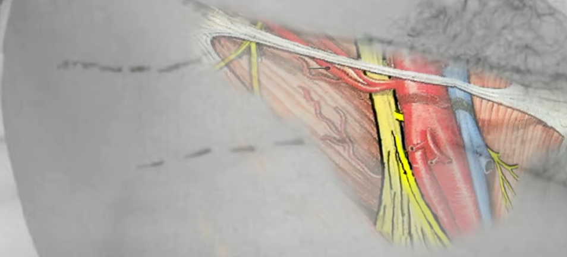
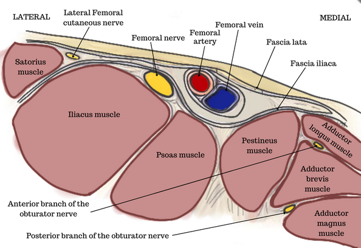
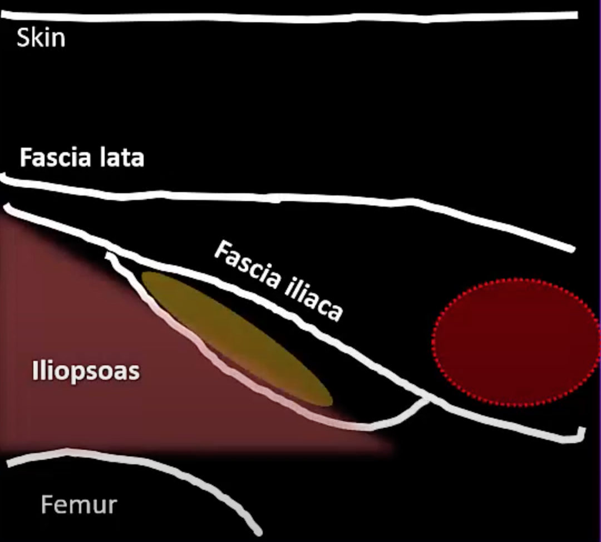
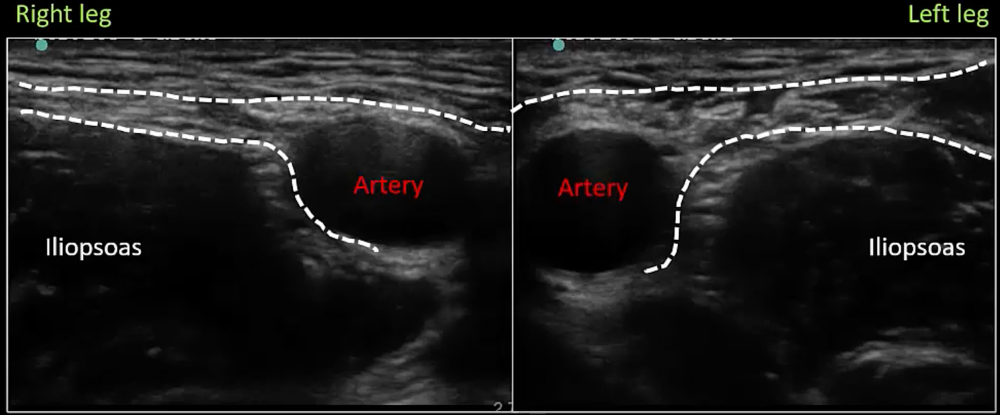

Femoral Nerve Anatomy for Femoral Nerve Block (FNB)    body {font-family: 'Open Sans', sans-serif; padding-left: 10px;}

### Femoral Nerve Anatomy for Femoral Nerve Block (FNB)

The femoral nerve arises from the ventral rami of the L2, L3, and L4 spinal nerves and enters the femoral triangle inferior to the inguinal ligament.

****

The goal of the FNB is to block the femoral nerve just proximal to the anterior and posterior division (above).  
The femoral nerve usually divides near the level of the femoral crease.

****

**The anterior and posterior division:  
**About 2-3 cm below the inguinal ligament, the femoral nerve divides into an anterior and posterior branch.  
At this level, it is located lateral and posterior to the femoral artery.  
  
The **anterior branches** innervate the anterior aspect of the thigh.**Anterior division** **gives rise to the following:**  
**Medial femoral cutaneous nerve (sensory):** Provides sensory to the skin on the medial thigh and knee.  
**Intermediate cutaneous (sensory):** Provides sensory to the skin on the anterior thigh and knee.  
**Innervates the sartorius muscle (motor):** Hip and knee flexion, and hip abduction  
**Innervates the pectineus muscle (motor):**  Hip flexion and abduction  
  
The **posterior branches** innervate the quadriceps muscles and continue below the knee as the saphenous nerve to provide sensory innervation from the media side of the calf to the medial malleolus.**Posterior division** gives rise to the saphenous nerve and provides innervation to quadricep femoris muscles below:  
**Innervates the vastus lateralis muscle (motor):** Hip flexion and knee extension  
**Innervates the vastus intermedius muscle (motor):** Hip flexion and knee extension  
**Innervates the vastus medialis muscle (motor):** Hip flexion and knee extension  
**Innervates the rectus femoris (motor):** Hip flexion and knee  
  
The saphenous nerve can be blocked separately (saphenous nerve block) at the level of the adductor canal.  
_Refer to “Saphenous Nerve Block (SNB)”_  
  
**The adductor canal:** A musculoaponeurotic tunnel found mid-thigh extends from the femoral triangle to the adductor magnus.\- At the femoral crease, fascia lata and fascia iliaca surround the femoral vessels.  
\- The fascia iliaca separates the femoral nerve from the femoral vessels.  
**\-** The local anesthetic is to be injected below the fascia iliaca that surrounds the vessels in order to reach the femoral nerve.  
**Medial-to-lateral relationship of the femoral nerve to vessels in the femoral triangle.  
The mnemonic “VAN”:** Vein, artery, nerve

****

**  
Cross section below:  
Normally, the femora nerve is located:**  
Lateral to the femoral artery  
Below the facial iliaca  
Above the iliopsoas  
**Iliopsoas:  
Composed of three muscles:** The iliacus, the psoas major, and the psoas minor.  
The femoral nerve usually has an elongated elliptical cross-section.

****

**The fascia lata and fascia iliaca:  
**The fascia iliaca is the key structure to identify when utilizing the ultrasound.

****

****

****

****

 **Note:** Failure to inject the local anesthetic BELOW the fascia iliaca will result in the local anesthetic not reaching the femoral nerve.  
**Landmarks:**

****

The femoral nerve block (needle insertion) is performed at the femoral crease (below the inguinal ligament) about 1-2 cm lateral to the femoral.  
  

Femoral Nerve Block  
StatPearls (accessed 11/2022)  
Zahra Sykes and Aimee Park  
https://www.ncbi.nlm.nih.gov/books/NBK546704/  
  
Femoral Nerve Block  
dvcipm.org (accessed 11/2022)  
https://www.dvcipm.org/site/assets/files/1083/chapt15.pdf  
  
Anatomy Made Simple  
https://anatomyqa.com/femoral-nerve-course-branches/  
  
Femoral Nerve Block (for Pediatrics)  
Government of Western Australia Child and Adolescent Health Service  
Perth Children’s Hospital (accessed 11/2022)  
https://pch.health.wa.gov.au/For-health-professionals/Emergency-Department-Guidelines/Femoral-nerve-block  
  
Femoral Nerve Block: Landmark Approach  
World Federation of Societies of Anaesthesiologists (accessed 11/2022)  
Dr. Andrew McEwen  
https://resources.wfsahq.org/atotw/femoral-nerve-block-landmark-approach/  
  
Ultrasound-Guided Femoral Nerve Block  
_Atchabahian, Ine Leunen, Catherine Vandepitte, and Ana M. Lopez_  
https://www.nysora.com/techniques/lower-extremity/ultrasound-guided-femoral-nerve-block/  
  
Femoral Nerve Block  
European Society for Paediatric Anaesthesiology (ESPA) accessed 11/2022  
https://www.euroespa.com/science-education/specialized-sections/espa-pain-committee/us-regional-anaesthesia/lower-limb/femoral/femoral-nerve-block/  
  
Femoral Nerve Block and Three-In-One-Block  
EM Didactic  
Dr. Lakshay Chanana  
http://emdidactic.blogspot.com/2017/07/femoral-nerve-block-and-three-in-one.html  
  
Back to Basics: Femoral Artery Access and Hemostasis  
Cath Lab Digest Vol. 21, Issue 10, 2013  
Dr Morton Kern  
  
Ultrasound-guided Femoral Nerve Block  
Lower Limb Blocks (accessed 11/2022)  
Dr. Ki-Jinn Chinn  
https://www.youtube.com/watch?v=z7fIZR\_Pieo