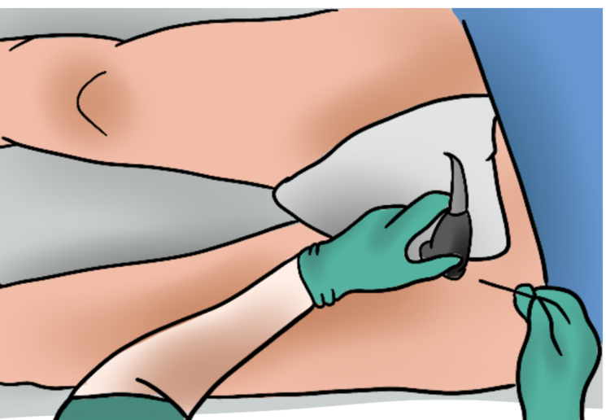
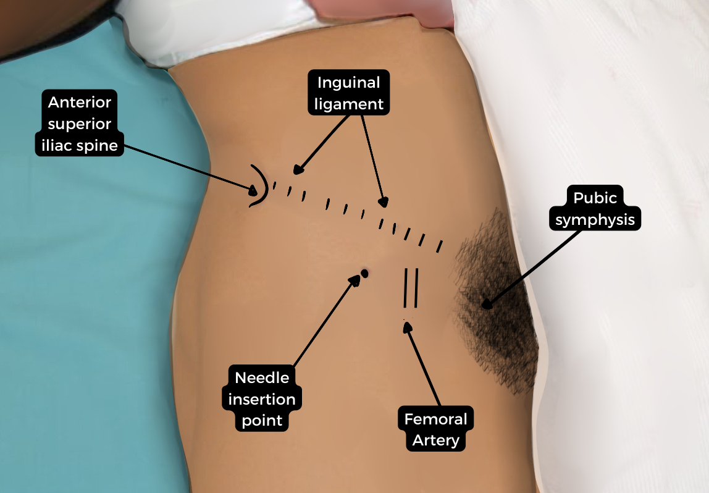
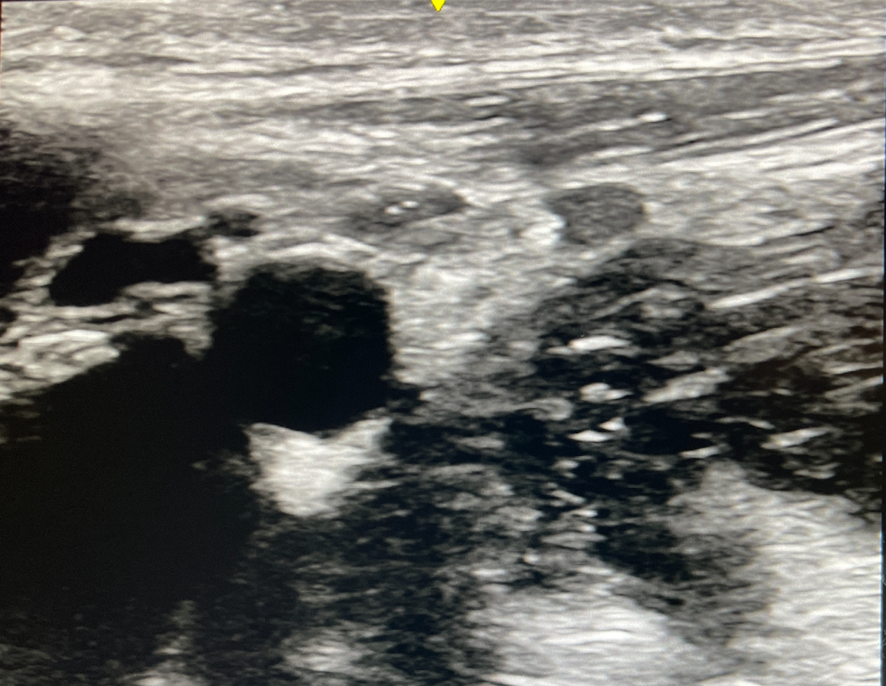

Femoral Nerve Block (FNB)    body {font-family: 'Open Sans', sans-serif;}

### Femoral Nerve Block (FNB)

\- Historically called the “3-in-1 block,” suggesting that a single injection could block the femoral, lateral femoral cutaneous, and obturator nerves at the femoral crease.  
\- However, the obturator nerve is often missed.  
  
**Excluding the morbidly obese patients, the FNB is one of the simpler blocks due to perform:  
**\- The patient remains supine  
\- Simple anatomy  
\- The depth of the femoral nerve is relatively superficial.  
\- The femoral nerve usually appears as a hyperechoic speckled triangular or oval-shaped structure lateral to the artery.  
  
**The FNB provides analgesia of the:**  
Anterior thigh  
Anteromedial knee  
Medial aspect of the lower leg  
Ankle and foot  
Osteotomal distribution (bone): Hip, knee and ankle joints

****

****

  
The FNB targets the femoral nerve as it divides into an anterior and posterior division in the area of the femoral crease.  
_Refer to “Femoral Nerve Block Anatomy.”_  
  
**Motor involvement:  
**Unfortunately, the FNB may also affects the flexor muscles of the hip and extensor muscles of the knee.  
**  
Possible surgical indications for FNB:  
**Femoral neck fractures (Hip)  
Femur fractures  
Patellar injuries  
Knee  
Medial aspect of the lower leg  
Quadriceps tendon  
Medial ankle  
Medial foot  
  
**FNM + Sciatic nerve block:**  
\- The FNB does not provide complete lower extremity analgesia.  
\- It may also be combined with a sciatic nerve block to provide more lower-extremity analgesia.  
\- The FNB can be used as a single injection and continuous infusions to relieve pain following total knee replacement.**  
  
The FNB is now becoming less popular:  
**\- The FNB results in quad muscle weakness, increasing the chance of falling postoperatively.  
\- These patients can be placed in a leg extension brace to help prevent falling.  
\- The saphenous nerve block (adductor canal block) is motor-sparing other than the vastus medialis muscle.**  
  
FNB vs Saphenous nerve block for total knee arthroplasties:  
**\- Due to the quad muscle weakness mentioned above, the saphenous nerve block is presently the preferred nerve block for total knee arthroplasties among experienced anesthesia providers.  
  
**AKA and TKAs at academic centers:**  
The FNB is more commonly performed at academic centers for below and above-knee amputations.  
Postoperative muscle weakness is not an issue in these situations.  
  
**Ultrasound probe position:** Transverse, femoral crease**Goal:** Local anesthetic spread adjacent to the femoral nerve.  
**Note:** Failure to inject the local anesthetic BELOW the fascia iliaca will result in the local anesthetic not reaching the femoral nerve.  
_Refer to “Femoral Nerve Block Technique” and “Femoral Nerve Block Anatomy” for details_  
  
**Landmarks:**

****

**Needle insertion:**  
\- The needle is to be inserted lateral-to-medial about 1 cm lateral to the femoral artery (at the lateral end of the ultrasound probe) at the level of the femoral crease parallel and caudal to the inguinal ligament.  
\- The needle tip should be adjacent to the lateral aspect of the femoral nerve, right below the two fascia layers.

****

**Depth of the femoral nerve:** 2 to 4 cm (though it may be variable depending on body habitus).  
  
**Local anesthetic FNB (10-20 mLs of one of the below):  
Note:** 20 mLs is common (varies with literature as 10-20 mLs)0.5% Bupivacaine  
0.5% Levobupivacaine  
0.5% Ropivacaine  
  
\- The local anesthetic should displace and/or spread above or below the femoral nerve.\- The needle tip should be adjacent to the lateral aspect of the femoral nerve, right below the two fascia iliaca.

****

****

**Absolute contraindications:** (as with other regional blocks)  
Patient refusalInflammation or infection over the injection site.  
Allergy to local anesthetics  
  
**Relative contraindications:** (as with other regional blocks)  
Anticoagulation or bleeding disorders  
Patient uncooperativeness (Pediatric or elderly patients may need sedation).  
Pre-existing peripheral neuropathies  
Concern for compartment syndrome  
Anticoagulation and antithrombotic medication  
**Nerve stimulator:  
**\- A nerve stimulator may be connected to a stimulating block needle to help identify the femoral nerve.  
\- However, many anesthesia providers do not utilize the nerve stimulator when using an ultrasound for visualization.  
_\- Refer to “Femoral Nerve Block and Nerve Stimulator.”_**Possible complications of FNB:  
**Intraneural needle placement (Nerve injury)  
Allergic reaction  
Hematoma  
Infection  
Local anesthetic systemic toxicity  
Postoperative fall injury from quad weakness  
  

Edited by Michael MacKinnon DNP, FNP-C, CRNA, FAANA  
National University Associate Professor Doctor of Anesthesiology Program  
  
Edited by Dr. Michael Kaminsky, Regional Anesthesiologist  
  
Ultrasound Guided Femoral Nerve Block  
NYSORA (accessed 11/2022)  
https://www.nysora.com/techniques/lower-extremity/ultrasound-guided-femoral-nerve-block/  
  
Femoral Nerve Block  
StatPearls (accessed 11/2022)  
Zahra Sykes and Aimee Park  
https://www.ncbi.nlm.nih.gov/books/NBK546704/  
  
Femoral Nerve Block  
dvcipm.org (accessed 11/2022)  
https://www.dvcipm.org/site/assets/files/1083/chapt15.pdf  
  
Femoral Nerve Block (for Pediatrics)  
Government of Western Australia Child and Adolescent Health Service  
Perth Children’s Hospital (accessed 11/2022)  
https://pch.health.wa.gov.au/For-health-professionals/Emergency-Department-Guidelines/Femoral-nerve-block  
  
Femoral Nerve Block: Landmark Approach  
World Federation of Societies of Anaesthesiologists (accessed 11/2022)  
Dr. Andrew McEwen  
https://resources.wfsahq.org/atotw/femoral-nerve-block-landmark-approach/  
  
Ultrasound-Guided Femoral Nerve Block  
_Atchabahian, Ine Leunen, Catherine Vandepitte, and Ana M. Lopez_  
https://www.nysora.com/techniques/lower-extremity/ultrasound-guided-femoral-nerve-block/  
  
Femoral Nerve Block and Three-In-One-Block  
EM Didactic  
Dr. Lakshay Chanana  
http://emdidactic.blogspot.com/2017/07/femoral-nerve-block-and-three-in-one.html