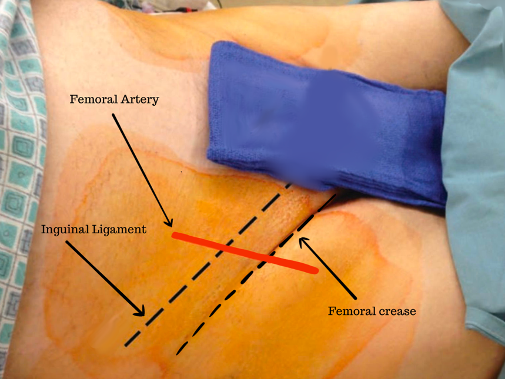
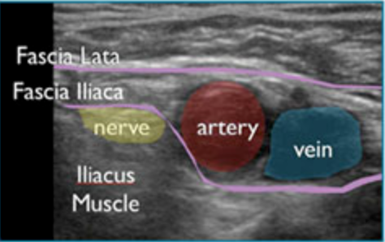
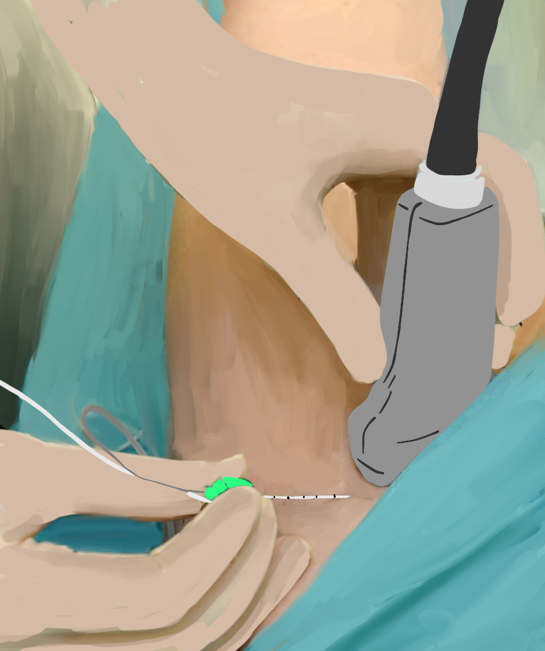
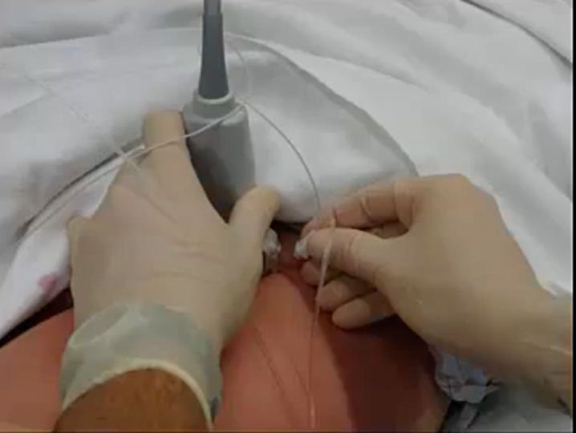
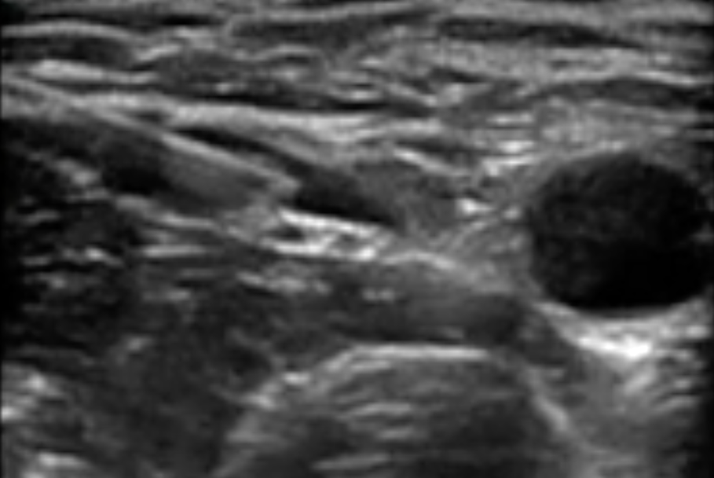

Femoral Nerve Block Technique    body {font-family: 'Open Sans', sans-serif;}

### Femoral Nerve Block Technique

\- Obtain the patient’s verbal/written consent.  
\- Perform a quick neuromuscular exam.  
\- Gather the needed equipment  
\- Place the patient in a supine position with both legs extended.  
\- The patient should be monitored, have supplement O2, and be adequately sedated.  
\- Properly drape the patient and disinfect the area of the femoral crease.  
\- Perform a Time Out.  
\- Palpate the pulse of the femoral artery.  
\- Using ultrasound gel, position the ultrasound probe over the pulse of the femoral artery and nerve at the femoral crease.  
  
**Optional:** Label the needle entry point at the femoral crease level (1-2 cm lateral to the femoral artery.

****

**Maneuver the probe as needed (tilting proximally or distally) to optimally identify the following:**  
Femoral artery and vein  
Femoral nerve  
Fascia lata and fascia iliaca surrounding the femoral vessels  
Iliacus muscle  
  
**Goal:  
**Insert and advance the tip of the needle immediately adjacent to the lateral aspect of the femoral nerve, below the fascia iliaca, or between the two layers of the fascia iliaca that surround the femoral nerve.

****

The femoral nerve is quite anisotropic.  
Tilt the probe cranially will often optimize the view.

****

****

**Depth of the femoral nerve:** 2 to 4 cm (though it may be variable depending on body habitus).**  
  
Needle insertion:**  
\- The needle is to be inserted lateral-to-medial about 1 -2 cm lateral to the femoral artery (at the lateral end of the ultrasound probe) at the level of the femoral crease parallel and caudal to the inguinal ligament.  
\- The needle tip should be adjacent to the lateral aspect of the femoral nerve, right below the two fascia layers.  
\- Aspiration confirm the needle tip is not vascular  
\- Inject 20 mLs of local anesthetic in intervals  
**Local anesthetic FNB (10-20 mLs of one of the below):  
Note:** 20 mLs is common (varies with literature as 10-20 mLs)0.5% Bupivacaine  
0.5% Levobupivacaine  
0.5% Ropivacaine

****

\- The local anesthetic should displace and/or spread above or below the femoral nerve.\- The needle tip should be adjacent to the lateral aspect of the femoral nerve, right below the two fascia iliaca.

****

**Injection of local anesthetic:**  
\- Needle aspiration prior to injecting the local injection  
\- Inject 1-2 mLs of the local anesthetic for needle tip confirmation via the spread of local anesthetic causing nerve separation.  
\- Administer the remaining dose increments of 3-5 mLs.  
\- Reposition the needle as needed for the optimal spread of the local anesthetic.  
  
**Other tips and notes:**  
**Obese patients:**  
In obese patients, you may place a pillow placed underneath the hips can facilitate palpation of the femoral artery and the block performance.  
If the patient has a very large pannus, it should be retracted manually or taped back out of the way.  
  
**Optional:** Label the needle entry point at the femoral crease level (2 cm lateral to the femoral artery.  
  
If multiple arteries are present, this indicates your probe is too caudal and should be moved to (cephalad) closer to the inguinal ligament.  
  
**Confirm the distribution of local anesthetic as it is being injected.**  
Confirm the distribution of the local anesthetic being injected by observing the displacement and separation of the femoral nerve from the surrounding and fascia iliaca layers.  
The spread of the local anesthetic may be above or below the femoral nerve.  
  

Edited by Michael MacKinnon DNP, FNP-C, CRNA, FAANA  
National University Associate Professor Doctor of Anesthesiology Program  
  
Edited by Dr. Michael Kaminsky, Regional Anesthesiologist  
  
Femoral Nerve Block  
dvcipm.org (accessed 11/2022)  
https://www.dvcipm.org/site/assets/files/1083/chapt15.pdf  
  
Femoral Nerve Block (for Pediatrics)  
Government of Western Australia Child and Adolescent Health Service  
Perth Children’s Hospital (accessed 11/2022)  
https://pch.health.wa.gov.au/For-health-professionals/Emergency-Department-Guidelines/Femoral-nerve-block  
  
Femoral Nerve Block: Landmark Approach  
World Federation of Societies of Anaesthesiologists (accessed 11/2022)  
Dr. Andrew McEwen  
https://resources.wfsahq.org/atotw/femoral-nerve-block-landmark-approach/  
  
Ultrasound-Guided Femoral Nerve Block  
_Atchabahian, Ine Leunen, Catherine Vandepitte, and Ana M. Lopez_  
https://www.nysora.com/techniques/lower-extremity/ultrasound-guided-femoral-nerve-block/  
  
Femoral Nerve Block and Three-In-One-Block  
EM Didactic  
Dr. Lakshay Chanana  
  
https://aneskey.com/femoral-nerve-block-4/