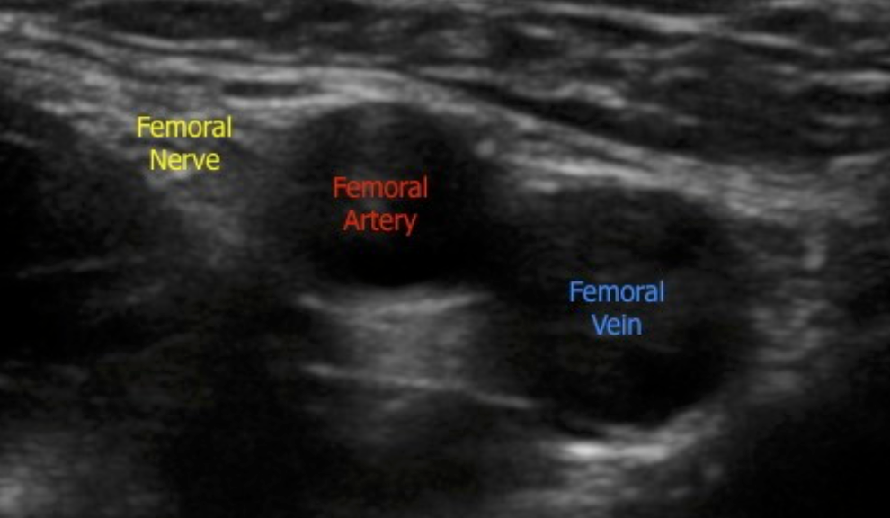
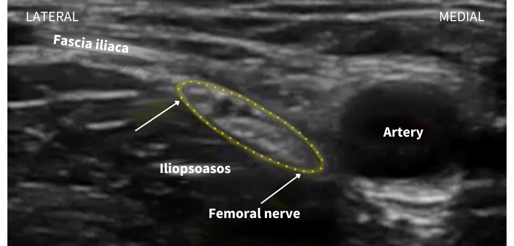
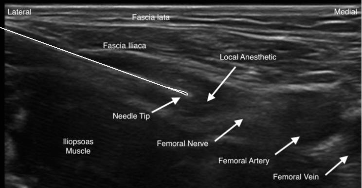
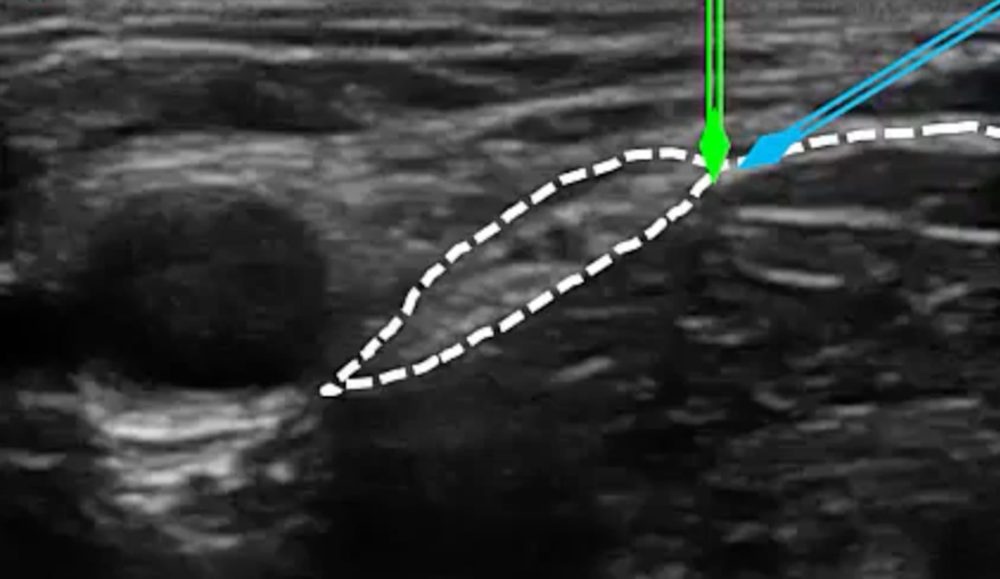
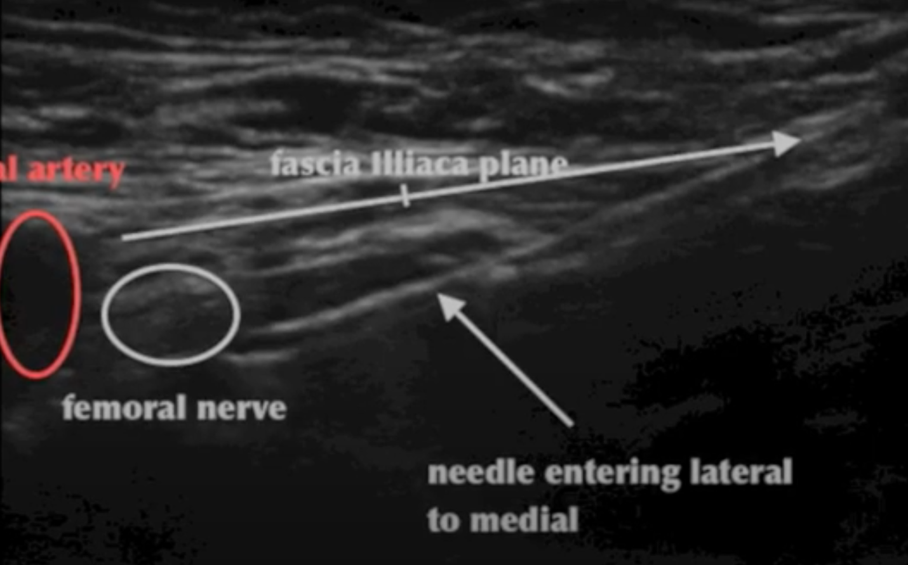

Femoral Nerve Block and Sonoanatomy Images and Notes    body {font-family: 'Open Sans', sans-serif;}

### Femoral Nerve Block and Sonoanatomy Images and Notes

_Consider reviewing “Femoral Nerve Block Anatomy.”  
  
_**Normally, the femora nerve is located:**  
Lateral to the femoral artery  
Below the facial iliaca  
Above the iliopsoas  
**Iliopsoas:  
The three muscles:** Iliacus, psoas major, and the psoas minor  
The femoral nerve usually has an elongated elliptical cross-section.  
  
**The femoral nerve is:  
**\- The femoral nerve typically is visualized at a depth of 2–4 cm (non-obese)  
\- Usually triangular shaped or oval/ flattened as the nerve fans out into multiple branches.  
\- It speckled and hyperechoic.  
\- It becomes less obvious as it branches out as the probe moves caudally.  
  
**Ultrasound probe positioning:  
**\- Transverse over the femoral crease\- Identify the femoral artery (maneuver the probe as necessary).  
\- Remember, the femoral nerve is lateral to the femoral artery.

****

****

****

\- Once the femoral nerve is identified, the needle is inserted in an in-plane approach in a lateral-to-medial direction.  
\- The needle must penetrate the fascia iliaca for an effective block.  
\- Advanced the needle towards the femoral nerve.  
\- Identify the fascial iliaca.  
\- Inject the local anesthetic below the fascial iliaca.

****

****

****

  
  

Edited by Dr. Michael Kaminsky, Regional Anesthesiologist