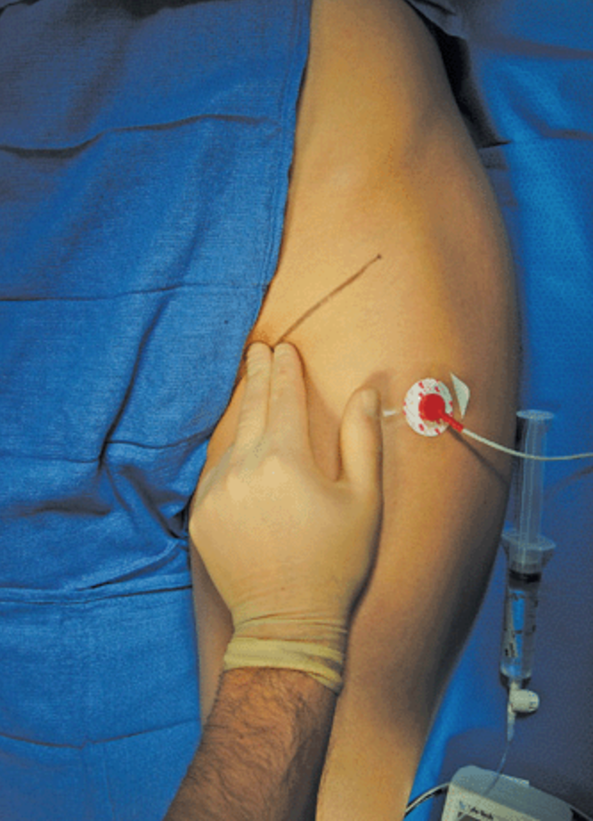

Femoral Nerve Block using a Nerve Stimulator    body {font-family: 'Open Sans', sans-serif;}

### Femoral Nerve Block using a Nerve Stimulator

**Nerve stimulators are now less commonly used.**  
Utilizing a nerve stimulator for peripheral nerve blocks is now much less popular due to the accessibility and superiority of the visualization provided by portable ultrasounds.  
However, there is currently no human data that supports the superiority between the usage of an ultrasound vs nerve stimulator technique over another to reduce potential nerve injuries (PNIs).  
  
**Advantages of ultrasound over using a nerve stimulator:  
Allows visualization of the femoral artery and nerve  
**\- The position of the probe can be adjusted to optimize the structures\- Allows the visualization for needle placement\- Allows the visualization of the needle-to-nerve relationship\- Allows visualization of the distribution of local anesthesia in relation to the femoral nerve  
\- It may reduce the risk of femoral artery puncture.  
  
Connect the nerve stimulator to a stimulating block needle.  
  
**Common settings:**  
Current density: 0.8 to 1 mA  
Frequency: 2 Hz  
Pulse duration: 0.1 milliseconds.  
  
**Lead placement for using a nerve stimulator:  
**Place the lead between the needle site and the patella.

****

  
**Sartorius muscle twitch without patella movement is not reliable.  
**\- It is common for the sartorius muscle to contract across the high without patella involvement.  
\- A sartorius twitch alone is unreliable because its branches may be outside the femoral sheath (iliacus fascia).  
\- To achieve patella and sartorius twitches, redirect the needle laterally and advance it deeper until a patella twitch becomes evident.  
\- The patella will not twitch until the needle tip is in the vicinity of the main trunk of the femoral nerve.  
  
**Nerve stimulator tips for femoral nerve block:  
**After initial stimulation of the femoral nerve is obtained, gradually reduce the stimulating current after patella twitches are seen or felt at 0.2 to 0.4 mA, which typically occurs at a depth of 2-3 cm.\- A brisk “patellar snap” with the current at 0.5 mA or less is indicative that the needle is near the femoral nerve.  
After obtaining negative blood aspiration test results, 15 to 20 mL of local anesthetic is injected slowly.  
  
**General settings (stimulating current) for the nerve stimulator (per ASRA):  
Initial settings with needle insertion:** 1-1.5 mA**As the needle approaches the target nerve:** Reduce to a minimum until the lowest twitch response is seen or paresthesia is felt.  
  
**Intraneural needle placement detection using a nerve stimulator:  
**\- The ASRA advisory panel suggested that a current of < 0.5 mA, which evokes a motor response (in peripheral nerve blocks), effectively indicates intraneural needle placement.  
\- Other published literature has suggested a lower threshold to illicit concern for intraneural needle placement (closer to 0.2 mA).  
\- However, they also suggest that higher thresholds should be considered in specific patient populations (i.e., those with diabetes, multiple sclerosis, and obesity).  
\- Unfortunately, using a nerve stimulator for the prevention of intraneural needle placement may not be reliable in patients with these conditions.  
  
**For optimal safety, ARSA suggests using the combination of:**  
Ultrasound  
Nerve stimulation  
Injection pressure monitoring  
Patient feedback  
  

Edited by Dr. Michael Kaminsky, Regional AnesthesiologistNerve Stimulator in Regional Anesthesia: Is it Out of Vogue?ASRA Pain Medicine (accessed 12/2022)Jaasmit Khurana, MD; Vivian H.Y. Ip, MBChB, MRCP, FRCA; Rakesh Sondekoppam Vijayashankar, MD; and Ban Tsui, MD, MSc, FRCPC  
https://www.asra.com/guidelines-articles/original-articles/point-of-care-ultrasound/point-of-care-ultrasound/asra-news/2020/11/01/nerve-stimulator-in-regional-anesthesia-is-it-out-of-vogue