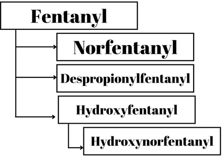

Fentanyl (Sublimaze) Pharmacokinetics    body {font-family: 'Open Sans', sans-serif;}

### Fentanyl (Sublimaze) Pharmacokinetics

**Generic Name:**  Fentanyl citrate**Brand Name:**  SublimazePaul Janssen structurally designed fentanyl in the early 1960s.   
A synthetic derivative of morphine in the phenylpiperidine family of opioid agents.  
A clear sterile, non-pyrogenic, preservative-free aqueous solution.  
  
**Concentration:** 50 mcg/mL  
A mu receptor agonist**Chemical name:** N-(l-phenethyl-4-piperidyl) propionanilide citrate (1:1)**Drug Class:**  Phenylpiperidine opioid  
**Empirical formula:** C22H28N20•C6H807  
**Analgesia occurs at blood levels:** 1 to 2 ng/mL  
**Surgical anesthesia blood levels:** 10-20 ng/mL (profound respiratory depression)  
**TIVA anesthesia blood levels:** 15 to 30 ng/mL  
**  
Mechanism of action:  
**Fentanyl binds to opioid receptors, especially the mu-opioid receptor, which are coupled to G-proteins.  
Activation of opioid receptors causes GTP to be exchanged for GDP on the G-proteins which down-regulates adenylate cyclase, reducing cAMP concentrations.  
Reduced cAMP decreases the cAMP-dependent influx of calcium ions into the cell.  
GTP exchange for GDP results in hyperpolarization of the cell and inhibition of nerve activity.  
**  
Fentanyl easily crosses the blood-brain barrier (BBB):**  
Fentanyl’s increased lipid solubility and small molecular conformation enable efficient penetration of the BBB and redistribution.  
**Bioavailability per route:**  
Fentanyl sublingual tablets are 54% bioavailable.  
Transmucosal lozenges are 50% bioavailable.  
Buccal tablets are 65% bioavailable.  
Sublingual spray is 76% bioavailable.  
Nasal spray is 65% bioavailable.  
**  
Fentanyl is metabolized by hepatic P-450 enzyme: CYP3A**  
It is susceptible to drug interactions that reflect interference with enzyme activity (less likely than with alfentanil).  
  
After an intravenous bolus, fentanyl distributes rapidly from plasma to highly vascular tissues (heart, lung and brain).  
More than 80% of the injected dose leaves plasma in less than 5 min and 98.6% leaves by 1 hour.  
Elimination from the vascular tissue also is rapid as fentanyl redistributes to other sites, such as muscle and fat.  
  
**First-pass pulmonary uptake:  
**The lungs also serve as a sizeable inactive storage site.  
Around 75% of the initial fentanyl dose undergoes first-pass pulmonary uptake.  
This limits the initial amount of drug that reaches the systemic circulation.  
(Stoelting’s Pharmacology & Physiology in Anesthetic Practice, 2022)  
  
**Pharmacokinetics of fentanyl:  
pKa:** 8.4  
**pH:** 4.0-7.5  
**Percent nonionized at a pH of 7.4:** 8.5  
**Protein binding:** 84% (erythrocytes, glycoprotein, plasma albumin)  
At physiologic pH, 8.5% of fentanyl is un-ionized in plasma, and 84% is bound to the proteins listed above.  
**Clearance (mL/minute):** 1,530  
  
**Total plasma clearance:** 0.5L/hr/kg (0.3-0.7L/hr/kg or 42L/hr.  
Following an IV dose, surgical patients displayed clearance of 27-75L/hour.  
Hepatically impaired plasma clearance: 3-80L/h  
Renal impaired plasma clearance: 30-78L/h  
More than 80% of the injected dose leaves the plasma in < 5 minutes.  
**Volume distribution:** 335 (Large, due to the high lipid solubility)  
**Partition coefficient:** 955  
**Onset (IV):** 4-6 minutes (patients usually state a decrease in pain within 1 minute)  
**Half-life IV:** 7 hours  
**Half-life sublingual spray:** 5-12 hours  
**Elimination halftime:** 3.1-6.6 hours  
  
**Analgesic Duration:** 30 to 60 minutes after a single IV of up to 100 mcg.  
**Context-sensitive half-time: 4-hour infusion (minutes):** 260  
**Effect-site (blood/brain) equilibrium time (minutes):** 6.8  
**First pass clearance:** A round 75%  
**Excretion with (BUN) > 60 mg/dL:** Reduced and may lead to respiratory depression.  
**Excretion:** Kidneys (urine), primarily as metabolites (around 75% within 72 hours)  
**Excreted unchanged:** < 10%  
**Excretion by feces:** < 10% (primarily as metabolites)  
  
**Onset and duration after IM injection:**  
**Onset:** 7-8 minutes (most patients state they feel pain reduction in 1-2 minutes)  
**Duration:**  1 to 2 hours  
  
**Metabolism of fentanyl:  
**Fentanyl is metabolized by CYP3A4 (a hepatic P-450 enzyme)It is extensively (99%) metabolized via norfentanyl.  
It can also be amide hydrolyzed to despropionylfentanyl or alkyl hydroxylated to hydroxyfentanyl, which is N-dealkylated to hydroxynorfentanyl.  
  
**Fentanyl metabolites:  
Norfentanyl:**  
The principal metabolite of fentanyl in humans.  
Structurally similar to normeperidine.  
It can be detected in the urine for 72 hours after a single IV dose of fentanyl.  
  
Despropionylfentanyl  
Hydroxyfentanyl  
Hydroxy-proprionyl-fentanyl

****

**The pharmacologic activity of metabolites:** Minimal or inactive   
**Fentanyl has a longer elimination half-time than morphine.  
**Fentanyl’s elimination half-time reflects its larger Vd than morphine, but clearance of both opioids is similar.  
Fentanyl’s larger Vd results from its greater lipid solubility and thus more rapid passage into tissues compared with the less lipid-soluble morphine.  
More than 80% of the injected dose leaves the plasma in < 5 minutes because it distributes rapidly to highly vascular tissues (brain, lungs, heart).  
The plasma concentrations of fentanyl are maintained by slow reuptake from inactive tissue sites, which accounts for persistent drug effects that parallel the prolonged elimination half-time.  
  

A Review of the Use of Fentanyl Analgesia in the Management of Acute Pain in Adults  
Anesthesiology, February 1999, Vol. 90, 576–599  
Philip W. H. Peng, MBBS, FRCPC; Alan N. Sandler, MBChB, MSc, FRCPC  
  
Fentanyl Citrate Injection, USP  
Access Data FDA (accessed 06/2022)  
https://www.accessdata.fda.gov/drugsatfda\_docs/label/2013/016619s034lbl.pdf  
  
Fentanyl Injection Data Sheet  
Medsafe (accessed 06/2022)  
https://www.medsafe.govt.nz/profs/datasheet/f/fentanylinj.pdf  
  
Stoelting’s Pharmacology & Physiology in Anesthetic Practice 6 th Ed., 2022, pages 214-223  
Pamela Flood, James P. Rathmell, and Richard D. Urman  
  
Smith’s Anesthesia for Infants and Children 8 th Ed. 2021, pages 241-244.  
Peter J. Davis, Franklin P Cladis and Etsuro K. Motoyama  
  
Colte and Lerman’s A Practice of Anesthesia for Infants and Children _5 th Ed. 2018, Pages.157-59  
_Charles J. Cote’, Jarrold Lerman and Brian J. Anderson  
  
Fentanyl  
Drug Bank (accessed 06/2022)  
https://go.drugbank.com/drugs/DB00813  
  
Fentanyl  
DrugBank Online: (accessed 06/2022)  
https://go.drugbank.com/drugs/DB00813