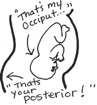
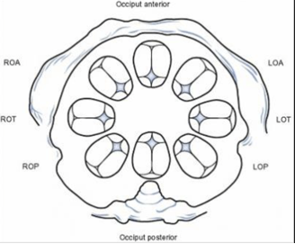
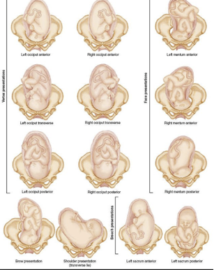

Fetal Presentation Images    body {font-family: 'Open Sans', sans-serif;}

### Fetal Presentation Images

**Remember:** Occiput Anterior (OA) is most favorable for delivery.  
  
The occiput (back) of the head is reference to the location of the baby’s occiput and the maternal pelvis.  
  
**Example:** With OP, the occiput of the baby is facing the mom’s spine.**  
  
OP is first image**

****

****

****

Fetal presentation before birth  
Mayo Clinic (accessed 08/2022)  
https://www.mayoclinic.org/healthy-lifestyle/pregnancy-week-by-week/multimedia/fetal-positions/sls-20076615