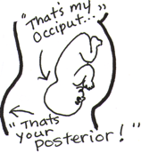

Fetal Presentations - Classifications    body {font-family: 'Open Sans', sans-serif;}

### Fetal Presentations - Classifications

**Cephalic Presentation** \- means head first.  
  
**Vertex (crown) -** the most common with and fewest complications - 97% of births.  
Vertex presentation is just means the "baby" head-down in the birth canal.  
sinciput (forehead)  
brow (eyebrows)  
face  
chin  
  
Vertex presentations are further classified according to the position of the occiput.  
The OP **position** **(occiput posterior** fetal **position)** is when the back of baby's head is against the mother's back.

****

The occiput could be right, left, transverse, anterior or posterior.  
The most common position for a baby during labor is head down with the back of the head (occiput) facing the front of the mother (anterior).  
  
**Breech Presentation (buttocks or feet first) -** **High risk for C-sections** complete breech  
footling breech  
frank breech  
  
**Shoulder Presentation  
**arm  
shoulder  
trunk

Fetal presentation before birth  
Mayo Clinic (accessed 08/2022)  
https://www.mayoclinic.org/healthy-lifestyle/pregnancy-week-by-week/multimedia/fetal-positions/sls-20076615