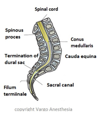

Filum Terminale    body {font-family: 'Open Sans', sans-serif;}

### Filum Terminale

The filum terminale is connective tissue that helps anchor (connect) the spinal cord to the coccyx.  
It is a strand of connective tissue which joins the end of the cord (the conus medullaris) to the dorsal surface of the first vertebra of the coccyx.  
It is non-neuronal  
It is about 20cm in length.  

****

  
The filum terminale consists of two parts, upper and lower. On most anatomy images, it appears as a long thin strand that runs from the tip of the spinal cord down through the middle of the cauda equina, through the dural sac, through the sacral canal and connecting to the coccyx.  
  
**Filum Terminale** **consists of two parts, an upper and a lower.**  
  
**Filum terminale internum (upper part):** Measures about 15 cm. in length and reaches as far as the lower border of the second sacral vertebra. It is contained within the tubular sheath of dura mater.  
  
It is surrounded by the cauda equina, from which it can be readily recognized by its bluish-white color.  
  
**Filum terminale externum (lower part):** Is adherent to the dura mater.  
It extends downward from the apex of the tubular sheath and is attached to the back of the first segment of the coccyx. It consists mainly of fibrous tissue, continuous above with that of the pia mater. 5-6 cm in length.  

Spine (Phila Pa 1976).  1998 Jul 1;23(13):1452-6.  
**The variation of position of the conus medullaris in an adult population. A magnetic resonance imaging study.  
**Saifuddin A 1 , Burnett SJ, White J.  
  
**Gray's Anatomy for Students  
**By Richard Drake, A. Wayne Vogl, Adam W. M. Mitchell