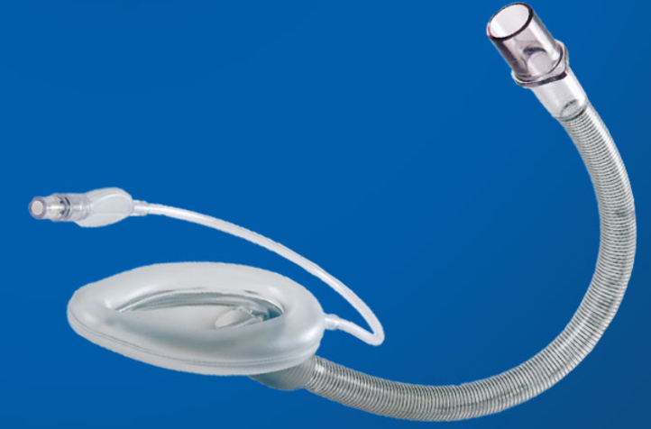

Flexible LMA    body {font-family: 'Open Sans', sans-serif;}

### Flexible LMA

It is also called the “Flexible reinforced laryngeal mask airway” (LMA; FLMA).

****

\- The wire-reinforced, flexible airway tubes have a smaller tube diameter than other LMAs\- It is resistant to kinking and compression as compared with classic LMA.  
\- Designed for shared airways.  
\- The reinforced airway tube can be moved out of the surgical field without displacement of the cuff or loss of seal.  
\- Reusable and single-use.**  
  
Possible surgical indications:  
**Oral  
Ophthalmic  
Head and neck surgeries  

A novel technique of flexible reinforced laryngeal mask airway insertion.   
_Anaesthesia and Intensive Care._  2009;39:669–70  
Chakravarty A, Wadhawan S.  
  
A new flexible laryngeal mask airway introducer  
Indian Journal of Anaesthesia 56(1):p 94-95, Jan–Feb 2012.   
Kulkarni, Anand Hanumantrao; Simon, Binu Puthur 1 ; Jose, Joju Kalan