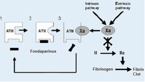

Fondaparinux (Arixtra)    body {font-family: 'Open Sans', sans-serif;}

### Fondaparinux (Arixtra)

**Indirect Xa Inhibitor**  
Approved by the FDA in December 2001 with a black box warning similar to that of the LMWHs and heparinoids.  
  
Fondaparinux is often compared to unfractionated heparin (UFH) and Low Molecular Weight Heparin (LMWH) because of its structure. But it is neither.  
  
**Fondaparinux mechanisms of action comparisons with UFH, LMWH and Warfarin.**  
**Heparin:** Inhibits factors Xa and to a lesser extent IIa. It also inhibits XIIa, XIa and IXa.  
**Wafarin:** Inhibits the synthesis of the vitamin K-dependent coagulation factors II, VII, IX, and X and anticoagulant proteins C and S. **Lovenox:** (LMWH) inhibits factors Xa and to a lesser extent IIa.  
**Fondaparinux:** An exclusive indirect factor Xa inhibitor.  
  
**_The fewer the clotting factors affected, the more reliable the anticoagulant, thus it does NOT need routine monitoring. Thus heparin and warfarin should be routinely monitored._**  
  
**Indications  
**Prophylaxis of deep vein thrombosis (DVT)  
Treatment of Acute DVTs.  
At least as safe and effective as treatment of DVT and pulmonary embolism (PE) as LMWH and UFH, respectively.  
  
**Mechanism of action:** (Indirectly blocks (w/o binding to) Factor Xa) Selectively and IRREVERSIBLY binds to Antithrombin III.This potentiates the action of ATIII by 300-fold to inactivate ONLY Factor Xa.  
Prothrombin cannot be converted to thrombin.Has no direct effect on thrombin.Has no effect on platelet function.Has excellent bioavailability and longer half-life after Sub Q injection.  
  
**_Note:_** _HEPARIN potentiates the action of ATIII by 2,000-fold, but affects other clotting factors besides Factor Xa)._  
  
When Factor Xa is neutralized, it inhibits thrombin formation and thrombus development.  
Fondaparinux does NOT inactivate thrombin (activated Factor II) and has no known effect on platelet function.  
  
**_As a result, fondaparinux has a more predictable and reproducible anticoagulant effect and can be administered in a fixed dose once daily and does not require monitoring for anticoagulant effect._**

****

**_Blocks the activity of this clotting factor Xa indirectly by binding to and activating antithrombin III._  
  
****Fondaparinux and Chemical Structure vs UFH and LMWH  
**Fondaparinux is composed of five monomeric sugars that are identical to the sequence present in heparin that comprises the high affinity binding site for antithrombin III. **Unlike standard and low molecular weight heparins, however, fondaparinux is specific for Factor Xa and has no effect on thrombin or other clotting factors. As a result, fondaparinux has a more predictable and reproducible anticoagulant effect and can be administered in a fixed dose once daily and does not require monitoring for anticoagulant effect.  
  
In short:** **Fondaparinux** shares the same pentasaccharide sequence as UFH and LMWH for the binding to antithrombin, however it has no extra chain and thus, **is NOT considered a heparin product.  
  
Lab Monitoring:** Fondaparinux and other Factor Xa inhibitors are considered reliable and do not need routine monitoring, unlike Warfarin and Heparin.  
There are specific lab tests for each Factor Xa inhibitor.**  
  
Anti-Xa assay for Arixta  
**Laboratory monitoring of Fondaparinux is possible by utilizing factor Xa inhibitory activity of the drug. Anti-Xa assay (used for monitoring heparin) is modified by using a standard curve constructed with Fondaparinux.  
  
**Anti-Xa values:** In patients treated with 2.5 mg fondaparinux daily, the peak steady-state plasma concentration is (on average) 0.39 to 0.50 mcg/mL approximately 3 hours post-dose and the minimum steady-state plasma concentration is 0.14 to 0.19 mcg/mL.  
  
**Optional Lab Monitoring**  
Anti-Xa assay: **is most reliable, increases with increasing drug concentration)-reaches maximum values in 3 hours.** **Fondaparinux Anti-Xa assay–(FNDXT).**  
_Proper monitoring is done by measuring the peak anti-Xa level within 3-5 hours after subcutaneous injection._  
  
**Normal Anti - Xa assay:** indicates no anticoagulation effect.  
**Elevated PT:** Fondaparinux is present, but no linear correlation.  
**Normal PT:** Minimal drug effect  
**Elevated aPTT and INR:** Fondaparinux is present, but no linear correlation.  
**Fibrinolytic activity or bleeding time:** Not affected at recommended doses.  
  
**Fondaparinux and HIT:** To date, there have been very few reports of HIT with fondaparinux. Some have proposed fondaparinux as a treatment for HIT.  
Antibodies to PF4/heparin develop in postoperative orthopedic patients receiving fondaparinux at a rate similar to those receiving enoxaparin, but none reacted with PF4/fondaparinux. Fondaparinux is likely unable to react with PF4 and cause platelet activation.  
  
**Fondaparinux used as a treatment for HIT  
**Currently under study. Not an FDA approved indication.**  
  
Should it be used in a patient with HIT?  
**A reasonable option - more studies required.  
  
**Bleeding with factor Xa inhibitors** Annually, 1% to 4% of patients treated with factor Xa inhibitors experience major bleeding, and an additional 1% may require emergency surgery. In the U.S in 2015, more than 80,000 patients treated with oral factor Xa inhibitors were admitted to hospitals because of bleeding.  
  
**Dosing  
Prophylaxis:** 2.5 mg once a day**Treatment doses:  
< 50kg:** 5mg once daily**50 -100kg:** 7.5 mg daily**\> 100kg:** 10 mg daily**Renal Adjustments:  
CrCl 30-50 mL/min:** Use caution  
**CrCl < 30 mL/min:** Contraindicated  
  
**Peak plasma:** 2 hours after Sub Q injection  
**Elimination half-life:** about 17 hours. Dose dependent - convenient for daily dosing.  
**Elimination:** Exclusively by kidneys  
  
In patients treated with 5 mg (body weight <50 kg), 7.5 mg (body weight 50 to 100 kg), and 10 mg (body weight <50 kg), fondaparinux once daily, the mean peak steady state plasma concentration is approximately 1.20 to 1.26 mcg/mL and the mean minimum steady state plasma concentration is approximately 0.46 to 0.62 mcg/mL.  
\[Arixtra prescribing information version September 2013. GlaxoSmithKline, Research Triangle Park, NC and Garcia et al. Chest 2012; 141:e24S-e43S\]  
  
**Comparative Table of Heparin, LMWH and Fondaparinux**

table.tableizer-table { font-size: 12px; border: 1px solid #CCC; font-family: Arial, Helvetica, sans-serif; } .tableizer-table td { padding: 4px; margin: 3px; border: 1px solid #CCC; } .tableizer-table th { background-color: #104E8B; color: #FFF; font-weight: bold; }

|  | Heparin | LMWH Enoxaparin | Fondaparinux |
| --- | --- | --- | --- |
| **Source** | Bovine and porcine Lung/intestine | Derived from UFH | Synthetic-small molecule |
| **Chain length** | ~ 45 saccharide units | ~ 15 saccharide units | 5 saccharide units |
| **Route** | IV or Sub Q | IV or Sub Q | IV or Sub Q |
| **Time to Cmax** | Sub Q: 20-30 mins eratic absorption | Sub Q: 3-4.5 hours predictable absorption | Sub Q: 2-3hours predictable absorption |
| **Half-life** | 0.5-2 hours | ~ 4-7 hours Daily to BID dosing | 15-17 hours Daily Sub Q dosing |
| **Dosing for renal impairment** | None needed | Must adjust If dialysis pt: not recommended | If CrCl < 30: contrandicated |
| **Lab Monitoring** | aPPT, ACT anti-factor 10x, check platelets | Routinely not done Optional: Anti-factor 10 Xa assay and check platelets | Routinely not done Optional: Anti-factor 10 Xa assay |

**Elimination:** In individuals with normal kidney function, fondaparinux is eliminated in urine mainly as unchanged drug.  
**Plasma T1/2:** 15-17 hours assuming single-daily dosing and normal renal function.  
**Renal:** Prolonged in patients with renal impairment.  
Fondaparinux can accumulate with renal dysfunction, and despite normal renal function, stable plateau requires 2–3 days to be achieved.  
  
Manufacturer recommends reducing dose with moderate renal insufficiency.  
Fondaparinux is contraindicated in severe renal insufficiency.  
  
**Total clearance of Fondaparinux:**  
25% lower in patients with mild renal impairment (CrCl 50 to 80 mL/min).  
40% lower in patients with moderate renal impairment (CrCl 30 to 50 mL/min).  
55% lower in patients with severe renal impairment ( < 30 mL/min).  
  
**Advantage of Fondaparinux over LMWH or unfractionated heparin**  
The risk for heparin-induced thrombocytopenia (HIT) is substantially lower.  
Unlike direct factor Xa inhibitors, it mediates its effects indirectly through antithrombin III, but unlike heparin, it is selective for factor Xa.  
  
**Recent ASRA and ESRA consensus**  
Recommends a 3-4-day interval (ideally 5 times. _T_ 1/2 ) before performing a regional anesthesia procedure; then resuming medication 12–24 hours post procedure.  
**Fondaparinux (Arixtra) and Neuraxial or Deep Regional Block**

table.tableizer-table { font-size: 12px; border: 1px solid #CCC; font-family: Arial, Helvetica, sans-serif; } .tableizer-table td { padding: 4px; margin: 3px; border: 1px solid #CCC; } .tableizer-table th { background-color: #104E8B; color: #FFF; font-weight: bold; }

| Minimal Time between  
last dose and neuraxial procedure | Can it be given with  
epidural catheter in place? | Restart after  
neuraxial procedure and/or  
catheter insertion | Restart after  
catheter removal |
| --- | --- | --- | --- |
| ASRA has no recommendation  
  
Other source:  
48 hours with CrCl ≥ 30 ml/min  
If CrCl < 30 ml/min: Call Hematology. | ASRA: Avoid  
  
Avoid | ASRA: Avoid  
  
Avoid | ASRA: 6 hours  
after catheter removal |

  
**Restart medication after procedure:** 12 - 24 hours (ASRA recommends against).  
**Remove catheter after administration: ASRA has no recommendations.**  
**Antidote:** None.  

**Perioperative Hemostasis – Coagulation for Anesthesiologist  
**C. Marcucci and P. Schoettker; 2015  
  
**Anticoagulation Reversal and Treatment Strategies in Major Bleeding: Update 2016  
**West J Emerg Med; v.17(3); 2016 May  
S. Christos, DO R. Naples MD  
https://www.ncbi.nlm.nih.gov/pmc/articles/PMC4899056/  
  
Guidelines for the Management of Anticoagulant and Anti-Platelet Agent Associated Bleeding Complications in Adults  
http://wsp.mclaren.org/Lapeer/files/Guidelines%20for%20the%20Management%20of%20Anticoagulant%20Agents.pdf  
  
Guidelines for Neuraxial Anesthesia and Anticoagulation  
Developed by Anticoagulation Task Force and Anesthesia Development Team. P&T Approved February 2014. Last update July 2015.  
https://kr.ihc.com/ext/Dcmnt?ncid=520499512&tfrm=default  
  
ANTICOAGULANTS: THE GUIDE TO REVERSAL  
OHSU Hospital and Clinics Department of Pharmacy Services Pharmacy and Therapeutics Committee October 2011.  
  
University of Washington; Guidelines for Reversals of Anricoagulants  
https://depts.washington.edu/anticoag/home/sites/default/files/GUIDELINES%20FOR%20REVERSAL%20OF%20ANTICOAGULANTS%20February%202016.pdf  
  
Neurosurg Focus 34 (5):E6, 2013 ©AANS, 2013  
The role of anticoagulants, antiplatelet agents, and their reversal strategies in the management of intracerebral hemorrhage  
_Division of Neurosurgery, Department of Surgery, East Carolina University Brody School of Medicine, Greenville, North Carolina; and Department of Neurosurgery, Virginia Commonwealth University School of Medicine, Richmond, Virginia_  
  
Anticoagulants: A Review of the Pharmacology, Dosing, and Complications  
Current Emergency Hospital Med Rep. 2013 Jun; 1(2): 83–97.  
Mohammed Alquwaizani, Leo Buckley, Christopher Adams, and John Fanikos  
Garcia DA, Baglin TP, Weitz JI, Samama MM. Parenteral anticoagulants: antithrombotic therapy and prevention of thrombosis, 9th ed: American College of Chest Physicians Evidence-Based Clinical Practice Guidelines. Chest. 2012  
  
Weitz DS, Weitz JI. Update on heparin: What do we need to know? J Thromb Thrombolysis. 2010;29:199–207.  
  
Neuraxial and peripheral nerve blocks in patients taking anticoagulant or thromboprophylactic drugs: challenges and solutions.  
  
Jinlei Li, Thomas Halaszynski; Department of Anesthesiology, Yale University, Yale New Haven Hospital, New Haven, CT, USA  
https://www.dovepress.com/neuraxial-and-peripheral-nerve-blocks-in-patients-taking-anticoagulant-peer-reviewed-fulltext-article-LRA  
  
Anticoagulation 3rd Edition  
_Regional Anesthesia and Pain Medicine_ :  
January/February 2010 - Volume 35 - Issue 1 - pp 64-101  
doi: 10.1097/AAP.0b013e3181c15c70  
Asra Practice Advisory  
  
British Journal of Anaesthesia 111 (S1): i96–i113 (2013)  
http://bja.oxfordjournals.org/content/111/suppl\_1/i96.full.pdf+html  
  
Regional anaesthesia in the patient receiving antithrombotic and antiplatelet therapy  
http://bja.oxfordjournals.org/content/107/suppl\_1/i96.full#ref-4  
T.T. Horlocker  
Department of Anesthesiology, Mayo Clinic, Rochester, MN 55905, USA  
  
Horlocker TT, Wedel DJ, Benzon H, et al. Regional anesthesia in the anticoagulated patient: defining the risks (the second ASRA Consensus Conference on Neuraxial Anesthesia and Anticoagulation). Reg Anesth Pain Med 2003;28:172-97  
  
Rxlist.com  
http://www.rxlist.com/arixtra-drug.htm  
  
Clinical Anesthesia Fundamentals; 2015  
Barash, Cullen, Stoelting, Cahalan, Stock, Ortega and Sharar  
  
Hartl P, Brucke P, Dienstl E, Vinazzer H: Prophylaxis of thromboembolism in general surgery: comparison between standard heparin and Fragmin. Thromb Res. 1990 Feb 15;57(4):577-84  
  
Samama MM, Gerotziafas GT: Comparative pharmacokinetics of LMWHs. Semin Thromb Hemost. 2000;26 Suppl 1:31-8.  
  
Drugs.com  
https://www.drugs.com/cdi/fondaparinux.html  
  
LiverTox, Clinical and Research Information on Drug Induced Liver Injury  
Fondaparinux  
https://livertox.nlm.nih.gov//Fondaparinux.htm  
  
Medicines for Residence  
http://medicineforresidents.blogspot.com/2011/01/fondaparinuxarixtra-and-word-of-caution.html  
Warkentin TE, Cook RJ, Marder VJ, Sheppard JA, Moore JC, Eriksson BI, Greinacher A, Kelton JG. Anti-platelet factor 4/heparin antibodies in orthopedic surgery patients receiving antithrombotic prophylaxis with fondaparinux or enoxaparin. Blood. 2005;106(12):3791 – 3796