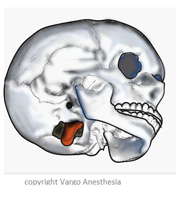

Foramen Magnum    body {font-family: 'Open Sans', sans-serif;}

### Foramen Magnum

The large opening in the base of the skull through which the spinal cord passes down from the brain. Where the spinal cord merges with the brain.

****

  

**Gray's Anatomy for Students**  
By Richard Drake, A. Wayne Vogl, Adam W. M. Mitchell