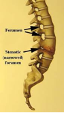

Foraminotomy: See Laminectomy Procedure     body {font-family: 'Open Sans', sans-serif;}

### Foraminotomy: See Laminectomy Procedure

Foraminotomy is basically a laminectomy with more of a lateral opening. This procedure can be done to decompress several levels.

A foramen is the opening around the nerve root coming right off the spine. -Otomy refers to the medical procedure for enlarging the opening. In this procedure, the surgeon widens the passageway to relieve pressure where the spinal nerve root is being squeezed in the foramen.

Foraminotomy alleviates the symptoms of foraminal stenosis. In foraminal stenosis, a nerve root is compressed inside the neural foramen. Small cutting instruments are used to carefully remove soft tissues within the neural foramen. The surgeon takes out any small disc fragments that are present and scrapes off nearby bone spurs. In this way, tension and pressure are taken off the nerve root.

Jaffe, Richard A. _Anesthesiologist's Manual of Surgical Procedures_, 2012.

Kim, Daniel H., Henn, Vaccaro, and Dickman. _Surgical Anatomy & Techniques to the Spine_, 2005.

Macksey, Lynn Fitzgerald. _Surgical Procedures and Anesthetic Implications: A Handbook for Nurse Anesthesia Practice_. Sudbury, MA: Jones & Bartlett Learning, 2012.