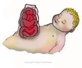

Gastroschisis Anesthesia   

## Gastroschisis Anesthesia

**_Mary Smith, CRNA_**

After delivery of a baby with gastroschisis, an OG tube is inserted to minimize distension. The intestines are covered with damp gauze or a plastic bag (maintain body temp and prevent evaporative heat loss), and the baby may be intubated for prevention of aspiration or if respiratory compromise is present. There has been a recent change in management of these kids, concerning when to repair gastroschisis. It has gone from a surgical emergency (to OR hours after birth), to placing a protective covering and medically stabilizing the neonate prior to surgery in the NICU for 1-2 days. Some facilities may place a silo under sedation, followed by fascial closure later in the OR.

**Surgical Procedure:**  
The goal is to place the exposed viscera into the abdomen. If this cannot be completed in one operation, the process will need to be staged.  
The abdominal viscera is replaced into the abdominal cavity, and the abdominal wall is closed. Approximately 15% will not be able to tolerate the entire gut being placed back into the abdominal cavity at once. Therefore, the remainder is placed into a prosthetic Silo (sterile plastic bag), and the neonate remains intubated/sedated in the NICU until further reduction procedures take place (goal is 5- 10 days).

**Possible associated complications of anomaly:**

-   Mucosal or muscularis dysfunction, altering peristalsis and nutrient absorption
-   Diminished length of bowel due to adhesions/bands due to malrotation of midgut
-   Intestinal atresia may be present (10%), essentially causing obstruction
-   Ischemia to intestines (hernia ring small)

**Pre-op: What to expect?  
**_Lucky for us, most infants with abdominal wall defects have been medically managed in the NICU with ventilator management, cardiovascular assessment, and labs treated._

**Pre-op management should focus on the following:**  
Fluid resuscitation  
Minimizing heat loss  
Treating sepsis  
Avoiding trauma (watch the guts!)  
  
Isotonic IVF titrated to 1-2 cc/kg/hr UOP is common.  
Broad spectrum antibiotics are given due to exposure of bowel and peritoneal cavity. Vitamin K should have been given (check).  
Ask about recent fluid boluses and UOP while in the unit.  
  
**Gestation:** Neonate. 55% are born prematurely.

**Weight:** 1-3 kg. 77% are underweight **.  
  
Intraoperative:**

**Anesthesia:** General/ETT  
**NGT:** Suction before induction.  
**Induction:** IV with cricoid if not already intubated. (Avoid inhalation induction with PPV to prevent gastric distension). Cuffed ETT if possible. Atropine and succs.  
Do not mask ventilate!

**Muscle relaxation:** Full relaxation to facilitate abdominal closure.

**Intubated:** Often intubated already due to respiratory insufficiency present at birth. If not, they are rarely a difficult intubation due to no syndromic association.

**Ventilator settings:** Usually well managed by the neonatologist. Make note of ventilator settings and recent ABG.

**IV Access:** Usually has a CVC-uterine venous (UV) line. IF not, the insertion of a reliable #22 PIV in upper extremity should do. (Abdominal pressure may temporarily restrict venous return post-op).

**Fluids:** Usually on a maintenance IVF/TPN and have received some fluid resuscitation.

Aggressive fluid resuscitation is advised.

**Hydration:** (below is just a common reference)  
Fluid replacements approach 15-25 ml/kg for hemodynamic stability.  
Maintain 1-2 mg/kg/hr UOP. Your patient should already be well hydrated with maintenance fluid and/or TPN.  
**Have albumin ready. Colloids should make up 25% of replacement fluids.**  
  
Albumin dose for mild hypotension: 10cc/kg is recommended (<10kg wt)  
Albumin - more effective with its oncotic pull than crystalloids (<10kg wt)  
Crystalloid Bolus dose for mild hypotension: 5-10cc/kg (<10kg wt)  
Crystalloid Bolus dose for mild hypotension: 20cc/kg (>10kg wt)  
Crystalloid Bolus (emergency) for severe hypotension (20-50cc/kg)  
  
**Replacement of Insensible Fluid Loss (reference)**  
Minimally invasive (inguinal, laparoscopic)    0-2 cc/kg/hr  
Mildly invasive (ureteral reimplantation)    2-4 cc/kg/hr  
Moderately invasive (simple bowel cases)    4-8 cc/kg/hr  
Significantly invasive (NEC)    >10 cc/kg/hr  
**3rd Spacing:** 10mL/kg/h is standard for 3rd space fluid loss with an open belly case.  
  
**EBV (reference)**  
**Premature:** 90-100cc/kg  
**Newborn:** 80-90cc/kg  
**3mo-1 year:** 70-80cc/kg  
**1-4 years:** 70cc/kg  
**Adult:** 55-60cc/kg

**Arterial line -** May have uterine arterial (UA) line, but is not always indicated. Useful for blood draws.

**Room Prep:** Warm the room to 75-76 F. Under warming blanket. Overhead light. Hotline +/-.

**Nitrous:** Avoid due to bowel distention**.**

**Position:** Supine

**Duration:** 2 hours.

**EBL:** 5-10 ml/kg, but we usually have blood available.

**Foley:** Yes. Should have one already.

**Extubation:** Most likely intubated for 24-28 hours following surgery.

**Ventilation:**  

-   Monitor airway pressures throughout the case, especially when bowel is placed back in abdomen. Communicate with surgeon. As abdominal pressures increase, increased thoracic pressure (PIP) can compress IVC, impeding venous return.
-   Abdominal pressure may also lead to decreased intestinal, renal, and hepatic perfusion, altering drug metabolism and prolonged drug effect. Some surgeons may measure bladder or intragastric pressures.
-   Monitor labs appropriately for chemistries/glucose and ABG’s (metabolic acidosis).

  
**Possible Complications:  
**Respiratory Failure  
Bowel ischemia/necrosis  
Paralytic ileus-lack of bowel activity  
Bowel obstruction due to scar tissue or a kink in a loop of bowel  
Renal Failure  
Peritonitis  
Sepsis/metabolic acidosis  
Pneumothorax  
RDS  
Atelectasis  
Volume overload/pulmonary edema  
GERD as a result of the increase in the abdominal pressure caused by the closure of the smaller than normal abdominal cavity  
Perioperative hypothermia  
Inguinal hernia (later) because of the high abdominal pressure

**Post-Operative** : Management in the NICU to monitor/optimize ventilatory status, organ function, body temperature, and pain control.

**Quick Basic Drug References  
****Propofol:** 2.5-3.5mg/kg IV  
**Succinylcholine:** <1 year: 3.0mg/kg  
\>1 year: 1.0-2.0mg/kg  
IM: 4-6mg/kg  
**Rocuronium:** <1 year: 0.25-0.5mg/kg  
1 year: 0.5-1.2mg/kg  
\>1 year: 0.5-1.3mg/kg  
**Vecuronium:** <1 year :0.05-0.1mg/kg  
\>1 year: 0.1mg/kg  
**Neostigmine:** 0.05-0.07mg/kg  
**Robinul:** 0.01mg/kg  
**Fentanyl:** 1-2mcg/kg  
**Morphine:** 0.05-0.15 mg/kg/dose IV q2-4h prn**Ofirmev:** \>2 years: 15mg/kg  
**Not FDA approved for < 2 years, but many still administer at 15mg/kg  
Toradol:** \>2 years: 0.5mg/kg  
**Precedex** (Emergence)**:** Slow push 0.5mcg/kg  
**Zofran:** 100mcg/kg (max 4mg)  
**Decadron:** 0.2-0.5mg/kg  
**Ancef:** 25mg/kg Q6h  
**Ampicillin:** 25-100mg/kg (max per day 100-400mg/kg)  
**Gentamycin:** 2-2.5 mg/kg/dose q8h (Max dose 80 mg)  
**Ceftriaxone (rocephin):** 50-75mg/kg  
**Clindamycin (cleocin):** 15-25mg/kg  
**Invanz** (ertapenem): (3 month -12 years): 15mg/kg  
**Vancomycin:** 10mg/kg slow IV

Jaffe, Richard A. _Anesthesiologist's Manual of Surgical Procedures_; 2012.  
Macksey, Lynn Fitzgerald.  
_Surgical Procedures and Anesthetic Implications: A Handbook for Nurse Anesthesia Practice._ Sudbury, MA: Jones & Bartlett Learning, 2012.  
Houck, Phillip, Hache,Manon and Sun, Lena; Handbook of Pediatric Anesthesia; 2015.  
Gregory and Andropoulus; Gregory’s Pediatric Anesthesia; Fifth Edition; 2012  
Litman; Basics of Pediatric Anesthesia; 2013.  
Davis, Cladis and Motoyama; Smith's Anesthesia for Infants and Children, 8th Edition; 2011.