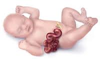

Gastroschisis Review   

## Gastroschisis Review

****

Gastroschisis is an abnormal opening of the abdominal wall, usually to the right of the umbilicus, which allows the intestines to spill out and float within the amniotic fluid. The liver is hardly ever protruding through the opening, but sometimes the stomach will be involved. The amniotic fluid exposure can cause mucosal or muscularis dysfunction to the intestines that may alter peristalsis and nutrient absorption. There could be a diminished length from ischemia, or luminal obstruction from adhesions or bands associated with malrotation of the midgut.

When the hernia ring that the intestines extend through is too tight or decreasing in size, this may also cause necrosis or progressive ischemia of the protruding intestines. Severe ischemia may result with a poor prognosis.

Sometimes, the baby will be delivered early (at 35 weeks) to limit the damage to the bowel tissue.

Gastroschisis is sometimes confused with a more serious birth defect called Omphalocele.  
Gastroschisis does not have a sac, Omphalocele does.  
Omphalocele often involves several organs that are in the sac, outside the belly, and associated with other anomalies. Gastroschisis does not.

Gastrochises occurs in about 2 of 10,000 in U.S. live births (varies with literature).  
1 out of every 2,229 in the US according to the CDC.  
75% of the time, it occurs in first-born children.  
Affects slightly more boys than girls.  
Rare for this condition to recur in subsequent pregnancies.  
Cause is unknown.  
U.S. survival rates 83%-97% without short-bowel syndrome complications.  
10% will have intestinal atresia.  
**Intestinal atresia** : Intestines haven’t formed correctly. There may be areas of blockage that prevent nutrition from flowing through the digestive tract, or some sections may not be connected together.  
  

55% are born prematurely  
77% will have a low birth weight  
Cardiac problems can also be seen with gastroschisis  
80% have a small opening (hernia ring)  
  
15% will NOT have enough room in the belly to put all the intestines back right away. In these cases, surgeons put the intestines in a bag that is attached to the baby’s belly. The intestines are squeezed back inside over 5 to 10 days.  
22% will have significant intestinal damage, which may prolong their NICU stay due to staged surgical repairing procedures.

The average length of stay in the hospital for gastroschisis is about a month and a half.

**Diagnosis**  
Gastroschisis is easily diagnosed during the 2nd trimester prenatal ultrasound.

Alpha-Fetoprotein (AFP) blood test may also be elevated.

The mother will continue to have ultrasounds throughout her pregnancy to follow the baby’s growth and amniotic fluid volume.

There is no harm to the baby with a vaginal delivery. A C-section is indicated only when there are unusual obstetrical indications.

**Medical Facility  
**Early detection of the gastroschisis allows for counseling, delivery planning and referral to a high-risk delivery center.

After birth, however, the exposed intestines have to be protected from direct trauma and infection. Because of this, it is recommended that deliveries take place in a hospital equipped with a Level III NICU, as well as a specialized team of neonatal surgeons.

**After Delivery  
**Most babies with gastroschises are born dehydrated and require at least 125% of normal maintenance of fluids to gain normovolemia.

At birth, the insertion of an OG Tube to remove air and to prevent intestinal distention is indicated. This will also enhance the placement (reduce) of intestines back into the abdomen.  
  
The intestines are immediately covered with damp warm gauze sponges or a damp warm roll of gauze to prevent heat and fluid loss.

Stabilize the bowel and diminish the risk of compromising its blood supply at the fascial ring.

Sometimes a plastic bag containing the baby from chest to feet is used to maintain normal body temperature and diminish evaporative fluid loss.

The baby is placed in a warm isolette or under an overhead radiant warmer and kept warm and moist until surgical repair or silo placement can be performed.

A central line is started for IV access; TPN feeds allow the intestines to heal. Some hospitals try and wait a few days to start a central line to decrease risks for infection.

Broad spectrum antibiotics are given because of the exposure of the bowel and peritoneal cavity.

  
Sometimes the baby intubated.

**Treatment**  
The treatment for gastroschisis is surgery to place the bowel back in the abdomen and close the abdominal wall defect. There are different ways to surgically repair gastroschisis, based on how much of the abdominal contents are outside of the abdomen, and if there are any complications with the intestine.

**Primary Repair:** Surgical procedure is straight forward and done in the first few days of life. If the defect is small enough, intestines can be placed back into the abdomen without too much added abdominal pressure to obstruct the bowel, compress major blood vessels, or restrict ventilation.

The goal is to maintain intra-abdominal pressure below 20 mmHg. Studies show >20 mmHg compromises abdominal organ perfusion.

**Staged Repair:**  
If the surgeon determines that placing the intestine into the abdomen will obstruct the bowel, compress major blood vessels, or restrict ventilation, the intestines will be treated with a plastic pouch, often called a “silo” bag. The bag not only protects the intestine but also allows gravity to gradually help the intestine into the abdomen. The surgeon will gradually squeeze the silo, thus reducing the intestines into the abdominal cavity over a period of 3 to 10 days in the NICU. Gravity of the silo above the abdomen will also help. When the intestines are returned to the abdominal cavity, the silo is removed. The infant is then taken to surgery for the closure of the abdominal wall.

**Turban Closure**  
A new technique can be used called a turban closure that repairs gastroschisis using the umbilical cord, without putting the patient under general anesthesia or closing the hole with stitches. This may make it less likely your baby will get an infection or have other complications.

After surgical repair, some babies have trouble digesting food. With time, more than 95% of babies treated for gastroschisis will eat and gain weight normally.

**Common Complications**  
Hypothermia  
Dehydration  
Sepsis  
Hypoglycemia  
Short Bowel Syndrome (Short Gut Syndrome)  
NEC-delayed onset, up to 20%  
Chronic TPN infusion because of short-bowel conditions may lead to intestinal transplantation.  
Wound infection

**More Notes**  
Most fetuses with gastroschisis do not have severe damage to the intestine before birth.

The majority of fetuses with this problem are born to mothers in their late teens or early twenties. .

Maternal illness and infection, prenatal drug use and smoking, and genetic abnormalities are sometimes associated with gastroschisis.

Gastroschisis rates varies by state.  
California, for example, published a 2005 report, which showed the incidence to be 1 in 1,727 births, and Texas rates show the incidence to be 1 in 1,683 in 2009.

In Canada, the current rate is 1 in 2,272, with an exception of the area of Nunavut, which, for unknown reasons is as high as 1 in 510 births.

Worldwide, rates of gastroschisis in industrial nations vary between 1 in 2,000 and 1 in 3,333, although some regions have higher rates, such as Wales, which is reported at 1 in 1,612 births and an area in Australia with an incidence as high as 1 in 892.

According to the International Clearinghouse for Birth Defects Surveillance and Research, a 2009 report from 16 separate registries shows that South America as a whole has the highest reported incidences of gastroschisis in the world, at 1 in 1,063 births. Unfortunately, there is little to no data collected on incidences in Africa.

Rates of gastroschisis are increasing worldwide.

The medical community still does not know what causes gastroschisis, but researchers have found many correlations and risk factors including aspirin and other medication use, exposure to certain chemicals, low maternal body mass index, and genitourinary infections.

Studies from Utah are demonstrating a familial link to gastroschisis, with one study showing that 23% of families studied had more than one relative with gastroschisis.

However, the single largest risk factor for having a child with gastroschisis continues to be young maternal age.

A 2006 study from the UK showed that mothers under 20 years old have an incidence of gastroschisis ranging from 1 in 1123 to 1 in 409.

http://www.medscape.com/viewarticle/458475\_14  
http://www.cdc.gov/ncbddd/birthdefects/features/birthdefects-keyfindings.html  
http://www.cdph.ca.gov/programs/CBDMP/Documents/MO-CBDMP-Gastroschisis.pdf  
http://www.icbdsr.org/filebank/documents/ar2005/Report2011.pdf  
http://www.aphp.ca/pdf/CAC%20report%202013%20EN.pdf  
http://www.ncbi.nlm.nih.gov/pmc/articles/PMC2432124/  
http://webarchive.nationalarchives.gov.uk/+/www.dh.gov.uk/en/Publicationsandstatistics/Publications/AnnualReports/Browsable/DH\_5328840  
http://www0.health.nsw.gov.au/resources/whatsnew/pdf/gastroschisis\_report.pdf  
http://onlinelibrary.wiley.com/doi/10.1002/ajmg.c.30181/abstract  
http://onlinelibrary.wiley.com/doi/10.1002/(SICI)1096-9926(199606)54:2%3C84::AID-TERA4%3E3.0.CO;2-4/abstract  
http://www.ncbi.nlm.nih.gov/pmc/articles/PMC2432124/  
http://www.ncbi.nlm.nih.gov/pubmed/21987464  
http://www.cdc.gov/ncbddd/birthdefects/features/gastroschisis-key-findings.html  
http://www.ncbi.nlm.nih.gov/pmc/articles/PMC1360382/  
http://www.ncbi.nlm.nih.gov/pubmed/17101355  
http://www.ncbi.nlm.nih.gov/pubmed/21311496?dopt=Abstract  
http://www.ncbi.nlm.nih.gov/pmc/articles/PMC3774449  
http://www.ljsfoundation.org.uk/