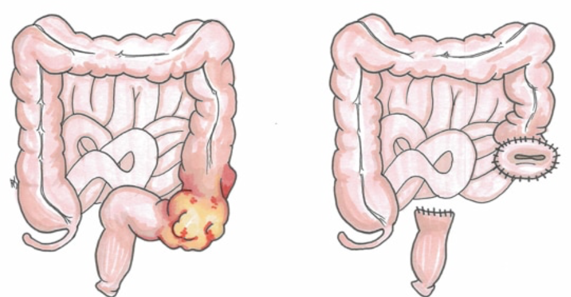

Hartmanns Procedure (Proctosigmoidectomy)    body {font-family: 'Open Sans', sans-serif;}

### Hartmanns Procedure (Proctosigmoidectomy)

A **sigmoid colectomy** with **end colostomy formation.**  
  
_\- The procedure is named after French surgeon Henri Albert Hartmann, who first described it in 1921 (different from the inventor of Hartmann’s solution despite the same name)._  
\- It is typically performed as an **emergency,** most commonly due to **sigmoid perforation** (e.g., secondary to diverticulitis) or a sigmoid malignancy causing bowel obstruction.  
\- In Hartmann’s procedure, a **descending colon end colostomy** is formed.  
\- The remaining rectum is sealed, creating what is known as Hartmann’s pouch.  
  
**Possible stage 2 procedure:** 12 months later (rare)  
\- Reversal of Hartmann’s Procedure (colostomy closure) if possible.  
\- Occasionally, a different bag (ileostomy) is required as part of this operation to allow the new anastomosis in the bowel to heal.  
\- If this occurs, the patient will need a third operation to join the bowel together again to reverse the ileostomy.  
  
**Note:** With colon resections, most surgeons initially attempt to perform an anastomosis to avoid a colostomy.  
However, the sigmoid is so distal that there is usually insufficient space (remaining distance) for an anastomosis with the rectum, thus having to create a colostomy.

****

While Hartmann’s procedure can be performed laparoscopically, some surgeons prefer a laparotomy to ensure adequate space to operate and to allow **maximum irrigation** of any intra-abdominal contamination.  
  
_**Possible Indications:**_Where intraoperative conditions contraindicate the completion of an anastomosis resulting in a colostomy.  
Injury to the colonDiverticulosis of the colon  
Peritonitis from diverticular disease  
Bowel obstruction  
Anastomotic complications  
Ischemic colitis  
Left-sided colonic volvulus  
Abdominal trauma  
Crohn’s disease  
Rectal prolapse  
Ulcerative colitis  
Radiation injuries  
  
**Pre-op:  
For patients with a perforation or bowel obstruction:  
Assess for sepsis and hypovolemia:  
\-** In severe cases, hypovolemia, sepsis, and peritonitis (e.g., purulent or fecal) may result in hemodynamic instability (hypotension), causing organ dysfunction or failure.  
\- Aggressive hydration is warranted if not contraindicated.  
\- Vasopressors via sepsis protocols (low-dose vasopressin and norepinephrine) may be warranted.  
\- Abdominal sepsis is a severe complication and may be diagnosed during pre-, intra-, or postoperative periods.  
  
**Nonurgent (scheduled procedure):  
**\- These patients are usually euvolemic, not septic, and stable.  
\- These patients DO NOT require aggressive hydration, especially during laparoscopic procedures.  
\- Patients are allowed to drink up to 2 hours before the operation.  
\- Do not require extra lines or monitoring (straightforward procedure)  
  
**Pre-op labs:**  
**CBC:**  
\- A leukocytosis may help differentiate simple obstruction from a strangulated and perforated bowel.  
\- Leukocyte counts of >25,000 dl–1 suggest mesenteric occlusion or perforation.  
\- Hct > 55% indicates a significant fluid shift and hypovolemia.  
\- Preoperative anemia, mainly iron deficiency, is common in colorectal cancer and inflammatory bowel disease patients.  
**  
BMP:  
**\- The deficiency of individual electrolytes can suggest the site of obstruction.  
\- Hypokalemia, hypomagnesemia, hypovolemia, or hypophosphatemia are more likely in large bowel obstruction.  
\- In bowel ischemia, there can be an accumulation of lactic acid and release of intracellular K+, resulting in metabolic acidosis and hyperkalemia.  
\- Electrolyte abnormalities must be corrected.  
  
**Lactate levels:** Elevated levels may indicate possible mesenteric and/or colonic ischemia or bowel strangulation.  
  
**ABGs** can immediately assess acid-base status.  
\- Metabolic alkalosis results from frequent emesis.  
\- Metabolic acidosis can result from bowel ischemia (directly related to obstruction) or associated severe dehydration.  
  
**Coags:** Consider thromboembolism prophylaxis.  
**Renal:** Urine specific gravity of 1.025 to 1.030 and increased BUN/Cr reflect the degree of extracellular volume loss.  
  
**Possible sepsis:  
**\- Sepsis is usually NOT present in the early stages of bowel obstruction as it is in the later stages.\- Sepsis is commonly associated with a decrease in SVR, requiring vasopressor support.  
\- ICU sepsis protocols include continuous infusions of norepinephrine and vasopressin.  
\- If the patient is already on vasopressors, these will be continued intraoperatively and titrated as needed.  
  
**Assessment for sepsis and septic shock:** table.tableizer-table { font-size: 12px; border: 1px solid #CCC; font-family: Arial, Helvetica, sans-serif; } .tableizer-table td { padding: 4px; margin: 3px; border: 1px solid #CCC; } .tableizer-table th { background-color: #104E8B; color: #FFF; font-weight: bold; }

|  |   |
| --- | --- |
| **Sepsis** | Temperature > 38°C or < 36°C  
HR > 90 BPM  
Ventilatory frequency > 20 BPM or PaC02 < 33 mmHg  
WBC<4000/mL or > 12,000/mL or > 10% immature forms  
Clinical evidence of infection |
| **Severe sepsis** | Sepsis is associated with organ dysfunction, hypotension  
(SAP < 90 mmHg or < 40% mmHg from baseline), and hypoperfusion abnormalities. |
| **Septic shock** | Sepsis-induced hypotension despite fluid resuscitation, with hypoperfusion abnormalities. |

**Fluid imbalance with intestinal obstruction:  
**The degree of hypovolemia can be estimated by the degree of bowel obstruction.

table.tableizer-table { font-size: 12px; border: 1px solid #CCC; font-family: Arial, Helvetica, sans-serif; } .tableizer-table td { padding: 4px; margin: 3px; border: 1px solid #CCC; } .tableizer-table th { background-color: #104E8B; color: #FFF; font-weight: bold; }

| Early stage | Well established stage | Late stage |
| --- | --- | --- |
| 1,500 mL of fluid accumulation  
in the bowel | 3,000 mL of fluid accumulation  
in the bowel | 6,000 mL of fluid accumulation  
in the bowel |
| Mild dehydration | Usually associated with vomiting  
Mild to severe dehydration | Hypotension and tachycardia
are normally present  
Elevated HCT  
Severe dehydration  
  
HCT > 55% indicates that 40% of plasma and  
extracellular fluid volume has been lost. |

  
  
\- Ideally, the patient will have been hydrated in the ICU or emergency department prior to surgery.  
\- Fluid replacement will help normalize systemic vascular resistance and optimize oxygen delivery.  
  
**Pre-op meds:**  
\- Avoid prokinetics (e.g., metoclopramide) because it may aggravate the bowel obstruction and increase the risk of perforation.  
\- If time permits, antacids (e.g., sodium citrate) and/or H2 antagonists (e.g., famotidine \[Pepcid®\]) maybe considered for a PARTIAL bowel obstruction.  
  
**These patients may be at a very high risk for aspiration.  
Nasogastric tube (NGT): For obstructed or septic patients  
**\- An NGT should have already been inserted when the bowel obstruction was initially assessed.\- A nasogastric tube will help decompress the stomach and reduce the risk of aspiration.  
\- For septic, symptomatic patients with a distended abdomen, one should be inserted prior to induction if the patient does not have an NGT.  
  
**Monitoring:** Central line and arterial line may be indicated for hemodynamically unstable and septic patients.  
\- A central line and CVP are optimal; however, these are currently less commonly used.  
\- Arterial lines are usually inserted in the ICU when vasopressors are being infused.\- A Foley catheter is necessary to monitor urine output.  
**  
Anesthesia: General/ETT**\- Suction and oropharyngeal suction attachment (yankauer) should be readily accessible near the patient’s airway with induction.  
\- NGT should be connected to suction prior to induction to empty the patient’s stomach.  
**Induction:** RSI with Sellick maneuver**Induction position:** Controversial  
\- For high aspiration risk patients, some anesthesia providers prefer to elevate the head of the bed to avoid passive regurgitation.  
\- Some literature recommends positioning the patient in Trendelenburg if aspiration occurs; however, this is rarely done.  
  
**OGT or NGT:** Yes, if the patient already does not have one.  
Ask the surgeon if they prefer an oral or nasal gastric tube.  
**Surgical positioning:** Mild to steep Trendelenburg.Consider multimodal analgesia.  
TAP block as an adjuvant is becoming more popular for elective abdominal procedures.**Thoracic epidurals:**  Rarely performed for the surgical repairs of bowel obstructions.\- Epidurals are controversial in the presence of sepsis and large fluid deficits.  
\- The placement of a thoracic epidural with a bolus of 6-8 ml of 0.25% bupivacaine with fentanyl or morphine prior to induction with continued doses in the postoperative period is acceptable and evidence-based.  
  
**Fluids: Crystalloid or colloid?  
**\- There is no gold standard or “magic formula” for fluid resuscitation.  
\- Most providers administer both albumin and LR.  
\- Vigorous IV fluid replacement may be required because of the loss of absorptive capacity, decreased oral intake, and vomiting.  
\- Colloids are now increasingly used in bowel surgery.  
\- Concomitant hypo-albuminemia can exacerbate the loss of fluid from the vascular space.  
\- Stroke volume measurement using noninvasive monitoring is becoming more common clinically for goal-directed fluid administration.  
**Warning:** Irrational and unmonitored fluid boluses to manage hypotension or low urine output may lead to fluid overload.  
  
**When this is an ERAS procedure: (Use institutions ERAS protocol)**  
To comply with ERAS recommendations, consider the following: restrict the fluid to < 8 ml/kg/hr IBW; usually, 4-5 ml/kg/hr IBW is sufficient.  
Usually, limit total fluids to < 1,500 mLs.  
  
**Fluid warmer or warming blanket:** It is necessary to avoid hypothermia, especially in open abdominal procedures.  
**Nitrous oxide** is to be avoided.  
**IV access:** If the patient is septic, two 18-gauge IVs (especially if both arms will be tucked)  
**NGT:** May be required pre-induction for obstructed or nauseated patients.  
**Induction:** Usually RSI (when urgent)  
**Position:** Supine (arms tucked if laparoscopic)  
**Trendelenburg:** Usually  
**Duration:** 1-2 hours  
**EBL:** Rarely exceeds 150 ml.  
**Muscle relaxant reversal:** Sugammadex may be preferred over neostigmine.  
**Extubation:** Awake  
  
**Factors that may prevent extubation:  
**Severe acidosis  
Hemodynamic instability  
V/Q mismatch  
Symptoms of aspiration  
  
**Possible surgical complications:  
**Adhesion formationFluid and electrolyte imbalanceAspiration pneumonitis  
Bowel Ischemia  
Bowel perforation, leading to peritonitis (high mortality)  
Infection  
Formation of abscesses  
Leakage of stool from the anastomosis  
Paralytic ileus (temporary paralysis of the intestines)  
Sepsis with multiorgan failure  
Dehydration and renal impairment  
Hemorrhage  
Atelectasis  
Recurrence of the obstructionWound Infection  
Paralytic ileus  
Abdominal sepsis  
Cardiovascular and pulmonary complications  
Postoperative urinary retention  
Abdominal compartment syndrome  
  
Twenty-five percent of the patients undergoing emergency colorectal cancer surgery have postoperative medical complications leading to significant mortality.  
Multi-organ dysfunction is the most common mode of death after emergency colorectal surgery.  

Danish colorectal cancer group: Postoperative medical complications are the main cause of early death after emergency surgery for colonic cancer.  
_British Journal of Surgery,._ 2008;95:1012–9  
Iversen LH, Bülow S, Christensen IJ, Laurberg S, Harling H.  
Anesthesia and perioperative management of colorectal surgical patients – specific issues (part 2)  
Journal of Anaesthesiology and Clinical Pharmacology, 2012 Jul-Sep; 28(3): 304–313.  
Santosh Patel, Jan M. Lutz, Umakanth Panchagnula, and Sujesh Bansal  
Current indications for the Hartmann procedure  
Journal of Visceral Surgery, 2016 Feb;153(1):31-8.  
J Barbieux, F Plumereau, A Hamy  
  
Colorectal Protocol with ERAS Elements  
Standard Medicine-Resources for Anesthesia Research and Education  
Accessed 12/2023  
Alimorad G. Djalali MD  
https://ether.stanford.edu/policies/colorectal.htmlConsent: Hartmann’s Procedure  
TeachMe Surgery  
Accessed 12/2023  
https://tinyurl.com/43stse4x  
  
Open Hartmann Procedure  
Medscape (accessed 04/2022)  
Angel Mario Morales Gonzalez, MD  
https://emedicine.medscape.com/article/1535055-overview  
  
Hartmann’s Procedure  
Patient Information-General Surgery  
Canterbury District Health Bound (accessed 04/2022)  
https://tinyurl.com/mr3she35  
  
Intestinal Obstruction  
5-Minute Clinical Consult  
Intestinal Obstruction (accessed 05/2020)  
https://tinyurl.com/mvz6v3zj  
  
Intestinal Obstruction  
Suazanne Strom, MG  
The 5-Minute Anesthesia Consult, 2013, pp 488  
Nina Singh-Radcliff  
  
Intestinal Obstruction  
Anesthesiology Core Review, Part Two: Advanced Exam, 2016, CH. 86, pp. 323-326  
B. Freeman and J. Berger Frank J.DominoSurviving sepsis campaign: International guidelines for management of severe sepsis and septic shock: 2012  
Critical Care Medicine. 2013;41:580–637.  
Dellinger RP, Levy MM, Rhodes A, Annane D, Gerlach H, Opal SM, et al.Anaesthetic management of patients with severe sepsis.  
British Journal of Anaesthiology 2010;105:734-43.  
Eissa D, Carton EG, Buggy DJ.  
  
ACCP/ATS/SIS International Sepsis Definitions Conference.  
Critical Care Medicine 2003;31:1250  
  
Anesthetic management of intestinal obstruction.  
British Journal of Anaesthesia 2005;1:138–41.  
Gemmell LW, Rincon C.  
  
Emergency preoperative stenting versus surgery for acute left-sided malignant colonic obstruction: a multicenter randomized controlled trial.  
Surgical Endoscopy. 2011;25(6):1814–1821  
Pirlet IA, Slim K, Kwiatkowski F, et al.  
  
Anesthetic management of intestinal obstruction: A postgraduate educational review  
Anesthesia Assays and Research 2016 Sep-Dec; 10(3): 397–401  
S. Parthasarathy, R. Sripriya, and N. Krishnaveni  
  
Anesthesia for Intestinal Obstruction (accessed 05/2020)  
Dr. Omar Faud Al-Katheri  
https://www.slideshare.net/dromarkatheri/anesthesia-for-intestinal-obstruction  
  
Anaesthetic management of intestinal obstruction  
L W Gemmell BSc FRCA and C Rincon FRCA  
British Journal of Anaesthesia | CEPD Reviews | Volume 1 Number 5 2001  
https://bjaed.org/article/S1472-2615(17)30125-5/pdf  
  
International guidelines for management of severe sepsis and septic shock: 2008.  
Critical Care Medicine 2008;36:296-327  
Dellinger RP, Levy MM, Carlet JM, Bion J, Parker MM, Jaeschke R, et al.