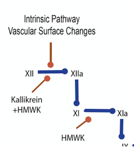

High Molecular-Weight Kininogen    body {font-family: 'Open Sans', sans-serif;}

### High Molecular-Weight Kininogen  
(Fitzgerald factor)

HMWK is one of the contact factors that participates in the early activation of the INTRINSIC pathway of coagulation when blood is exposed to a negatively charged foreign surface.  
  
With contact activation, activated factor XII (XIIa) converts prekallikrein into kallikrein.  
Kallikrein then helps activates more factor XII (Hageman factor).  
HMWK acts as a cofactor in both reactions.  
HMWK also acts as a cofactor in the activation of factor XI by factor XIIa.  
  
Kallikrein releases bradykinin from HMWK, which has vasoactive activities.

****

  
**Part of the intrinsic Pathway**  
Factors VIII, IX, XI, XII, prekallikrein, and HMWK are the coagulation factors of the intrinsic coagulation pathway.  
Factor XII, HMWK and prekallikrein are also called the “contact” factors.  
Factor XI is activated by factor XIIa formed through activation of XII by HMWK-prekallikrein complex on endothelial cells.  
HMWK is one of four proteins which interact to initiate the **intrinsic pathway** of coagulation.  
  
**The other three are:** Factor XII, Factor XI and prekallikrein.  
  
**Plasma half-life:** 144 hours  
Produced by the liver together with prekallikrein.  
When decreased, HMWK may prolong PTT but not PT.  
  
HMWK proteolysis leads to the production of bradykinin, a mediator of vasodilation, smooth muscle contractions, and increased vascular permeability.  
  
Other functions of HMWK include inhibition of thrombin-induced platelet aggregation, participant in fibrinolysis. It also has surface-binding antiadhesive properties.  
  
HMWK is encoded by the KNG1 gene (612358) (Bick, 2002; Takagaki et al., 1985).  

Waldmann R, Abraham JP, Rebuck JW, Caldwell J, Saito H, Ratnoff OD (Apr 1975).  
"Fitzgerald factor: a hitherto unrecognised coagulation factor".   
_Lancet_ . **1** (7913): 949–51.  
  
Higashiyama S, Ohkubo I, Ishiguro H, Kunimatsu M, Sawaki K, Sasaki M (Apr 1986).  
"Human high molecular weight kininogen as a thiol proteinase inhibitor: presence of the entire inhibition capacity in the native form of heavy chain".   
_Biochemistry_ . **25** (7): 1669–75  
  
Mingers AM, Heimburger N, Zeitler P, Kreth HW, Schuster V.  
Homozygous type I plasminogen deficiency.  
Semin Thromb Hemost 1997;23:259-69