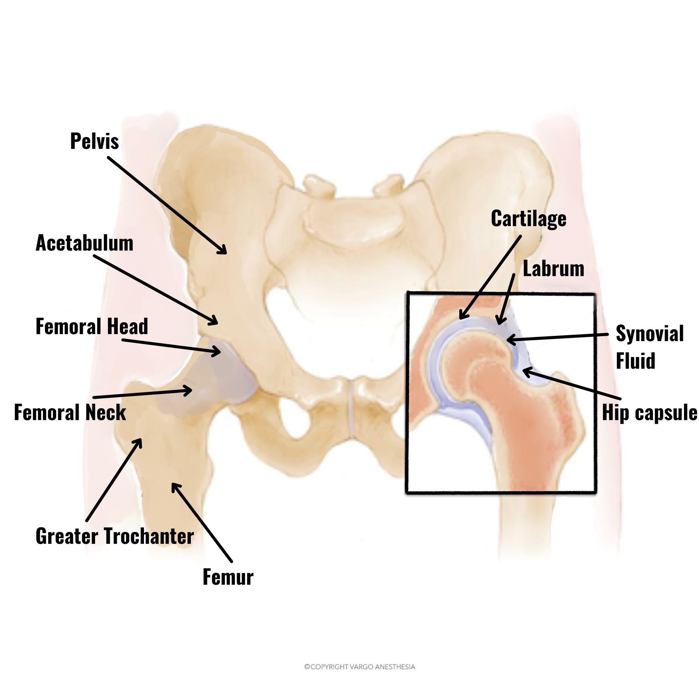
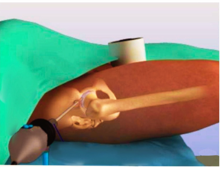
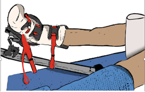

Hip Arthroscopy    body {font-family: 'Open Sans', sans-serif;}

### Hip Arthroscopy

-   Hip Arthroscopy is not a common orthopedic procedure, and there is limited literature concerning anesthetic and surgical management.
-   Both general and neuraxial anesthesia is acceptable

**Hip anatomy notes**

-   The hip is a ball-and-socket joint
-   The socket is formed by the acetabulum, which is part of the large pelvis bone
-   The acetabulum is ringed by strong fibrocartilage (the labrum) that forms a gasket around the socket
-   The ball is formed by the femoral head, which is the upper end of the femur
-   The surfaces of both the ball and socket are covered with a smooth tissue (articular cartilage) that cushions the ends of the bones and enables them to glide across each other with ease
-   The hip joint is surrounded by a synovial membrane, a thin tissue that produces a small amount of fluid to lubricate the cartilage and eliminate nearly all friction during hip movement

  
  

****

**Nerve supply to the hips**

-   **Different parts of the hip joint capsule have different sensory innervations**
-   The nerve innervation to the hip joint provides multiple anesthetic options.
-   The best anesthetic strategy remains unclear.
-   _Femoral nerve_: Innervates the anterior part of the hip joint
-   _Obturator nerve_: Gives branches to the anteromedial part
-   _Sciatic nerve_: Provides innervation to the posterior part of the joint

**Indications of hip arthroscopy**

_Femoroacetabular impingement_ (FAI):

-   Bone overgrowth or spurs that develops along the acetabulum or femoral head or both areas
-   This bone overgrowth damages the soft tissues (labrum) of the hip during movement

_Snapping hip syndrome_

-   The snapping or popping of the hip is often harmless and requires no treatment
-   In some cases, the tendon is damaged by the repeated rubbing across the outside of the joint

_Synovitis_

-   Inflammation of the tissues that surround the synovial lining of the joint

_Loose bodies_

-   Similarly, as the knee and shoulders, small fragments of bone or cartilage may become loose or broken off inside the joint, can cause pain, and/or may possibly be caught in the moving parts of the joint

_Other indications_

-   Hip joint infection
-   Labral tears
-   Chondral injuries
-   Osteonecrosis
-   Septic arthritis 

**Relative contraindications**

-   Arthritis of the hip
-   Hip dysplasia

**Procedure** **Incision**

-   Some surgeons mark out externally internal anatomical landmarks to mark portal placements
    -   This avoids the potential location of nerves and blood vessels
-   Two to five small incisions (each less than 1 cm) are made around the hip to insert the arthroscopy camera and necessary instruments
-   A C-arm is used to guide the insertions and placement of portals
-   Fluid irrigates and fills the joint space to increase the view
-   Just as with other joint arthroscopies, the surgeon will perform tasks such as shaving, cutting, grasping, suture passing, knot tying, or anchoring stitches into bone

****

**Possible arthroscopic procedures**

-   Trimming or repairing torn cartilage
-   Trimming and smoothing bone spurs caused by FAI
-   Removing inflamed synovial tissue (joint membrane tissues)
-   Labral repair

**Anesthesia and surgical management**

-   These patients experience moderate to severe pain after hip arthroscopy due to the invasion of intra-articular structures and traction

****

**Anesthesia**

-   General or neuraxial (SAB)
-   Recent literature states that a fascia iliaca, femoral nerve, or lumbar plexus blocks may significantly reduce postoperative pain

  
**Muscle relaxation:** Usually, the surgeon may request muscle relaxation to limit the amount of traction required.  
**Blood pressure:** Permissive hypotension may be requested to limit bleeding.  
**Duration:** Usually 1.5 to 2 hours, depending on the procedure being performed.  
**Positioning and traction:**

-   Supine with the leg slightly abducted
-   Traction is applied to pull the hip away from the socket far enough to allow the surgeon to insert instruments, view the entire joint, and perform the necessary treatments

**EBL:** Less than 100 mL

-   Be aware that the hip joint is very vascular

**Postoperative pain sources**

-   From surgical intrusion of the intra-articular compartment
-   Traction
-   Incisional pain can originate from the portal tracts
-   Possible extravasation of irrigation fluids through the capsulotomy leads to soft tissue swelling.
-   Postoperative pain management:
-   Intravenous and oral opioids
-   Lumbar plexus block and fascia iliaca block can be performed pre- or postoperatively
-   Possible complications:
-   Extravasation of irrigation fluid
-   Hypothermia
-   Infections
-   Thromboembolic events (DVTs)
-   Temporary hip numbness from traction stretching nerves

  
  

Hip arthroscopy surgery: femoral acetabular impingement, labral repair  
Ohio State Medical Center (Wexner University) accessed 11/2021  
https://www.youtube.com/watch?v=CKgNr5cl0rs  
  
Hip Arthroscopy  
BoneSmart (accessd 11/2021)  
https://bonesmart.org/hip/hip-arthroscopy/?gclid=Cj0KCQiAkZKNBhDiARIsAPsk0WiyP6VyjyPCsELMg0yqEjIozMohhywydpKBU-v7spEh4mF5uY0j0NAaAo-NEALw\_wcB  
  
Perioperative pain management in hip arthroscopy; what options are there?  
Journal of Hip Preservation Surgery 2016 Aug; 3(3): 181–189.  
N. H. Bech, A. H. Hulst, J. A. Spuijbroek, L. L. A. van Leuken, and D. Haverkamp  
  
Hip Arthroscopy  
UW Medicine -Orthopaedics and Sports Medicine (accessed 11/2021)  
https://orthop.washington.edu/patient-care/articles/sports/hip-arthroscopy.html  
  
Anesthesia for hip arthroscopy: a narrative review  
Canadian Journal of Anesthesia 2016 Nov;63(11):1277-90  
Hai Chuan Yu, Mohammed Al-Shehri , Kelly D Johnston, Ryan Endersby, Leyla Baghirzada   
Hip Arthroscopy  
Shorleliune Orhtopaedics (accessed 11/2021)  
https://shorelineortho.com/specialties/hip-hip\_arthroscopy.php  
  
Use of Regional Anesthesia in Hip Arthroscopy  
ClinicalTrials.gov (accessed 11/2021)  
https://clinicaltrials.gov/ct2/show/NCT02851888