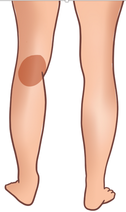
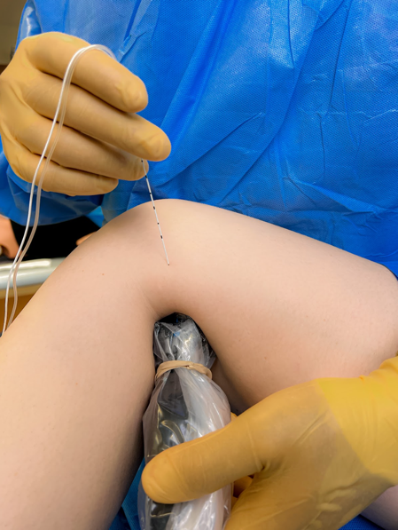
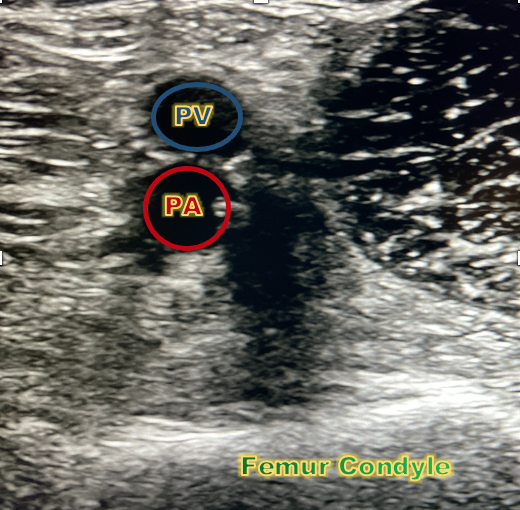
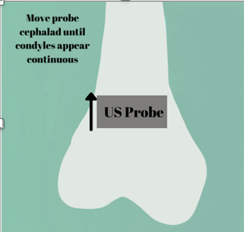
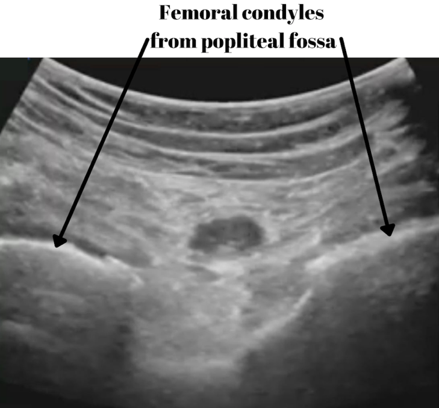
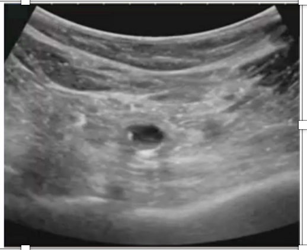
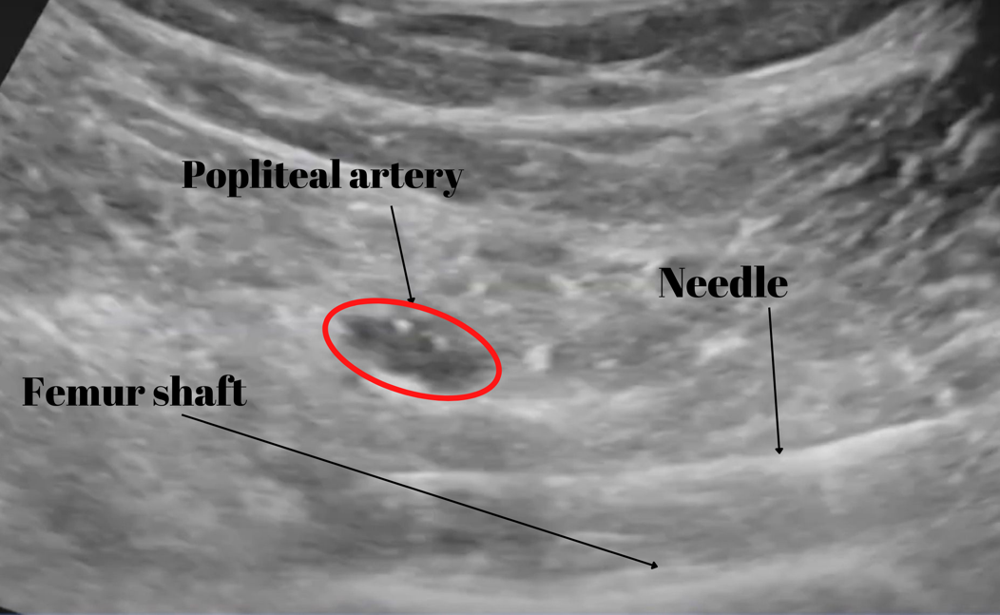
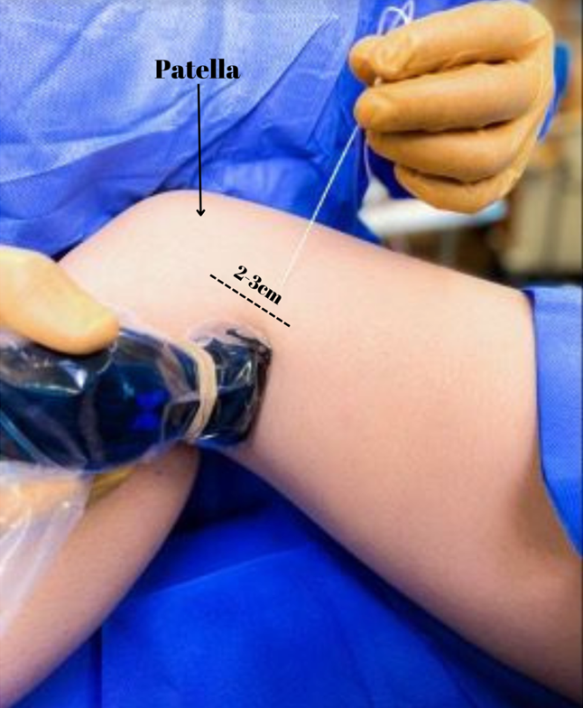

IPACK Block    body {font-family: 'Open Sans', sans-serif;}

### IPACK Block

Also spelled as iPACK.  
**IPACK nerve block:** Motor sparing analgesia for the posterior knee.  
  
The IPACK block consists of an infiltration of a local anesthetic between the popliteal artery (PA) and the posterior capsule of the knee.  
  
This motor sparring technique selectively blocks the articular branches that provide sensory innervation to the posterior knee capsule while sparing the tibial and common peroneal nerve motor branches.  
  
**However, blocking the main trunks of tibial and common peroneal nerves may result in:**  
**Footdrop:** When the common perineal nerve has been blocked  
**Weakness** **of foot muscles:** When the tibial nerve has been blocked  
  
**IPACK and Adductor canal blocks for major knee surgery:**  
\- The IPACK block is often combined with the adductor canal block to provide additional analgesia to the anterior knee.  
\- Is it logistically easier to do both the IPACK and AC blocks with the patient supine and remaining in the frog-leg position as it does not involve repositioning or changing sterile covers.  
**AC nerve block:** Analgesia to the anteromedial aspect of the knee to the medial malleolus.

****

**Surgical indications of IPACK block:**  
\- Total or partial knee arthroplasty  
\- Anterior cruciate ligament (ACL) repair  
\- Procedures that involve the posterior capsule of the knee  
\- Surgery to the posterior aspect of the knee  
\- Pain control for posterior knee pain after knee arthroplasty  
\- Knee manipulation procedures  
  
**Goal:**  
To anesthetize the articular branches innervating the posterior knee joint while avoiding any motor impairment of the leg and foot (foot drop).  
**Absolute contraindication:** (as with other regional blocks)  
\- Patient refusal  
\- Inflammation or infection over the injection site.  
\- Allergy to local anesthetics  
  
**Relative contraindications:** (as with other regional blocks)  
\- Anticoagulation or bleeding disorders (relative)\- Patient uncooperativeness (Pediatric or elderly patients may need sedation).  
\- Pre-existing peripheral neuropathies.  
**  
Equipment:**  
80-100 mm, 20-22 gauge needle  
Linear transducer  
15-20 ml syringe containing local anesthetic of choice  
Ultrasound transducer sterile cover  
Sterile gloves  
Ultrasound gel  
Chlorhexidine gluconate or povidone-iodine cleansing solution  
  
**Patient position:**  
**Supine:** (most popular) frog-leg  
It provides the US transducer access to a lateral and posterior view of the IPACK area.

****

**Two different transducer approaches to performing an IPACK block:**  
\- Posterior transducer placement (most popular)  
\- Lateral transducer placement (rarely done and more explained at the bottom of this page)  
\- In both transducer approaches, the local anesthetic is deposited in the interspace between the popliteal artery and the knee capsule using a 100-mm needle from medial to lateral.  
\- However, when the probe position is different (lateral vs posterior), the US view of the needle and interspace differs.  
  
**Posterior view:**  
\- The curvilinear probe is placed transversely in the popliteal fossa crease to identify the femur, femoral artery, and femoral vein.  
**Note:** The patient may also be placed in **lateral decubitus** with the operative side up to improve ergonomics in obese patients.  
  
**US transducer:**  
\- A linear transducer can be used; however, a **curvilinear probe** may be preferred as it provides a broader field of vision and eliminates the need to chase a needle with a beam.  
\- The curvilinear probe is often preferred for deeper targets, typically greater than 6 cm.  
\- Viewing the posterior femur, the probe is positioned on the popliteal fossa, and the artery and femur are identified.  
\- Color Doppler can be used to assist in the confirmation of the pulsating popliteal artery.  
\- Slide the probe distally until it reveals the two femoral condyles (humps).  
\- At this point, the probe should be slid proximally until the two humps disappear and a flat metaphysis is present.  
\- The IPACK space is between the artery and the femur, about four centimeters deep from the US probe surface.

****

****

The anesthesia provider can slide the probe distally until it reveals the two femoral condyles (humps) as reference points.

****

**Ultrasound probe and corresponding ultrasound image:**  
Moving the probe cephalad (proximal) while keeping the popliteal artery in view, the condyles changes to a continuous line (below).

****

\- The popliteal artery is seen as pulsating in the center of the scan.  
\- The popliteal vein may not be seen (collapsed) as it depends on the pressure applied by the transducer.  
\- At this point, the probe should be slid proximally until the two humps disappear and a flat metaphysis is present (above).

****

\- The plane between the popliteal artery and the femur is the target tissue space for infiltration.  
\- It is about four centimeters deep from the US probe surface in a normal-sized patient.  
\- This is the area in which the articular branches are traversing.  
  
**Needle insertion:  
**\- Medial to lateral approach.  
**\- US probe:** High-frequency linear probe or low-frequency curvilinear transducer  
\- Depends on body habitus.  
\- The curvilinear probe  
\- In-plane probe (not optimal)  

****

**Insertion point:**  
\- Parallel to the femur (above image), in the middle of the tissue plane.  
\- Insert the needle as illustrated above and advance the need immediately posterior to the femoral shaft in the anteromedial to the posterolateral direction so that the needle reaches the narrow space (IPACK space) between the femoral shaft and popliteal artery.  
\- If you are unsure where the needle tip is, you can jostle the needle a little back and forth.  
\- Once the needle tip has reached the level of the popliteal artery, inject five mLs of the local anesthetic.  
\- Incrementally, as the needle is being withdrawn, inject the remaining ten mLs.  
\- When injecting more volume of local anesthetic, you should see the IPAC space expand, thus, creating a greater distance between the femoral shaft and the popliteal artery.  
  
**IPACK: Transducer in lateral approach (below)**\- The block is performed with the patient in the same position as when performing AC or FT blocks, supine with the knee flexed and the hip externally rotated (‘frog leg’ position).  
\- The curvilinear probe is placed on the medial side of the lower third of the thigh to identify the femur, the femoral artery, and the femoral vein.  
\- The femoral vessels are then traced distally to observe them diving into the popliteal fossa to become the PA and popliteal vein.  
\- Once the PA is identified posterior to the femur, the probe is moved slightly distal and posterior to get a better view of the interspace between the PA and the femur shaft just above the femoral condyles.  
\- The needle is inserted from medial to lateral and advanced parallel to the acoustic shadow of the femur between the shaft of the femur and the PA until the tip is placed 2 cm beyond the PA.  
\- The LA is injected as the needle is withdrawn after negative aspiration, filling the gap between the PA and the femur.

****

**Prone:** Rare because it involves repositioning and re-prepping a sedated patient to perform an AC block.  
  

Michael MacKinnon DNP, FNP-C, CRNA, FAANA  
National University Associate Professor Doctor of Anesthesiology Program  
Edited by Dr. Michael Kaminsky, Regional Anesthesiologist  
  
Motor Sparing Blocks for the Knee  
World Federation of Society of Anesthesiologists (accessed 08/2022)  
Emily Spence1, Vijayaraghavan Ramesh2, Maria Paz Sebastian2†  
**https://tinyurl.com/32kdh6s4  
  
PACK block (Interspace between the Popliteal Artery and Capsule of the Knee)  
**Regional Anesthesiology and Acute Pain Medicine (accessed 08/2022)  
Duke University  
https://www.youtube.com/watch?v=MXPaxznJtfE  
  
IPACK Block  
Advancing the Science of Ultrasound Guided Regional Anesthesia and Pain Medicine  
(accessed 08/2022)  
Maria Fernanda Rojas G & Vincent Chan  
**https://www.youtube.com/watch?v=QwhBIO5cD34**  
  
**What is Ipack? - Regional anesthesia Crash course with Dr. Hadzic**NYSORA-Education (accessed 08/2022)  
https://www.youtube.com/watch?v=jQ4D9LE-EUU  
Ultrasound guided IPACK block (accessed 08/2022)  
Valentine Gibson  
https://www.youtube.com/watch?v=inhxSlgDlT0  
  
IPACK Block: Technique  
NYSORA, Chapter 24  
https://tinyurl.com/28jhhkas